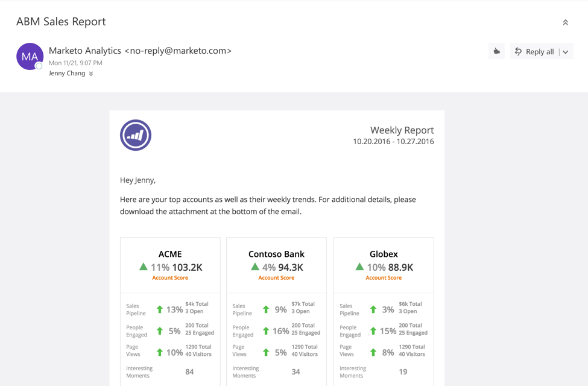

# ABM-verkooprapport {#abm-sales-report}

Ontvang wekelijks een e-mail met je topaccounts en hun wekelijkse trends.

>[!NOTE]
>
>Leer hoe u dit rapport [hier](/help/marketo/product-docs/target-account-management/measure/abm-report-setup.md) instelt.

Het verslag deelt:

* Benoemde accounts gesorteerd op de door u gekozen accountscore
* Meest betrokken personen
* Belangrijke trends en interessante momenten
* Een koppeling om een CSV-bestand te downloaden met aanvullende gegevens

## Verkooprapportsleutel {#sales-report-key}

<table> 
 <tbody> 
  <tr> 
   <td><strong>Accountscore</strong></td> 
   <td> 
    

      Wekelijkse trend naar accountscore (geselecteerd in setup), gevolgd door huidige accountscore 
    
</td> 
  </tr> 
  <tr> 
   <td><strong>Verkooppijpleiding</strong></td> 
   <td> 
    

      Wekelijkse trend per pijpleiding, gevolgd door de totale huidige pijpleiding en het aantal open kansen 
    
</td> 
  </tr> 
  <tr> 
   <td><strong>Paginaweergaven</strong></td> 
   <td> 
    

      Wekelijkse trend van paginaweergaven, gevolgd door totale paginaweergaven en aantal unieke bezoekers 
    
</td> 
  </tr> 
  <tr> 
   <td><strong>Interesserende momenten</strong></td> 
   <td> 
    

      Totaal aantal interessante momenten die zich tijdens de week hebben voorgedaan 
    
</td> 
  </tr> 
 </tbody> 
</table>