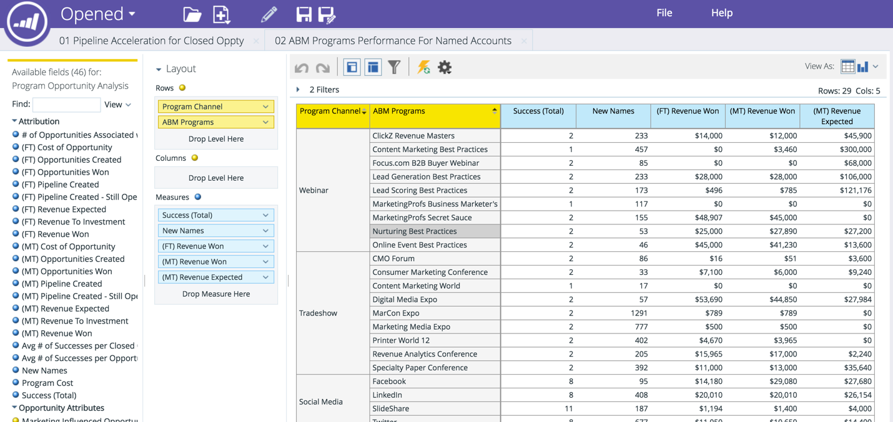

# Benoemde Account Dimension in RCA {#named-account-dimension-in-rca}

Bouw op opbrengst-gebaseerde rapporten gebruikend de TAM-specifieke Benoemde dimensie van de Rekening in de Analyse van de Cyclus van de Ontvangsten.

>[!NOTE]
>
>**Dimension** -kenmerken (weergegeven door gele stippen) die verschillende weergaven van de meetwaarden geven.

>[!NOTE]
>
>De dimensie van de Benoemde Rekening in RCA kan worden gebruikt om bottom-line effect van gerichte rekeningen (b.v. gewonnen opbrengst, pijpleiding of versnelling in verkoopcyclus) te meten. Deze dimensie kan ook worden gebruikt om vast te stellen welke programma&#39;s wel en niet goed presteerden tegen benoemde accounts.

De volgende rapporten hebben toegang tot de dimensie Benoemd account:

* E-mailanalyse
* Analyse van lead
* Opportuniteitsanalyse
* Analyse van het lidmaatschap van het programma

>[!NOTE]
>
>Hieronder volgen enkele voorbeelden van Marketo TAM in Revenue Cycle Analytics.

Pipetversnelling binnen benoemde accounts

De doeltreffendheid van het kanaal en succes door genoemde rekeningen

Doeltreffendheid van het programma en impact op de bodem

Dekking van kwaliteitsleads en betrokkenheid binnen benoemde accounts

