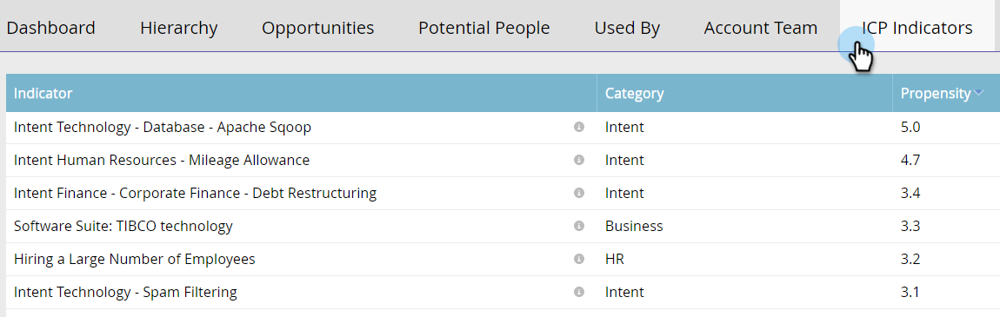

# Benoemde accountgegevens {#named-account-insights}

Het dashboard Benoemde account biedt een weergave van 360 graden van een doelaccount.

## Dashboard {#dashboard}

Het dashboard bundelt belangrijke inzichten op rekeningniveau van alle mensen binnen een genoemde rekening, zodat het niet nodig is naar elke persoon te gaan om hun vooruitgang te evalueren. U kunt dieper naar de e-mailactiviteiten gaan met [E-mailinzichten](/help/marketo/product-docs/reporting/email-insights/filtering-in-email-insights.md#account-based-marketing).

>[!NOTE]
>
>Grafieken tonen inzichten van de afgelopen 90 dagen.

**Betrokkenheid van account in de tijd** Klik op de knop **Weergave** aan de rechterkant om de weergave te wijzigen. Naast de score van de Rekening, kunt u door Totale Ontvangsten bekijken...

...of pijplijn.

<table> 
 <tbody> 
  <tr> 
   <td><strong>Accountscore</strong></td> 
   <td>
Zie de wekelijkse betrokkenheid op basis van alle accountscores die u hebt gemaakt in Admin. U kunt deze accountscores naast elkaar vergelijken. Om de wekelijkse betrokkenheid te bepalen, nemen we de maximale betrokkenheid van elke dag van de week.
</td> 
  </tr> 
  <tr> 
   <td><strong>Pijpleiding</strong></td> 
   <td>Zie de pijpleiding in tijd. Om pijpleiding over tijd door week te bepalen, nemen wij de pijpleiding op de laatste dag.</td> 
  </tr> 
  <tr> 
   <td><strong>Ontvangsten</strong></td> 
   <td>Zie inkomsten in de loop der tijd. Om de inkomsten in de loop der tijd per week te bepalen, nemen we de som van alle inkomsten die in die week zijn behaald.</td> 
  </tr> 
 </tbody> 
</table>

**Interesserende momenten**

Beschikbaar voor gebruikers van Marketo Sales Insight, zie de interessante momenten die op accountniveau worden opgerold.

**Bovenste personen**

Deze personen worden berekend op basis van prioriteiten die gebaseerd zijn op de recensie of urgentie van personen met een benoemde account (zoals [Beste bieten](/help/marketo/product-docs/marketo-sales-insight/msi-for-salesforce/features/stars-and-flames/priority-urgency-relative-score-and-best-bets.md) in het Inzicht van de Verkoop), of Scores die door de gebruiker worden bepaald. **Prioriteit** is alleen beschikbaar voor gebruikers van Marketo Sales Insight.

**Inclusief kinderen**

Klikken **Inclusief kinderen** om de onderliggende accounts van de geselecteerde benoemde account te bekijken en te kiezen en hun samengestelde analyse weer te geven.

>[!NOTE]
>
>Als u accounts selecteert, kunt u kiezen tussen alles selecteren of afzonderlijk maximaal 100 selecteren.

## Hiërarchie {#hierarchy}

Zie waar het geselecteerde benoemde account woont in verhouding tot de hiërarchie.

## Kansen {#opportunities}

Een roll-up mening van alle open kansen op een rekeningsniveau, die de teams van de Marketing helpt zich op het sluiten van specifieke kansen concentreren.

## Potentiële mensen {#potential-people}

Bij &#39;Lead-to-Account&#39;-overeenkomst wordt gebruikgemaakt van wazige logica om zwakke overeenkomsten te zoeken die kunnen worden opgelost op het tabblad Potentiële personen.

>[!NOTE]
>
>Als u personen wilt toevoegen aan de lijst, selecteert u deze en klikt u op **Personen toevoegen**.

## Gebruikt door {#used-by}

Op dit tabblad ziet u welke slimme campagnes, webcampagnes, slimme lijsten of rapporten momenteel verwijzen naar specifieke benoemde accounts of accountlijsten.

## Accountteam {#account-team}

Accountteamleden weergeven, leden toevoegen/verwijderen en zelfs een accounteigenaar toewijzen op dit tabblad.

>[!NOTE]
>
>Klik op de knop **Handelingen in accountteam** vervolgkeuzelijst voor het toevoegen/verwijderen van accountleden of het toewijzen van een accounteigenaar.

## ICP-indicatoren {#icp-indicators}

Bekijk de Indicatoren ICP u selecteerde om te exporteren wanneer u [hebt uw model aangepast](/help/marketo/product-docs/target-account-management/account-profiling/account-profiling-ranking-and-tuning.md#model-tuning).

