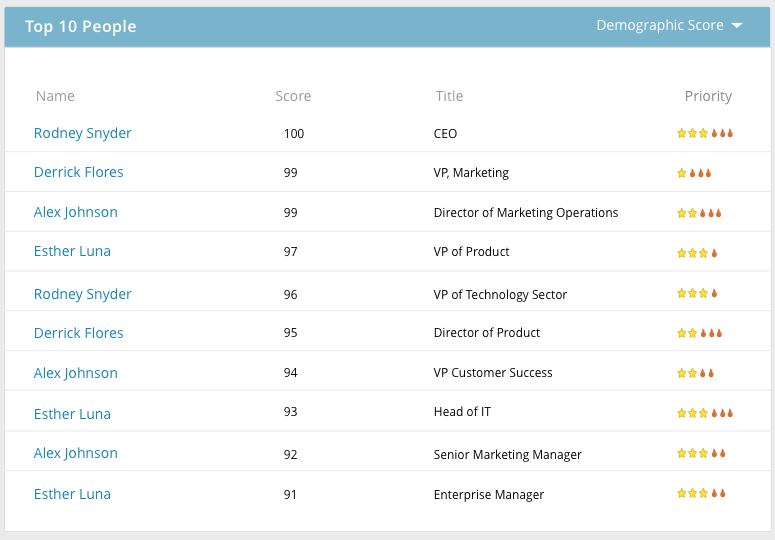

# Benoemde accountgegevens {#named-account-insights}

Het dashboard Benoemde account biedt een weergave van 360 graden van een doelaccount.

## Dashboard {#dashboard}

Het dashboard bundelt belangrijke inzichten op rekeningniveau van alle mensen binnen een genoemde rekening, zodat het niet nodig is naar elke persoon te gaan om hun vooruitgang te evalueren. U kunt dieper naar e-mailactiviteit boor gebruikend [ E-mailInzichten ](/help/marketo/product-docs/reporting/email-insights/filtering-in-email-insights.md#account-based-marketing).

>[!NOTE]
>
>Grafieken tonen inzichten van de afgelopen 90 dagen.

**[!UICONTROL Account Engagement Over Time]** Klik op de vervolgkeuzelijst **[!UICONTROL View]** rechts om de weergave te wijzigen. Naast [!UICONTROL Account Score] kunt u ook weergeven op [!UICONTROL Total Revenue] ...

...of [!UICONTROL Pipeline] .

<table> 
 <tbody> 
  <tr> 
   <td><strong>Accountscore</strong></td> 
   <td>
Zie week-aan-week overeenkomst die op alle rekeningsscores wordt gebaseerd u in  Admin  creeerde. U kunt deze accountscores naast elkaar vergelijken. Om de wekelijkse betrokkenheid te bepalen, nemen we de maximale betrokkenheid van elke dag van de week.
</td> 
  </tr> 
  <tr> 
   <td><strong>Pijpleiding</strong></td> 
   <td>Zie de pijpleiding in tijd. Om pijpleiding over tijd door week te bepalen, nemen wij de pijpleiding op de laatste dag.</td> 
  </tr> 
  <tr> 
   <td><strong>Ontvangsten</strong></td> 
   <td>Zie inkomsten in de loop der tijd. Om de inkomsten in de loop der tijd per week te bepalen, nemen we de som van alle inkomsten die in die week zijn behaald.</td> 
  </tr> 
 </tbody> 
</table>

**[!UICONTROL Interesting Moments]**

Beschikbaar voor gebruikers van [!DNL Marketo Sales Insight], zie de interessante momenten opgerold op accountniveau.

**Hoogste Mensen**

Deze mensen worden berekend gebaseerd op prioriteiten die op recentie of urgentie gebaseerd zijn die door mensen van genoemde rekeningen (het zelfde als [ Beste Bets ](/help/marketo/product-docs/marketo-sales-insight/msi-for-salesforce/features/stars-and-flames/priority-urgency-relative-score-and-best-bets.md) in de Insight van de Verkoop) wordt getoond, of Scores die door de gebruiker worden bepaald. **[!UICONTROL Priority]** is alleen beschikbaar voor gebruikers van [!DNL Marketo Sales Insight] .

**omvat Kinderen**

Klik op **[!UICONTROL Includes Children]** om de onderliggende accounts van het geselecteerde benoemde account weer te geven en te kiezen en de samengestelde analyse weer te geven.

>[!NOTE]
>
>Als u accounts selecteert, kunt u kiezen tussen alles selecteren of afzonderlijk maximaal 100 selecteren.

## Hiërarchie {#hierarchy}

Zie waar het geselecteerde benoemde account woont in verhouding tot de hiërarchie.

## [!UICONTROL Opportunities] {#opportunities}

Een roll-up mening van alle open kansen op een rekeningsniveau, die de teams van de Marketing helpt zich op het sluiten van specifieke kansen concentreren.

## [!UICONTROL Potential People] {#potential-people}

Bij overeenkomsten van account tot account wordt vage logica gebruikt om zwakke overeenkomsten te zoeken die kunnen worden opgelost op het tabblad [!UICONTROL Potential People] .

>[!NOTE]
>
>Als u een van de vermelde personen wilt toevoegen, selecteert u deze en klikt u op **[!UICONTROL Add People]** .

## [!UICONTROL Used By] {#used-by}

Op dit tabblad ziet u welke slimme campagnes, webcampagnes, slimme lijsten of rapporten momenteel verwijzen naar specifieke benoemde accounts of accountlijsten.

## [!UICONTROL Account Team] {#account-team}

Accountteamleden weergeven, leden toevoegen/verwijderen en zelfs een accounteigenaar toewijzen op dit tabblad.

>[!NOTE]
>
>Klik op de vervolgkeuzelijst **[!UICONTROL Account Team Actions]** om accountleden toe te voegen of te verwijderen of om een accounteigenaar toe te wijzen.

## [!UICONTROL ICP Indicators] {#icp-indicators}

Bekijk [!UICONTROL ICP Indicators] u selecteerde om uit te voeren wanneer u [ uw model ](/help/marketo/product-docs/target-account-management/account-profiling/account-profiling-ranking-and-tuning.md#model-tuning) stemde.

