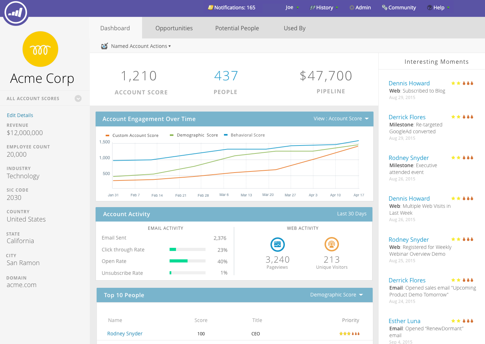

# TAM-hoofddashboard {#tam-main-dashboard}

Het hoofddashboard geeft een overzicht van uw [!UICONTROL Target Account Management] -inspanningen. U kunt de doelaccounts of accountlijsten zien die succes tonen, en de accounts die meer aandacht nodig hebben.

Klik op de vervolgkeuzelijst **[!UICONTROL View]** om te filteren op accountlijst...

...en maak een selectie. In dit voorbeeld, kiezen wij onze &quot;**[!UICONTROL High Tech]**&quot;rekeningslijst.

Om het [&#x200B; dashboard van de Lijst van de Rekening &#x200B;](/help/marketo/product-docs/target-account-management/measure/account-list-insights.md#account-list-dashboard) te bekijken, klik de naam van de rekeningslijst u selecteerde...

...en het dashboard wordt geladen.

Als u in plaats van het dashboard Accountlijst weer te geven een account met een naam wilt openen, klikt u op **[!UICONTROL More Details]** onder de naam...

...en bekijk de [&#x200B; genoemde inzichten van de rekening &#x200B;](/help/marketo/product-docs/target-account-management/measure/named-account-insights.md).

