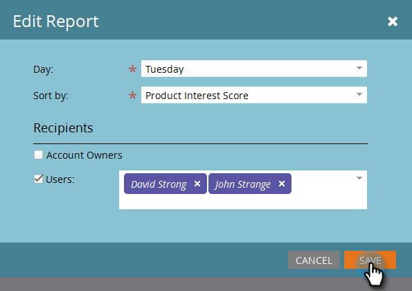

# TAM Report Setup {#tam-report-setup}

Het TAM-verkooprapport is een wekelijkse, persoonlijke e-mail die naar het accountteam wordt verzonden.

## Rapportinstelling {#report-setup}

1. Klik op **[!UICONTROL Admin]**.

   

1. Klik op **[!UICONTROL Target Account Management]**.

   

1. Klik onder [!UICONTROL Weekly Report] op **[!UICONTROL Edit]** .

   

1. Klik op de vervolgkeuzelijst **[!UICONTROL Day]** en selecteer de dag van de week waarop de ontvangers het e-mailbericht willen ontvangen.

   

1. Klik op de vervolgkeuzelijst **[!UICONTROL Sort By]** en maak een selectie om de indeling van uw e-mail te bepalen.

   

1. Schakel het selectievakje **[!UICONTROL Users]** in, klik op de vervolgkeuzelijst en selecteer wie u de e-mail wilt ontvangen.

   

   >[!NOTE]
   >
   >Meldingen worden alleen verzonden naar eigenaars van accounts of teamleden.

1. Klik op **[!UICONTROL Save]**.

   

En dat is het!

## Abonnement opzeggen {#how-to-unsubscribe}

Elk rapport wordt geleverd met de optie om te weigeren. Klik hiertoe op **[!UICONTROL Unsubscribe]** onder aan het e-mailbericht.

## Opnieuw abonneren {#how-to-resubscribe}

1. Klik op **[!UICONTROL Admin]**.

   

1. Klik op **[!UICONTROL Target Account Management]**.

   

1. Klik onder [!UICONTROL Weekly Report] op het nummer dat wordt vermeld als [!UICONTROL Unsubscribed] .

   

1. Klik op de vervolgkeuzelijst **[!UICONTROL Users]** .

   

1. Selecteer opnieuw de gebruiker die u e-mailberichten wilt ontvangen en klik op **[!UICONTROL Resubscribe]** .

   
