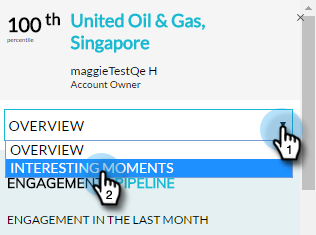
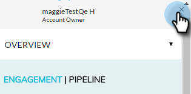

# [!DNL Account Insight] Overzicht van plug-in {#account-insight-plug-in-overview}

[!DNL Account Insight] is een [!DNL Chrome] -plug-in die actionable TAM en accountinzichten voor uw verkoopteams bevat, zodat zij accounts effectiever kunnen gebruiken.

>[!AVAILABILITY]
>
>* Account Insight is inbegrepen voor alle klanten die zowel TAM als Marketo Sales Insight hebben. Voor klanten die alleen TAM hebben, is Account Insight beschikbaar als aangeschafte add-on. Elke klant heeft maximaal 250 Insight-licenties voor accounts. Neem contact op met je verkoper voor meer informatie. Het is niet beschikbaar voor klanten die geen TAM hebben.
>
>* Deze stop-binnen is niet compatibel met [ de authentificatie van de Identiteit van Adobe ](/help/marketo/product-docs/administration/marketo-with-adobe-identity/adobe-identity-management-overview.md){target="_blank"} momenteel.

>[!CAUTION]
>
>De [!DNL Account Insight] stop-binnen zal niet in abonnementen werken die [ SSO-slechts ](/help/marketo/product-docs/administration/additional-integrations/restrict-user-login-to-sso-only.md) (enige toegelaten sign-on) hebben.

>[!CAUTION]
>
>De CRM-context werkt voor Salesforce wanneer de plug-in wordt gestart vanuit een account, lead of contactpersoon. De CRM-context werkt niet voor Dynamics wanneer u de plug-in vanuit een account, lead of contactpersoon start. We raden gebruikers van Dynamics aan de plug-in [!DNL Account Insight] te gebruiken.

## Benoemde accounts {#named-accounts}

Zie benoemde accounts in volgorde van rangschikking. Deze lijst is alleen beschikbaar voor eigenaars van accounts. De ondersteuning van het accountteam is binnenkort beschikbaar.

Klik op de naam van een account als u details voor een account met een naam wilt weergeven...

...en het overzicht wordt weergegeven.

Bekijk interessante momenten met de vervolgkeuzelijst.

Schuif omlaag om de beste bedden te zien. Ook hier zijn interessante momenten, samen met betrokken mensen.

Klik op de naam van een persoon...

...en hun activiteiten bekijken.

U kunt ook van **[!UICONTROL Engagement]** naar **[!UICONTROL Pipeline]** schakelen.

Als u het account met de naam wilt verlaten, klikt u op de X in de rechterbovenhoek.

## [!UICONTROL Activity Feed] {#activity-feed}

De activiteitsfeed laat recente activiteit zien, die zeven dagen teruggaat.

Klik op de vervolgkeuzelijst **[!UICONTROL Filter]** om te filteren op verschillende soorten activiteit.

Er kan op verschillende items worden geklikt. Klik op de benoemde account om de details weer te geven. Klik op de naam van de gebruiker om zijn of haar activiteit te bekijken. Klik op **[!UICONTROL More Activities]** om meer activiteiten weer te geven.

Mooi cool spul!

>[!MORELIKETHIS]
>
>[ Opstelling  [!DNL Account Insight]](/help/marketo/product-docs/target-account-management/setup-tam/set-up-account-insight.md)
