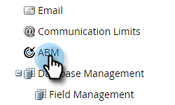

# Account Team Setup {#account-team-setup}

Een accountteam is een groep belanghebbenden die samenwerken aan een benoemde account. Voer de volgende stappen uit om te kiezen welke CRM-accountrollen moeten worden toegevoegd.

1. Klik **Admin**.

   

1. Klik **ABM**.

   

1. Klik onder Accountteamleden op **Bewerken**.

   

   >[!NOTE]
   >
   >Geef deze als accountrol een naam en pas deze aan het gewenste zoekveld voor gebruiker in uw CRM aan.

1. Typ de naam van uw accountrol en selecteer het veld **CRM**. Voeg maximaal 10 toe.

   

   >[!NOTE]
   >
   >U kunt geen eigenaar van account selecteren. Het wordt door gebrek gekozen van het rekeningsniveau in uw CRM.

1. Klik **Opslaan** wanneer gereed.

   

   >[!CAUTION]
   >
   >Als u een update uitvoert, kan het enige tijd duren voordat de wijzigingen worden weerspiegeld in ABM.

   >[!NOTE]
   >
   >Als Meerdere CRM-accounts met verschillende rekeningeigenaren worden samengevoegd tot een Benoemde account, kiest Marketo één &quot;Rekeningeigenaar&quot; en voegt het andere rekeningeigenaren toe als &quot;Rekeningeigenaren&quot;
   >
   >Als de naam van een CRM-veld &quot;Role&quot; later wordt gewijzigd of verwijderd, stopt Marketo ABM met het synchroniseren van de bijgewerkte waarden totdat de gebruiker de instellingen in ABM handmatig bijwerkt
