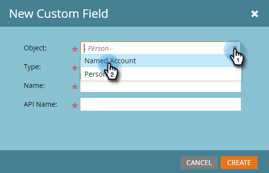
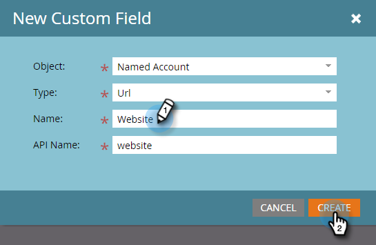
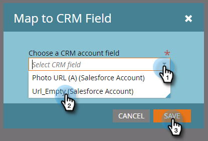

# Een aangepast veld maken voor CRM-detectie {#create-a-custom-field-for-crm-discovery}

Voeg aangepaste velden toe aan accounts, wijs deze toe aan uw CRM en gebruik ze voor CRM-accountdetectie in Marketo.

1. Klikken **Beheer**.

   

1. Klikken **Veldbeheer** vervolgens **Nieuw aangepast veld**.

   

1. Klik op de knop **Object** vervolgkeuzelijst en selecteer **Benoemd account**.

   

1. Klik op de knop **Type** en selecteer een type.

   

1. Voer een **Naam** (de API-naam wordt automatisch ingevuld) en klik op **Maken**.

   

1. Nadat het veld is gemaakt, selecteert u het in de boomstructuur aan de rechterkant. Klik op de knop **Veldhandelingen** vervolgkeuzelijst en selecteer **Toewijzen aan CRM-veld**.

   

1. Selecteer het de rekeningsgebied van CRM u aan in kaart wilt brengen en klikken **Opslaan**.

   

   Zodra gesynchroniseerd, zal uw nieuw gebied op uiterst rechts in uw Ontdek het net van CRM verschijnen.

   
