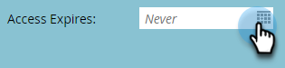

# Gebruikers uitnodigen om toegang te krijgen [!UICONTROL Account Insight] {#invite-users-to-access-account-insight}

Voer de volgende stappen uit om gebruikers toegang te geven tot [!UICONTROL Account Insight] .

1. Klik op **[!UICONTROL Admin]**.

   

1. Klik op **[!UICONTROL Users & Roles]** in de structuur. Klik vervolgens op de tab **[!UICONTROL Sales Users]** en **[!UICONTROL Invite New Sales User]** .

   

   Er zijn twee manieren om gebruikers uit te nodigen: door CRM of per e-mail. In dit voorbeeld zullen wij Uitnodiging door CRM gebruiken.

   >[!NOTE]
   >
   >Wanneer u nieuwe (niet-Marketo) gebruikers uitnodigt via de gebruikerslijst van CRM, kunt u meerdere personen tegelijk uitnodigen. Uitnodigen per e-mail is 1 voor 1.

1. Klik op de vervolgkeuzelijst **[!UICONTROL CRM User]** en selecteer de gewenste gebruiker.

   

   >[!NOTE]
   >
   >Als u **[!UICONTROL Invite User by email]** kiest, voert u gewoon de voornaam, achternaam en het e-mailadres in en gaat u verder met stap 4.

1. Als u een vervaldatum voor de toegang van de gebruiker (optioneel) wilt instellen, klikt u op het kalenderpictogram. Het is standaard ingesteld op &quot;nooit&quot;.

   

1. Klik op **[!UICONTROL Next]**.

   

1. Schakel het selectievakje **[!UICONTROL Account Insight]** in en klik op **[!UICONTROL Next]** .

   

1. Kijk over het verzendbericht, breng desgewenst wijzigingen aan (optioneel) en klik op **[!UICONTROL Send]** .

   
