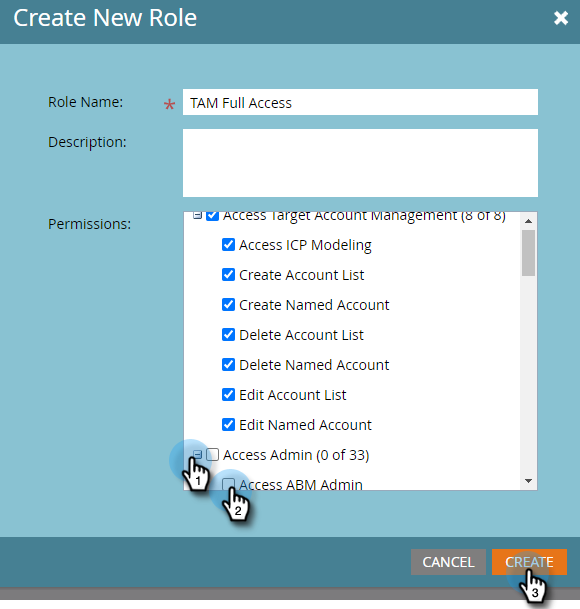

# Machtigingen {#permissions}

U zult toestemmingen voor uw gebruikers moeten plaatsen om TAM te kunnen gebruiken. Zo gaat het.

1. Klik op **[!UICONTROL Admin]**.

   

1. Klik op **[!UICONTROL Users & Roles]**.

   

   >[!NOTE]
   >
   >U kunt TAM-machtigingen toevoegen voor een bestaande rol of een geheel nieuwe rol maken. In dit voorbeeld wordt een nieuwe rol gebruikt.

1. Klik op **[!UICONTROL Roles]** en vervolgens op **[!UICONTROL New Role]** .

   

1. Voer een [!UICONTROL Role Name] in en klik op het pictogram **+** naast het selectievakje **[!UICONTROL Access Target Account Management]** .

   

1. Om _alle_ toestemmingen te selecteren, controleer eenvoudig checkbox. **[!UICONTROL Access Target Account Management]**

   

   >[!NOTE]
   >
   >U kunt ook slechts enkele opties selecteren. Doe dat door elk selectievakje afzonderlijk in te schakelen.

1. Klik op **+** om het menu **[!UICONTROL Access Admin]** te openen. Schakel het selectievakje **[!UICONTROL Access ABM Admin]** (ABM is de vorige naam voor TAM) in en klik op **[!UICONTROL Create]** .

   

   Uw nieuwe rol van TAM is nu klaar om [ aan een gebruiker ](/help/marketo/product-docs/administration/users-and-roles/managing-user-roles-and-permissions.md#assign-roles-to-a-user) worden toegewezen!
