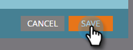

# Account Insight instellen {#set-up-account-insight}

Hieronder wordt beschreven hoe u Account Insight instelt.

>[!PREREQUISITES]
>
>De de rekeningsscore van TAM [&#x200B; moet &#x200B;](/help/marketo/product-docs/target-account-management/setup-tam/account-score.md) eerst worden gevormd.

1. Klik op **[!UICONTROL Admin]**.

   

1. Klik op **[!UICONTROL Target Account Management]** in de structuur en klik vervolgens op de tab **[!UICONTROL Sales]** .

   

1. Klik op **[!UICONTROL Edit]**.

   

1. Klik op de vervolgkeuzelijst om te bepalen hoe accounts waaraan een naam is toegekend, voorrang krijgen op benoemde accounts en betrokken personen.

   

   >[!NOTE]
   >
   >Als de [&#x200B; montages van de Score van de Rekening &#x200B;](/help/marketo/product-docs/target-account-management/setup-tam/account-score.md) op om het even welk punt worden bijgewerkt, moet de configuratie onder Verkoop door Admin worden bijgewerkt om ervoor te zorgen de scores nauwkeurig op de voorkeur van de gebruiker wijzen. De gebruiker moet zich afmelden en zich opnieuw aanmelden om de veranderingen te zien.

1. Klik op **[!UICONTROL Save]**.

   
