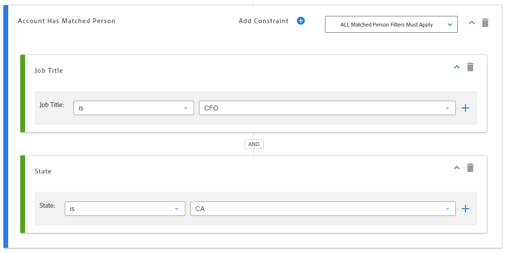

# Slimme accountlijsten {#account-smart-lists}

Hieronder wordt beschreven hoe u uw hoogwaardige accounts snel en nauwkeurig kunt identificeren.

>[!NOTE]
>
>Deze functie wordt ingeschakeld voor alle in aanmerking komende Marketo-instanties op de avond van dinsdag 11 mei.

>[!NOTE]
>
>Deze functie is alleen beschikbaar voor gebruikers met zowel TAM als de Adobe Marketo Engage Next-Gen gebruikerservaring ingeschakeld.

## Een slimme lijst voor een account maken {#create-an-account-smart-list}

1. Ga in Marketo naar **Marketingactiviteiten**.

   

1. Zoek en selecteer het gewenste programma.

   

1. Klik op de vervolgkeuzelijst **Nieuw** en selecteer **Nieuw lokaal element**.

   

1. Klik **Account Smart List**.

   

1. Voer een naam in en klik op **Maken** (Beschrijving en labels zijn optioneel).

   

Uw slimme lijst met accounts is gemaakt. Zie hieronder voor stappen over het definiëren van de regels.

## Regels {#account-smart-list-rules} voor slimme accountlijsten

De slimme Lijsten van de rekening werken zo gelijkaardig aan standaard Slimme Lijsten, met een opmerkelijke uitzondering: containers.

1. Als u uw slimme lijst met accounts wilt definiëren, klikt u op het tabblad **Regels voor slimme lijst met accounts**.

   

1. Kies de gewenste accountfilter(s). In dit voorbeeld kiezen wij _Industrie is Gezondheidszorg_.

   

   

1. Kies uw filter(s) voor overeenstemmende personen. In dit voorbeeld kiezen wij _Staat is Californië_.

   

**Optionele stap**: Hier komen containers. Als u een extra Gelijke Filter van de Persoon kiest, kunt u het onder eerste laten vallen, of _in_ het, creërend een container. In dit voorbeeld maken we een container door _Taaktitel is CFO_ toe te voegen.

Zo ziet de container eruit.

>[!NOTE]
>
>Als u een container met filters maakt, wordt de regel &quot;en&quot; gemaakt. Dit betekent dat alleen alle gecombineerde resultaten worden geretourneerd. In dit voorbeeld, rekeningen met een industrie van gezondheidszorg, samen met het worden gevestigd in Californië _en_ met iemand die als CFO wordt vermeld. Als u geen containers wilt gebruiken, laat u gewoon het filter onder of boven de bestaande onder- of boven.

En dat is het! Bekijk de onderstaande sectie om te zien hoe u de Smart List voor uw account kunt gebruiken.

>[!TIP]
>
>Net als bij standaard slimme lijsten kunt u geavanceerde logica gebruiken om de resultaten verder te verfijnen. Hiervoor hebt u ten minste drie filters nodig en in Account Smart List is één container (ongeacht het aantal filters dat de container zelf bevat) gelijk aan één filter.

## Handelingen voor slimme accountlijsten {#account-smart-list-actions}

Op het tabblad Overzicht van de slimme lijst met accounts ziet u enkele actieopties.

**Exporteren**: Hiermee exporteert u de resultaten van uw slimme accountlijst als een CSV-bestand.

**Klonen**: Hiermee maakt u een kopie van de slimme lijst voor uw account.

**Verzenden naar advertentienetwerk**: Hiermee verzendt u de lijst naar LinkedIn als een nieuw gekoppeld publiek.

U kunt ook verwijzen naar uw slimme lijst van de Rekening in een standaard Slimme Campagne/Lijst door _Personenlid van Slimme Lijst_ filter te gebruiken.

>[!NOTE]
>
>De resultaten van de slimme lijst Personen die lid zijn van account tonen elke persoon in de geïdentificeerde account(s), niet alleen de personen die via de filters Gelijktijdige persoon in de slimme lijst met accounts zijn gevonden.

>[!NOTE]
>
>**Definitie**
>
>**Smart List** voor personen die lid zijn van account: In dit geval verwijst het woord &quot;lid&quot; naar de rekening zelf, dus &quot;persoon lid&quot; betekent de werkelijke personen (Marketo-administratie) in die rekeningen.
