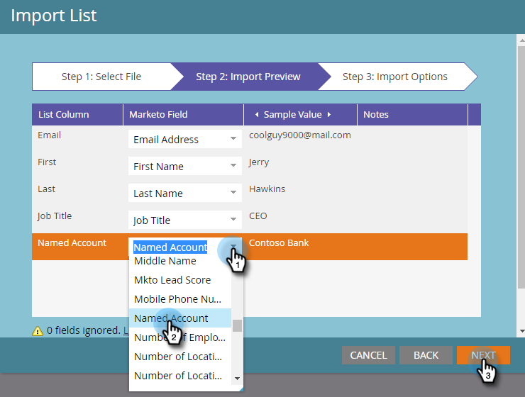
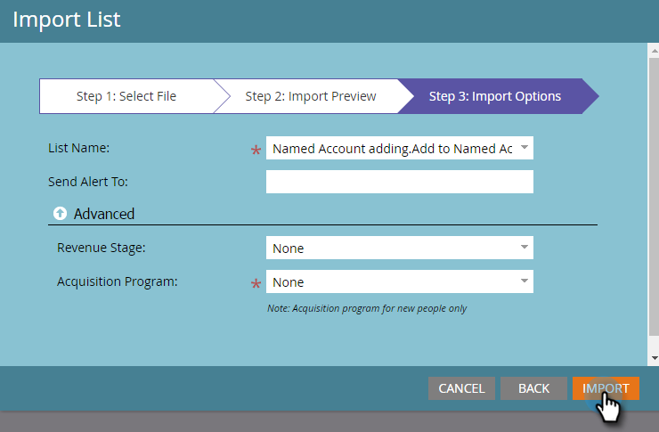

# Personen toevoegen aan een [!UICONTROL Named Account] {#add-people-to-a-named-account}

Er zijn drie verschillende manieren om mensen aan een genoemde rekening in TAM manueel toe te voegen.

## Single Flow-actie {#single-flow-action}

1. Klik op **[!UICONTROL Database]**.

   

1. Voer het e-mailadres van de persoon in en druk op Enter.

   

1. Klik op de persoon om deze te selecteren. Klik op de vervolgkeuzelijst **[!UICONTROL Person Actions]** , klik op **[!UICONTROL Marketing]** en selecteer **[!UICONTROL Add to Named Account...]** .

   

1. Klik op de vervolgkeuzelijst **[!UICONTROL Named Account]** , selecteer de gewenste [!UICONTROL Named Account] en klik op **[!UICONTROL Run Now]** .

   

## Stroom van slimme campagne {#smart-campaign-flow-step}

1. Selecteer uw slimme campagne en klik op **[!UICONTROL Flow]** .

   

1. Typ &quot;[!UICONTROL Add to Named Account]&quot; in het zoekvak.

   

1. Sleep het filter naar het canvas.

   

1. Klik op de vervolgkeuzelijst **[!UICONTROL Named Account]** en selecteer de gewenste [!UICONTROL Named Account] .

   

   Dat is het! Start vervolgens gewoon uw slimme campagne (of activeer deze) en de flowstap begint gekwalificeerde personen toe te voegen aan het toegewezen benoemde account.

## Lijstimport {#list-import}

1. Selecteer de lijst, klik op de vervolgkeuzelijst **[!UICONTROL List Actions]** en selecteer **[!UICONTROL Import List]** .

   

1. Klik op **[!UICONTROL Next]** nadat u het bestand en de instellingen hebt gekozen.

   

1. Wijs de gewenste velden toe. Controleer of het veld **[!UICONTROL Named Account]** is toegewezen.

   

1. Kies de gewenste instellingen en klik op **[!UICONTROL Import]** .

   

>[!MORELIKETHIS]
>
>[&#x200B; Lood aan de Vergelijking van de Rekening &#x200B;](/help/marketo/product-docs/target-account-management/target/named-accounts/lead-to-account-matching.md)
