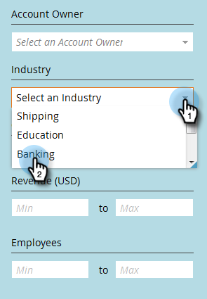

# Filteren in benoemde accounts {#filtering-in-named-accounts}

Filteren is een geweldige manier om gegevens snel omlaag te brengen.

>[!NOTE]
>
>Gegevens in filterdrop-down wijzen op alle beschikbare gebieden in uw CRM die aan Marketo zijn gesynchroniseerd.

1. Klik op het filterpictogram.

   

   >[!NOTE]
   >
   >Er zijn verschillende combinaties van zoekparameters. In dit voorbeeld vinden we het volgende: _Industrie = Bankwezen, Land = Verenigde Staten, Max. werknemers = 10000_.

1. Klik op de vervolgkeuzelijst **Industrie** en selecteer **Bankwezen**.

   

1. Klik op de vervolgkeuzelijst **Land** en selecteer **Verenigde Staten**.

   

1. Typ onder **Werknemers** &quot;0&quot; in het veld **Min**, &quot;10000&quot; in het veld **Max** en klik vervolgens op **Toepassen**.

   

   En dat is het! De gefilterde resultaten worden aan de linkerkant van het scherm weergegeven.

   >[!NOTE]
   >
   >Als u meer filters wilt toevoegen waaruit u kunt kiezen, klikt u op **Filter toevoegen** linksonder in het formulier.
