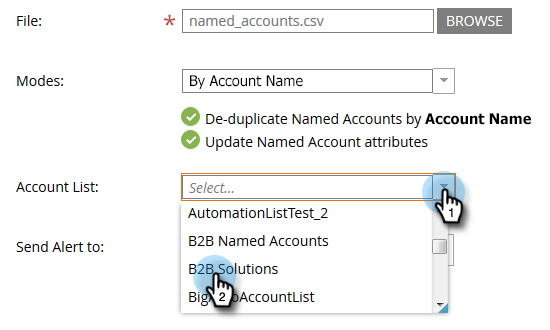

# Importeren [!UICONTROL Named Accounts] {#import-named-accounts}

Beschikt de CSV al over een volledig overzicht van de potentiële doelrekeningen? Importeer ze rechtstreeks in TAM!

1. Klik op de vervolgkeuzelijst **[!UICONTROL New]** en selecteer **[!UICONTROL Import Named Accounts]** .

   

1. Er wordt een nieuw venster geopend. Klik op **[!UICONTROL Browse]** en selecteer het bestand met benoemde accounts die u wilt importeren.

   

   >[!TIP]
   >
   >In uw dossier, verstrek [&#x200B; zoveel informatie &#x200B;](/help/marketo/product-docs/target-account-management/target/named-accounts/named-account-overview.md#named-account-attributes) mogelijk. U kunt alleen firmografische informatie toevoegen; Marketo berekent niets (bijv. Pipeline). Als u benoemde accounts wilt maken op basis van CRM-accounts, exporteert u gewoon de naam van de account en de CRM-id van uw CRM naar een CSV-bestand, gebruikt u de optie Accountnaam en wijst u de CRM-id toe tijdens het importproces. Om een rekening van CRM aan een genoemde rekening behoorlijk te verbinden, moet u de nauwkeurige naam van de rekening verstrekken CRM.

1. Kies uit twee deduplicatiemodi: Accountnaam of Domeinnaam. In dit voorbeeld kiezen we Account. Klik op de vervolgkeuzelijst **[!UICONTROL Modes]** en selecteer **[!UICONTROL By Account Name]** .

   

   >[!NOTE]
   >
   >Als u **[!UICONTROL By Domain Name]** kiest, moeten zowel de benoemde account als de domeinvelden worden opgenomen.

1. Als u wilt kiezen aan welke accountlijst uw benoemde account wordt toegevoegd, klikt u op de vervolgkeuzelijst **[!UICONTROL Account List]** en selecteert u deze.

   

   >[!NOTE]
   >
   >U kunt ook een gloednieuw [!UICONTROL Account List] maken door de naam ervan in de keuzelijst te typen.

1. Als u een bericht over het importeren wilt verzenden, klikt u op de vervolgkeuzelijst **[!UICONTROL Send Alert To]** en selecteert u een Marketo-gebruiker. U _kunt niet_ manueel een e-mailadres ingaan.

   

1. Klik op **[!UICONTROL Next]**.

   

1. Wijs elk veld toe door te dubbelklikken op de vervolgkeuzelijst **[!UICONTROL Marketo Field]** en het desbetreffende veld te selecteren. Klik op **[!UICONTROL Next]** als u klaar bent.

   

   Succes!

   

   >[!NOTE]
   >
   >Met Importstatus controleren worden alleen de laatste drie dagen van de activiteit weergegeven.

Scenario&#39;s wanneer u dedupliceert [!UICONTROL by Account Name] :

<table>
 <tbody>
  <tr>
   <td><strong>Het invoeren van verslag met bestaande  Benoemde naam van de Rekening </strong></td>
   <td>
We zullen de bestaande record bijwerken
</td>
  </tr>
  <tr>
   <td><strong>Het invoeren van verslag met nieuwe  Benoemde naam van de Rekening </strong></td>
   <td>We maken een nieuw record</td>
  </tr>
 </tbody>
</table>

Scenario&#39;s wanneer u dedupliceert [!UICONTROL by Domain Name] :

<table>
 <tbody>
  <tr>
   <td><strong>Record met een nieuwe accountnaam en een nieuwe domeinnaam importeren</strong></td>
   <td>Wij zullen een nieuwe  Benoemde Rekening  met verstrekte info tot stand brengen</td>
  </tr>
  <tr>
   <td><strong>Record importeren met een bestaande accountnaam en bestaande domeinnaam</strong></td>
   <td>Wij zullen de bestaande  Genoemde Rekening  bijwerken</td>
  </tr>
   <tr>
   <td><strong>Record importeren met een nieuwe accountnaam en een bestaande domeinnaam</strong></td>
   <td>Wij zullen de nieuwe rekeningsnaam aan de bestaande  Benoemde Rekening  toevoegen die de domeinnaam aanpast en andere info (d.w.z. Industrie, Staat, enz.) bijwerkt</td>
  </tr>
  <tr>
   <td><strong>Het invoeren van verslag met bestaand  Genoemde Naam van de Rekening  &amp; nieuwe domeinnaam</strong></td>
   <td>Wij zullen de nieuwe domeinnaam aan de bestaande  Benoemde Rekening  toevoegen die de rekeningsnaam aanpast en andere info (d.w.z. Industrie, Staat, enz.) bijwerkt</td>
  </tr>
 </tbody>
</table>

>[!NOTE]
>
>Wanneer Marketo een account met een naam toevoegt, wordt een regel (achter de schermen) bijgewerkt waarmee we personen kunnen identificeren die deel moeten uitmaken van de [!UICONTROL Named Account] . Voorbeeld: als u &quot;IBM&quot; bijwerkt naar &quot;IBM, USA&quot;, worden personen met een van beide bedrijfsnaam gekoppeld aan de [!UICONTROL Named Account] .

Als Marketo records vindt die we als duplicaten zien, zullen we alleen de eerste verwerken.
