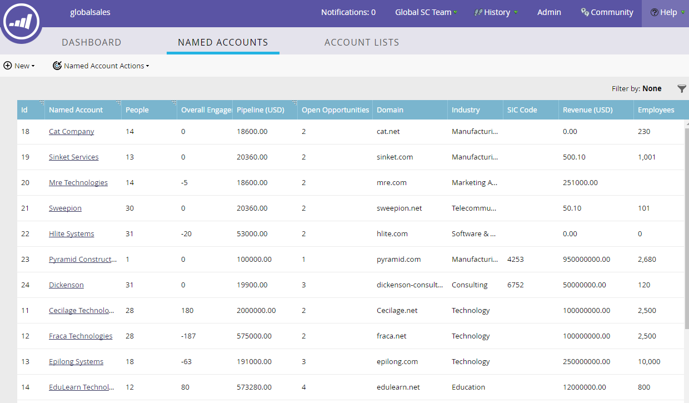

# [!UICONTROL Named Account] Overzicht {#named-account-overview}

[!UICONTROL Named Accounts] bewaar de mensen van de bedrijven u richt. Het dashboard biedt de huidige gegevens van elk kenmerk voor al uw benoemde accounts.

## [!UICONTROL Named Accounts] Dashboard {#named-accounts-dashboard}

>[!TIP]
>
>Benoemde accounts worden standaard gesorteerd op Aanmaakdatum, maar u kunt sorteren op elke kolom met een sorteerpictogram in de koptekst.

>[!NOTE]
>
>Marketo geeft alle CRM-gebruikers weer die in Marketo zijn gesynchroniseerd als filterwaarden van &quot;Account Owner&quot; of &quot;Member of Account Team&quot;.

## [!UICONTROL Named Account] Kenmerken {#named-account-attributes}

<table> 
 <tbody> 
  <tr> 
   <td><strong>Id</strong></td> 
   <td>Identificatienummer van benoemde account</td> 
  </tr> 
  <tr> 
   <td><strong>Benoemd account</strong></td> 
   <td>Naam van benoemde account</td> 
  </tr> 
  <tr> 
   <td><strong>Mensen</strong></td> 
   <td>Hoeveelheid personen toegewezen aan benoemde account</td> 
  </tr> 
  <tr> 
   <td><strong>Pijpleiding</strong></td> 
   <td>Som van Bedrag van alle kansen in uw systeem van CRM die niet Gesloten Won of Gesloten Verloren zijn</td> 
  </tr> 
  <tr> 
   <td><strong>Open kansen</strong></td> 
   <td>Alle kansen in uw CRM die niet Gesloten Won of Gesloten Verlies zijn.</td> 
  </tr> 
  <tr> 
   <td><strong>Domein</strong></td> 
   <td>Domein van benoemde account (bijvoorbeeld marketo.com)</td> 
  </tr> 
  <tr> 
   <td><strong>Marktsegment</strong></td> 
   <td>Type bedrijfstak toegekend aan Benoemde Rekening</td> 
  </tr> 
  <tr> 
   <td><strong>SIC-code</strong></td> 
   <td><strong> Standaard van 0} S </strong> I <strong> industriële </strong> C <strong> classificatie - viercijfercode voor het classificeren van industrieën</strong> </td> 
  </tr> 
  <tr> 
   <td><strong>Ontvangsten</strong></td> 
   <td>Jaarlijkse inkomsten van de onderneming</td> 
  </tr> 
  <tr> 
   <td><strong>Werknemers</strong></td> 
   <td>Aantal werknemers dat wordt toegerekend aan een Benoemde Rekening</td> 
  </tr> 
  <tr> 
   <td colspan="1"><strong>Accountscore</strong></td> 
   <td colspan="1">Geaggregeerde leadscores van meerdere leads voor score op accountniveau</td> 
  </tr> 
  <tr> 
   <td colspan="1"><strong>Stad</strong></td> 
   <td colspan="1">Plaats van benoemde account</td> 
  </tr> 
  <tr> 
   <td colspan="1"><strong>Staat/regio</strong></td> 
   <td colspan="1">Status of regio van benoemde account</td> 
  </tr> 
  <tr> 
   <td colspan="1"><strong>Land</strong></td> 
   <td colspan="1">Land van benoemde account</td> 
  </tr> 
  <tr> 
   <td colspan="1"><strong>Gemaakt op</strong></td> 
   <td colspan="1">De datum waarop het benoemde account is gemaakt</td> 
  </tr> 
  <tr> 
   <td colspan="1"><strong>Eigenaar account</strong></td> 
   <td colspan="1">Eigenaar van opgegeven account</td> 
  </tr> 
  <tr> 
   <td colspan="1"><strong>Accountteamleden</strong></td> 
   <td colspan="1">Lid van de groep van belanghebbenden die samenwerken aan specifieke rekeningen</td> 
  </tr> 
 </tbody> 
</table>
