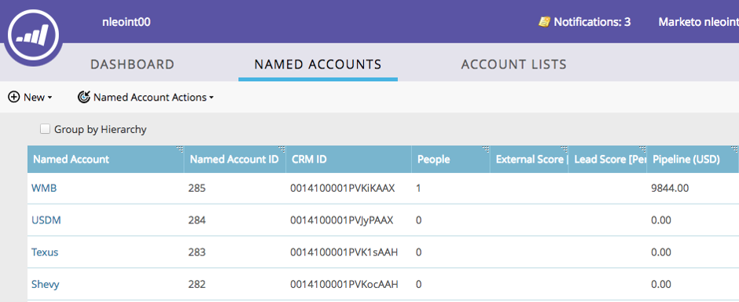

# TAM-hiërarchie {#tam-hierarchies}

De hiërarchieën geven de gebruikers van TAM de capaciteit om de ouder/kindverhoudingen tussen Benoemde Rekeningen in hun CRM te erven.

## Wat zijn TAM-hiërarchieën? {#what-are-tam-hierarchies}

Ondernemingen kunnen meerdere divisies en dochterondernemingen hebben. Die bedrijven organiseren zich vaak door ouder-kind verhoudingen genoemd hiërarchieën. TAM kan deze hiërarchieën van uw integratie van SFDC of MSD erven en u toestaan om met de verschillende afdelingen als één enkele familie te werken.

## Werken met TAM-hiërarchieën {#working-with-tam-hierarchies}

Met de Hiërarchieën van TAM, kunt u informatie over een volledige hiërarchie of individuele rekeningen in het Benoemde dashboard van de Rekening snel verkrijgen.

**Geen hiërarchie gebruiken**

**Hiërarchie gebruiken**

>[!NOTE]
>
>De interface Marketo wordt slechts weergegeven tot 10 niveaus omlaag (onderliggende en onderliggende accounts van de bovenliggende account), maar er is geen limiet aan het aantal onderliggende accounts dat u kunt maken.

Doel en rapport over volledige hiërarchieën met [één klik](/help/marketo/product-docs/target-account-management/engage/account-filters.md#member-of-named-account).

