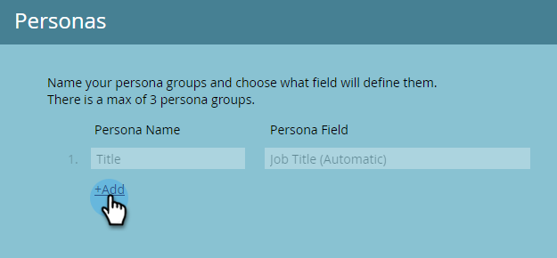

# Persoonlijke gegevens gebruiken {#using-personas}

Persona&#39;s zijn een geweldige manier om uw ABM-publiek en -markt te segmenteren tot een bepaalde groep mensen.

## Een persoon toevoegen {#add-a-persona}

1. Klik in Mijn Marketo op **Beheer**.

   

1. Selecteer in de boomstructuur de optie **Doelaccountbeheer**.

   

1. Klikken **Bewerken**.

   

   >[!NOTE]
   >
   >De persoon van de Titel van de Baan is inbegrepen door gebrek. Kan niet worden gewijzigd of verwijderd.

1. Als u aanvullende personen wilt toevoegen, klikt u op **+Toevoegen**.

   

1. Geef uw persoon een naam en selecteer het desbetreffende veld in de vervolgkeuzelijst. U kunt maximaal twee extra persona&#39;s toevoegen. Klikken **Opslaan** wanneer gereed.

   

   >[!NOTE]
   >
   >Alleen aangepaste Salesforce-velden van het type &quot;picklist&quot; die zijn gesynchroniseerd naar uw Marketo-instantie, zijn beschikbaar in de vervolgkeuzelijst voor persoonlijke velden wanneer u een persona maakt.

## Je persoonlijke gegevens weergeven {#view-your-personas}

Bekijk uw persoonlijke gegevens door een specifiek Benoemd account te bezoeken.

1. Selecteer het gewenste account met naam.

   

1. Klik op de knop **Personas** tab.

   

1. Al uw persona&#39;s worden vermeld. Klik op een nummer om de lijst met personen weer te geven.

   

   >[!NOTE]
   >
   >De X in de Title Persona fungeert als een jokerteken. &#39;CXO&#39; omvat bijvoorbeeld CEO&#39;s, CFO&#39;s, enzovoort.

## Persona Filters {#persona-filters}

1. Gebruik persona-filters in een slimme lijst om op de markt te brengen voor een specifieke groep personen.

