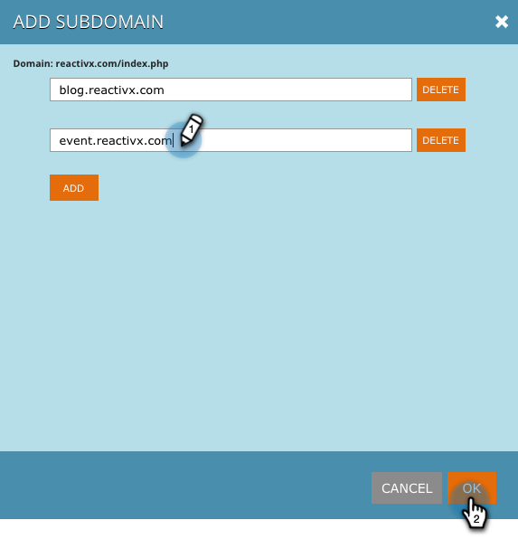

# Subdomeinen toevoegen in [!UICONTROL Account Settings] {#add-subdomains-in-account-settings}

Hieronder wordt beschreven hoe u subdomeinen kunt toevoegen aan uw primaire domeinen in [!UICONTROL Account Settings] . Dit zal u toestaan om subdomeinen met betrekking tot specifiek Javascript RTP van uw primair domein te beheren. U wordt aangeraden de tag [!DNL Javascript] toe te passen op toegevoegde subdomeinen.

1. Ga in Web Personalization naar **[!UICONTROL Account Settings]** .

   

1. Op de pagina van de Configuratie van het Domein, zult u een lijst van alle primaire domeinen zien verbonden aan uw rekening. In elke sectie wordt eerst het primaire domein weergegeven (hieronder gemarkeerd), gevolgd door eventuele subdomeinen. Klik op **[!UICONTROL Add Subdomain]**.

   

1. Klik op **[!UICONTROL Add]**.

   

1. Voer de URL van het subdomein in. Klik op **[!UICONTROL Add]** of **[!UICONTROL Delete]** om de lijst met subdomeinen te beheren en klik vervolgens op **[!UICONTROL OK]** wanneer u klaar bent.

   

1. Het zojuist toegevoegde subdomein wordt nu weergegeven.

   

   >[!NOTE]
   >
   >Als u _primaire_ domeinen aan uw rekening wilt toevoegen, gelieve [ de Steun van Marketo ](https://nation.marketo.com/t5/Support/ct-p/Support) te contacteren.
