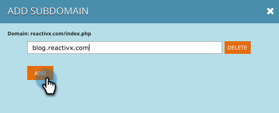

# Subdomeinen toevoegen aan accountinstellingen {#add-subdomains-in-account-settings}

Hier is hoe te om subdomeinen aan uw primaire domeinen in de Montages van de Rekening toe te voegen. Dit zal u toestaan om subdomeinen met betrekking tot specifiek Javascript RTP van uw primair domein te beheren. U wordt aangeraden de Javascript-tag in te zetten op toegevoegde subdomeinen.

1. Ga in Persoonlijke webweergave naar **Accountinstellingen**.

   

1. Op de pagina van de Configuratie van het Domein, zult u een lijst van alle primaire domeinen zien verbonden aan uw rekening. In elke sectie wordt eerst het primaire domein weergegeven (hieronder gemarkeerd), gevolgd door eventuele subdomeinen. Klikken **Subdomein toevoegen**.

   

1. Klikken **Toevoegen**.

   

1. Voer de URL van het subdomein in. Klikken **Toevoegen** of **Verwijderen** om uw lijst van subdomeinen te beheren, dan klik **OK** als je klaar bent.

   

1. Het zojuist toegevoegde subdomein wordt nu weergegeven.

   

   >[!NOTE]
   >
   >Als u wilt toevoegen _primair_ domeinen voor uw account, neem contact op met [Marketo-ondersteuning](https://nation.marketo.com/t5/Support/ct-p/Support).
