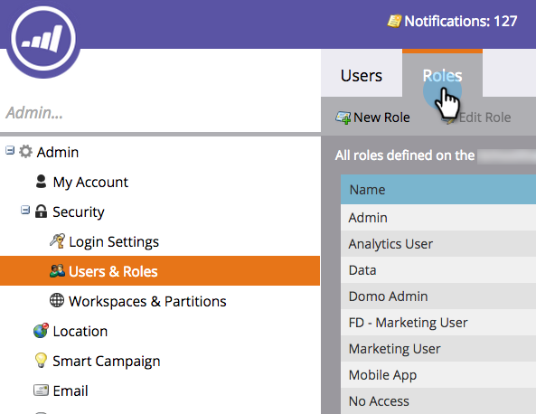
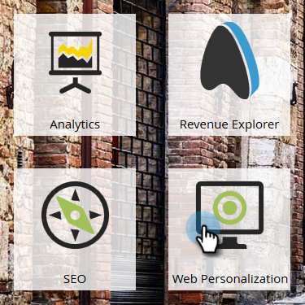

# Aanmelding en gebruikersbeheer {#login-and-user-management}

## Een [!UICONTROL Web Personalization] gebruikersrol maken {#create-a-web-personalization-user-role}

1. Ga naar de sectie **[!UICONTROL Admin]** en klik vervolgens op **[!UICONTROL Users & Roles]** .

   

1. Klik op **[!UICONTROL Roles]**.

   

   >[!NOTE]
   >
   >Als de Web Personalization (WP) gebruikersrol reeds bestaat, zorg ervoor het zoals aangetoond in Stap 4 wordt gevormd.

1. Klik op **[!UICONTROL New Role]**.

   

1. Voer een [!UICONTROL Role Name] in en selecteer [!UICONTROL Permissions] . Klik **[!UICONTROL Create]** (deze rol moet [ op alle werkruimten ](/help/marketo/product-docs/administration/users-and-roles/managing-marketo-users.md) van toepassing zijn).

   

   >[!TIP]
   >
   >Om gebruikerstoestemming te geven om tot alles in het richten en Personalization toegang te hebben, ben zeker om _alle_ checkboxes te selecteren.

## [!UICONTROL Web Personalization]- en voorspellende-inhoudmachtigingen {#web-personalization-and-predictive-content-user-permissions}

**[!UICONTROL Targeting and Personalization]**: de gebruiker heeft alleen weergavemachtigingen als deze machtiging alleen is geselecteerd.

**[!UICONTROL Admin Web Personalization + Predictive]**: de gebruiker heeft alleen toegang tot de instellingen Account Settings en Content voor Web Personalization en de toepassing Predictive Content. Gebruikers kunnen pagina&#39;s in de app weergeven, maar beschikken niet over de machtigingen voor maken, bewerken, verwijderen en starten.

**[!UICONTROL Predictive Content Editor]**: de gebruiker heeft editortoegang tot de toepassing Predictive Content. Met deze machtiging kunt u inhoudsonderdelen maken, bewerken en verwijderen. Inhoud kan niet worden ingeschakeld voor voorspellend gebruik op internet of e-mail.

**[!UICONTROL Predictive Content Launcher]**: de gebruiker heeft toegang tot alle functies voor voorspellende inhoud, behalve Account en Content Settings. Met deze machtiging kunt u inhoudsonderdelen maken, bewerken en verwijderen en inschakelen.

**[!UICONTROL Web Campaign Editor]**: gebruiker heeft editortoegang tot alle Web Personalization-functie om webcampagnes te maken, te bewerken en te verwijderen, maar niet te starten.

**[!UICONTROL Web Campaign Launcher]**: de gebruiker heeft toegang tot alle Personalization-toepassingsfuncties op het web, behalve Account en Content Settings. Met deze machtiging kunt u webcampagnes maken, bewerken, verwijderen en starten.

## WP-rol toewijzen aan gebruiker {#assign-wp-role-to-user}

1. Ga naar **[!UICONTROL Users]** .

   

1. Selecteer de gebruiker om WP toegang tot te verlenen en **[!UICONTROL Edit User]** te klikken.

   

1. Selecteer de WP gebruikersrol voor alle werkruimten.

   

1. De volgende keer dat gebruikers zich aanmelden, wordt in Mijn Marketo de tegel **[!UICONTROL Web Personalization]** weergegeven.

   
