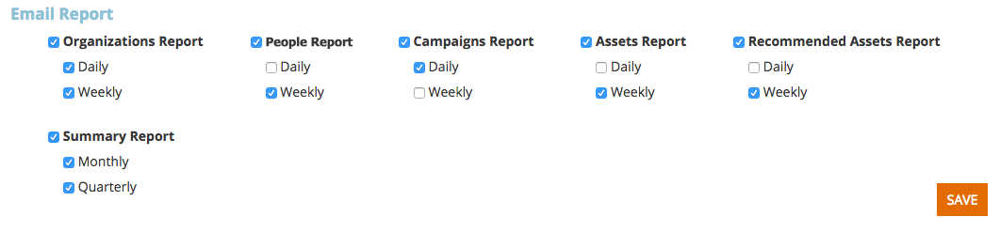

# [!UICONTROL User Settings] {#user-settings}

Wijzig instellingen zoals tijdzone- of Web Personalization-e-mailrapporten.

## Gebruikersprofiel / Wachtwoorden / Tijdzones {#user-profile-passwords-time-zones}

1. Klik op uw naam en selecteer **[!UICONTROL User Settings]** .

   

1. De pagina [!UICONTROL User Settings] wordt weergegeven.

   

   Op de pagina [!UICONTROL User Settings] kunt u:

   * Je e-mailadres wijzigen
   * Persoonlijke gegevens toevoegen (voornaam en achternaam, mobiel nummer en tijdzone)
   * Selecteer het aantal rijen dat u wilt exporteren bij het exporteren van tabellen in het platform. Zie veld: &quot;Max. aantal rijen in Excel-export (beperkt tot 10.000)&quot;
   * Selecteer uw [!UICONTROL Mobile Notification] voor een nieuwe persoon of controlelijst voor de mobiele toepassing
   * Pas de instellingen van Persoonlijk gebied aan door op **[!UICONTROL Edit Regions]** te klikken.
   * Uw wachtwoord wijzigen
   * Selecteer de meldingsinstellingen voor e-mailrapporten voor organisaties, personen, campagnes en bedrijfsmiddelen

   Klik op **[!UICONTROL Save]** nadat u wijzigingen hebt aangebracht.

   >[!NOTE]
   >
   >Als u uw regio selecteert, worden alleen gegevens weergegeven en e-mailrapporten verzonden die betrekking hebben op organisaties en personen uit het gedefinieerde gebied.

## E-mailrapporten selecteren {#select-email-reports}

Selecteer welke [[!UICONTROL Email Report]](/help/marketo/product-docs/web-personalization/reporting-for-web-personalization/email-reports.md) aan uw gebruiker, en frequentie ([!UICONTROL Daily], [!UICONTROL Weekly] of [!UICONTROL Quarterly]) moet associëren wanneer het rapport zal worden verzonden.

>[!NOTE]
>
>Als u op **[!UICONTROL Save]** klikt, wordt u niet afgesloten met Gebruikersinstellingen. Als u wilt afsluiten, klikt u op het Marketo-logo linksboven en selecteert u de bestemming.

>[!MORELIKETHIS]
>
>[ geef Gebieden ](/help/marketo/product-docs/web-personalization/getting-started/edit-regions.md) uit
