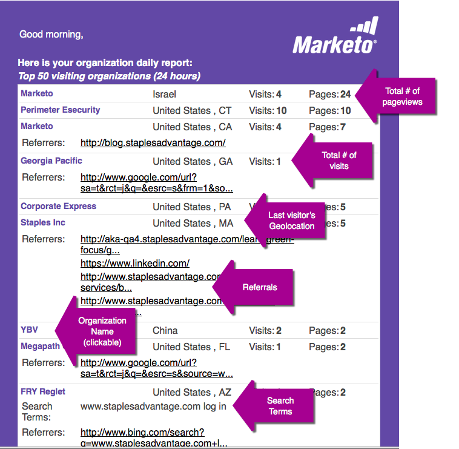
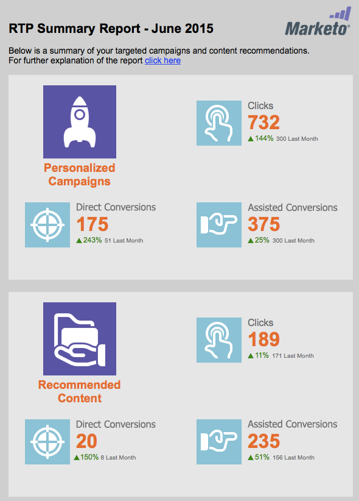

# E-mailrapporten {#email-reports}

Zie de [[!UICONTROL User Settings] sectie ](/help/marketo/product-docs/web-personalization/getting-started/user-settings.md) als u wilt aanpassen welk geautomatiseerd e-mailrapport de gebruiker ontvangt.

## Web Personalization-e-mailrapporten {#web-personalization-email-reports}

Dagelijkse of wekelijkse e-mailrapporten worden verzonden naar het e-mailadres van de gebruiker met de meest recente prestatiegegevens van organisatie, persoon, campagne en middelen.

De volgende rapporten zijn beschikbaar:

## Dagelijks/wekelijks rapport van organisaties {#daily-weekly-organizations-report}

Het dagelijkse/wekelijkse rapport stuurt de gebruiker een e-mail van de 50 belangrijkste bezoekende organisaties, met inbegrip van de naam van de Organisatie, de plaats, het aantal bezoeken, paginameningen en verwijzingsplaats of gebruikte onderzoekstermijn.

## Dagelijks/wekelijks Persverslag {#daily-weekly-people-report}

Het dagelijkse/wekelijkse Rapport van Mensen stuurt de gebruiker een e-mail van de recentste 100 mensen van de website volgens: het e-mailadres van de persoon, de naam van de organisatie, de plaats, de staat, de datum van persoonopname en segmenten die die persoon tot behoort.

## [!UICONTROL Top Performing Real-time Campaigns] {#top-performing-real-time-campaigns}

Met het rapport Best Performance Real-Time Campaigns (Meest uitvoerende realtime campagnes) wordt de gebruiker een e-mail gestuurd met de beste uitvoerende campagnes in real time, met daarin de naam van de campagne, de indrukkingen, de kliks, het segment waarop de campagne heeft gereageerd en de conversiesnelheid van de campagne.

## Best presterende Assets-rapport {#top-performing-assets-report}

Met het best presterende Assets-rapport wordt de gebruiker een e-mail gestuurd met de best presterende content-elementen, waarin de elementnaam en het percentage overeenkomsten worden weergegeven in vergelijking met andere middelen.

## Aanbevolen Assets-rapport {#recommended-assets-report}

Met het rapport Aanbevolen Assets wordt de gebruiker een e-mail gestuurd met alle inhoud en het aantal klikken dat is gegenereerd door inhoud die wordt weergegeven in de Content Recommendation Engine.

## Samenvattingsrapport {#summary-report}

Het overzichtsrapport verstuurt de gebruiker een e-mail (maandelijks of driemaandelijks) van alle campagnes en de aanbevolen prestaties van de Inhoud op basis van het aantal klikken en het aantal (directe of ondersteunde) personen dat betrokken was bij de Gepersonaliseerde Campagne of Aanbevolen Inhoud en vervolgens bekend werd. Het verslag vergelijkt de resultaten met de vorige maand of het vorige kwartaal.

>[!NOTE]
>
>**Definities**
>
>**[!UICONTROL Direct Conversions]**: Een webbezoeker die op een gepersonaliseerde campagne of aanbevolen inhoud klikt en die tijdens dezelfde bezoekerssessie een formulier op de website invult, vult het desbetreffende e-mailadres in.
>
>**[!UICONTROL Assisted Conversions]**: Een webbezoeker die elk formulier op de website invult en zijn e-mailadres verlaat terwijl hij tijdens een vorig bezoek (in de laatste zes maanden) op een gepersonaliseerde campagne of een aanbevolen inhoudsbestand heeft geklikt.

>[!NOTE]
>
>Marketo Web Personalization legt het e-mailadres van de webbezoeker vast voor elk formulier dat op de website is ingevuld. Dit wordt weergegeven op de pagina [!UICONTROL Web Personalization] [!UICONTROL People] en is de persoon die wordt gebruikt in het rapport Overzicht.

Om aan te passen welk geautomatiseerd e-mailrapport de gebruiker ontvangt, zie de [ sectie van de Montages van de Gebruiker ](/help/marketo/product-docs/web-personalization/getting-started/user-settings.md).
