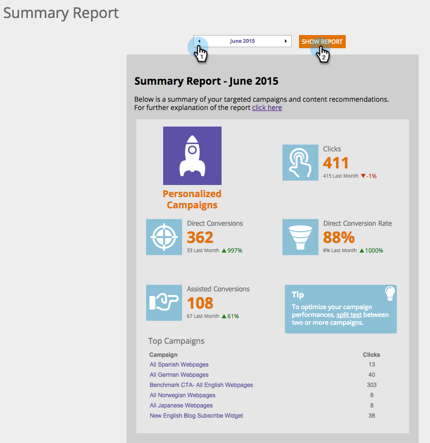

# Het overzichtsrapport {#understanding-the-summary-report}

Het overzichtsrapport is een maandelijkse weergave van alle campagnes en aanbevolen prestaties van de inhoud. Het is gebaseerd op het aantal klikken en het aantal leads (direct of ondersteund) dat betrokken was bij de gepersonaliseerde campagne of aanbevolen inhoud en vervolgens een bekende lead werd. Het rapport vergelijkt de resultaten met de vorige maand.

>[!NOTE]
>
>**Definitie**
>
>Directe omzetting: Een webbezoeker die op een gepersonaliseerde campagne of aanbevolen inhoudsbron klikt en tijdens dezelfde sessie gaat verder met het invullen van elk formulier op de website met het e-mailadres.
>
>Ondersteunde conversie: Een webbezoeker die elk formulier op de website invult en zijn e-mailadres verlaat, die tijdens een vorig bezoek (in de laatste zes maanden) op een gepersonaliseerde campagne of aanbevolen inhoudsbestand heeft geklikt.

Ga in Persoonlijke webweergave naar **Analyse** en **Samenvattingsrapport**.

Selecteren **Maand** en klik op **Rapport tonen**.

Het eerste deel van het rapport heeft betrekking op Persoonlijke de campagnes en vertoningen van de Personalisering van het Web:

* **Klikken** - alle klikken op webpersonalisatiecampagnes
* **Directe conversies** - alle bezoekers die tijdens het bezoek op een webpersonalisatiecampagne hebben geklikt en een formulier hebben ingevuld
* **Directe conversiesnelheid** - het percentage bezoekers dat een directe lead werd nadat op een webpersonalisatiecampagne werd geklikt. Directe leads gedeeld door klikken
* **Bijgewerkte conversies** - alle bezoekers die een formulier hebben ingevuld en tijdens een vorig bezoek (in de afgelopen zes maanden) op een webpersonalisatiecampagne hebben geklikt
* **Tips** - tips voor het optimaliseren van de prestaties van uw webpersonalisatiecampagnes
* **Bovenste campagnes** - de campagnes die tijdens de geselecteerde tijdsperiode het meest worden uitgevoerd, geordend door het aantal klikken

Het tweede deel van het rapport heeft betrekking op Aanbevolen Inhoud van de motor van de inhoudaanbeveling van de Aanpassing van het Web. Het toont:

* **Klikken** - klik op Web Personalization aanbevolen content
* **Directe conversies** - alle bezoekers die tijdens hun bezoek op aanbevolen inhoud hebben geklikt en een formulier hebben ingevuld
* **Directe conversiesnelheid** - het percentage bezoekers dat een directe lead werd nadat op aanbevolen inhoud werd geklikt. Directe leads gedeeld door klikken
* **Bijgewerkte conversies** - alle bezoekers die een formulier hebben ingevuld en tijdens een vorig bezoek (in de afgelopen zes maanden) op aanbevolen inhoud hebben geklikt.
* **Tips** - tips om te optimaliseren met de Content Recommendation Engine
* **Top Recommendations** - de best presterende aanbevolen inhoud tijdens de geselecteerde tijdsperiode, geordend door het aantal klikken

>[!NOTE]
>
>Met Marketo Web Personalization wordt het e-mailadres van de webbezoeker vastgelegd voor elk formulier dat op de website is ingevuld. Dit wordt bekeken in de pagina van de Leidingen van de Personalisatie van het Web en is de lood die in het Samenvattingsrapport wordt gebruikt.
