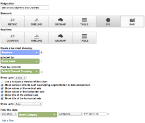
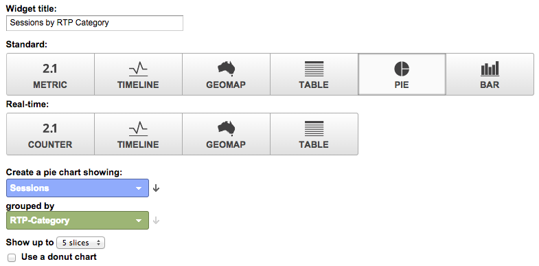
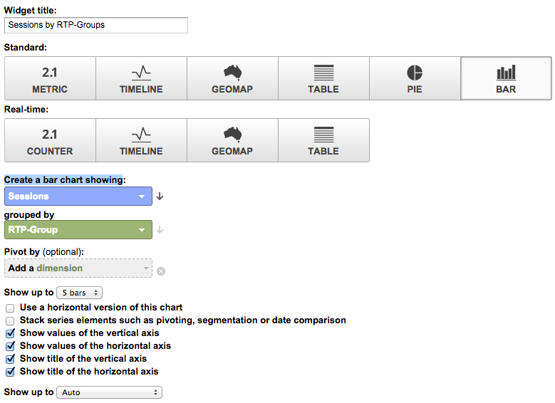
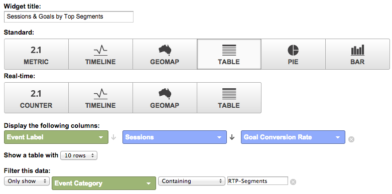

# Aangepaste RTP-dashboards in Google Universal Analytics {#custom-rtp-dashboards-in-google-universal-analytics}

>[!PREREQUISITES]
>
>[ integreer RTP met de Universele Analytics van Google ](/help/marketo/product-docs/web-personalization/reporting-for-web-personalization/web-analytics-integrations/integrate-rtp-with-google-universal-analytics.md)

In dit artikel wordt uitgelegd hoe u RTP-dashboards kunt instellen in Google Universal Analytics (GUA). De gegevens die van RTP naar GUA worden verzonden kunnen opstelling als twee afzonderlijke geroepen douanedashboards zijn:

* RTP B2B
* RTP-betrokkenheid

## Een aangepast dashboard instellen {#setting-up-a-custom-dashboard}

1. Meld u aan bij Google Analytics. Klik op **[!UICONTROL Reporting]** in het bovenste menu. Klik op **[!UICONTROL Dashboards]** en **[!UICONTROL New Dashboard]** .

   

1. Selecteer **Lege Canvas**, voeg de Naam van het a **Dashboard** toe en klik **[!UICONTROL Create Dashboard]**.

1. Klik op **[!UICONTROL Add Widget]** om een nieuwe widget te maken.

   

## RTP B2B-dashboard {#rtp-b-b-dashboard}

Met dit dashboard kunnen gebruikers de prestaties van hun website analyseren vanuit een B2B-perspectief.

Het verstrekt informatie zoals bezoekbron en onsite gedrag door industrie, opbrengst, grootte, op rekening-Gebaseerde lijsten, en doelsegmenten.

Het dashboard bestaat uit drie kolommen

* verkeersbron
* Segmentatie
* Ingebouwde boor omlaag

1. Creeer een nieuw dashboard genoemd **RTP B2B Dashboard** en bepaal de volgende widgets:

<table>
 <thead>
  <tr>
   <th>
    

      Kolom 1 - Verkeersbronnen
    
</th>
   <th>
    
 <strong> Kolom 2 - Segmentatie </strong>
    
</th>
   <th>
    
 <strong> Kolom 3 - Ingebouwde Boor neer </strong>
    
</th>
  </tr>
 </thead>
 <tbody>
  <tr>
   <td>
    <ul>
     <li>Naam: sessies per segment en kanaal</li>
     <li>Het type van widget:  Bar  </li>
     <li> creeer een staafdiagram dat  toont:  Zitting </li>
     <li> Gegroepeerd door :  etiket van de Gebeurtenis </li>
     <li> Draaien door :  StandaardGroepering van het Kanaal </li>
     <li>Filter:   slechts tonen  |  Categorie van de Gebeurtenis  ( die  bevatten) RTP-Segmenten</li>
    </ul>

</td>
   <td>
    <ul>
     <li>Naam: # van gebruikers die door RTP worden gesegmenteerd</li>
     <li>Type:  2.1 Metrisch </li>
     <li> toon volgende metrisch :  Gebruikers  </li>
     <li>Filter:   slechts tonen  |  Categorie van de Gebeurtenis  (die) RTP-Segmenten bevatten</li>
    </ul>

</td>
   <td>
    <ul>
     <li>Naam: Sessies per bedrijfstak</li>
     <li>Type:  Schijf  </li>
     <li> creeer een cirkeldiagram dat  toont:  Sessies </li>
     <li> Gegroepeerd door  :  RTP-Industrie </li>
    </ul>

</td>
  </tr>
  <tr>
   <th>
    <ul>
     <li><strong>Naam: Sessies op branche en kanalen</strong></li>
     <li><strong>Het type van widget:  Bar </strong></li>
     <li><strong> creeer een staafdiagram dat  toont:  Zitting </strong></li>
     <li><strong> Gegroepeerd door :  RTP-Industrie </strong></li>
     <li><strong> Draaien door :  StandaardGroepering van het Kanaal </strong> </li>
    </ul></th>
   <th>
    <ul>
     <li><strong>Naam: Gesegmenteerde sessies per land</strong></li>
     <li><strong>Type:  Geomap </strong></li>
     <li><strong> Plot selecteerde metrisch :  Land  |  Sessies </strong></li>
     <li><strong> selecteer een gebied :  De Wereld </strong></li>
     <li><strong>Filter:  slechts tonen  |  Categorie van de Gebeurtenis  (die) RTP-Segmenten bevatten</strong></li>
    </ul>

</th>
   <th>
    <ul>
     <li><strong>Naam: Sessies per RTP-categorie</strong></li>
     <li><strong>Type:  Schijf </strong></li>
     <li><strong> creeer een cirkeldiagram dat  toont:  Sessies </strong></li>
     <li><strong> Gegroepeerd door :  RTP-Categorie </strong></li>
    </ul>

</th>
  </tr>
  <tr>
   <th> </th>
   <th>
    <ul>
     <li>Naam: bovenste doelsegmenten</li>
     <li>Type:  Bar </li>
     <li> creeer een staafdiagram dat  toont:  Gebruikers </li>
     <li> Gegroepeerd door :  Actie van de Gebeurtenis </li>
     <li>Filter:  slechts tonen  |  Categorie van de Gebeurtenis  (die) RTP-Segmenten bevatten</li>
    </ul>

</th>
   <th>
    <ul>
     <li>Naam: Zittingen door RTP-Groepen</li>
     <li>Type: balk </li>
     <li>Een staafdiagram maken met de weergave Sessies</li>
     <li>Gegroepeerd door: RTP-Group</li>
    </ul>

</th>
  </tr>
  <tr>
   <th> </th>
   <th>
    <ul>
     <li>Naam: Sessies en doelen per bovenste segment</li>
     <li>Type: Tabel </li>
     <li>Toon de volgende kolommen:   Etiket van de Gebeurtenis | Sessies | Omzetsnelheid doel</li>
     <li>Filter:   Alleen tonen | Gebeurtenissencategorie (bevattende) RTP-segmenten</li>
    </ul>

</th>
   <th> </th>
  </tr>
 </tbody>
</table>

## RTP-betrokkenheidsdashboard {#rtp-engagement-dashboard}

Met dit dashboard kunnen gebruikers hun RTP-prestaties en aanbevelingen voor de engine voor services analyseren. Het biedt een vergelijking van avg. sessieduur en pagina&#39;s per sessie tussen:

* Niet-actief
* Gecentreerd (impressies en klikken op een gepersonaliseerde campagne)
* Klik op de engine voor aanbevelingen en de aanbevolen inhoud als eerste

Creeer een nieuw dashboard genoemd **Dashboard van de Betrokkenheid RTP** en bepaal de volgende widgets:

<table>
 <thead>
  <tr>
   <th>
    
 <strong> Kolom 1 CampagneBelichting </strong>
    
</th>
   <th>
    
 <strong> Kolom 2 Campagnes Klikthrough </strong>
    
</th>
   <th>
    
 <strong> Kolom 3 de Motor van de Aanbeveling </strong>
    
</th>
  </tr>
 </thead>
 <tbody>
  <tr>
   <td>
    <ul>
     <li>Naam: <strong> Totale CTA (Betrokkenheid) </strong></li>
     <li>Type: <strong> 2.1 Metrisch </strong></li>
     <li>Toon volgende metrisch: <strong> Totale Gebeurtenissen </strong></li>
     <li>Filters: <strong> [tonen slechts] de Categorie van de Gebeurtenis (bevat): RTP-Campagnes </strong>  <strong> [tonen slechts] de Actie van de Gebeurtenis (precies het in orde brengen): Indrukking </strong> [tonen niet] het Etiket van de Gebeurtenis (die bevat: #</li>
    </ul>

</td>
   <td>
    <ul>
     <li>Naam: <strong> Totale CTA (Klikthrough) </strong></li>
     <li>Type: <strong> 2.1 Metrisch </strong></li>
     <li>Toon volgende metrisch: <strong> Totale Gebeurtenissen </strong></li>
     <li>Filters: <strong> [tonen slechts] de Categorie van de Gebeurtenis (bevat): RTP-Campagnes </strong>  <strong> [tonen slechts] de Actie van de Gebeurtenis (exact aanpassing): Klik </strong> <strong> [tonen niet] het Etiket van de Gebeurtenis (die) bevatten: #</strong></li>
    </ul>

</td>
   <td>
    <ul>
     <li>Naam: <strong> CRE - Totale Klikken </strong></li>
     <li>Type: <strong> 2.1 Metrisch </strong> </li>
     <li> toon volgende metrisch : <strong> Pieken </strong></li>
     <li>Filter: <strong> [ tonen slechts ]  Pagina  ( bevattend ): rcmd </strong></li>
    </ul>

</td>
  </tr>
  <tr>
   <td colspan="1">
    <ul>
     <li>Naam: <strong> Avg. De Duur van de zitting (Betrokkenheid) </strong></li>
     <li>Type: <strong> 2.1 Metrisch </strong></li>
     <li>Toon volgende metrisch: <strong> Avg. Sessieduur </strong></li>
     <li>Filters: <strong> [tonen slechts] de Categorie van de Gebeurtenis (precies aanpassing): RTP-Campagnes </strong>  <strong> [tonen slechts] de Actie van de Gebeurtenis (exact aanpassing): indruk </strong> <strong> [tonen niet] het Etiket van de Gebeurtenis (die) bevatten: #</strong></li>
    </ul>

</td>
   <td colspan="1">
    <ul>
     <li>Naam: <strong> Avg. De Duur van de zitting (Klikthrough) </strong></li>
     <li>Type: <strong> 2.1 Metrisch </strong></li>
     <li>Toon volgende metrisch: <strong> Avg. Sessieduur </strong></li>
     <li>Filters: <strong> [tonen slechts] de Categorie van de Gebeurtenis (precies aanpassing): RTP-Campagnes </strong>  <strong> [tonen slechts] de Actie van de Gebeurtenis (exact aanpassing): klikt </strong> <strong> [tonen niet] het Etiket van de Gebeurtenis (die) bevatten: #</strong></li>
    </ul>

</td>
   <td colspan="1">
    <ul>
     <li>Naam: <strong> CRE - Hoogste Geadviseerde Inhoud </strong></li>
     <li>Type: <strong> Lijst </strong> </li>
     <li> Vertoning de volgende kolommen :  <strong>  Titel van de Pagina  |  Paageviews  </strong> </li>
     <li>Filters:  Filter: <strong> &lbrack; toont   slechts Pagina  ( die  bevat): rcmd </strong></li>
    </ul>

</td>
  </tr>
  <tr>
   <td>
    <ul>
     <li>Naam: <strong> Pagina's/Zitting (Betrokkenheid) </strong></li>
     <li>Type: <strong>  2.1 Metrisch  </strong></li>
     <li> toon volgende metrische : <strong> Pagina's/Zitting </strong></li>
     <li>Filters: <strong> [ tonen slechts ]  Categorie van de Gebeurtenis  ( precies aanpassing ): RTP-Campagnes </strong></li>
     <li><strong>[ toont slechts ]  Actie van de Gebeurtenis  ( precies aanpassend ): indruk</strong></li>
     <li><strong>[ toont niet ]  Etiket van de Gebeurtenis  ( die  bevatten): #</strong></li>
    </ul>

</td>
   <td>
    <ul>
     <li>Naam: <strong> Pagina's/Zitting (Klikthrough) </strong></li>
     <li>Type: <strong> 2.1 Metrisch </strong></li>
     <li>Toon volgende metrisch: <strong> Pagina's/Zitting </strong></li>
     <li>Filters: <strong> [tonen slechts] de Categorie van de Gebeurtenis (precies aanpassing): RTP-Campagnes </strong></li>
     <li><strong>[alleen tonen] Gebeurtenisactie (exact overeenkomend): klikt</strong></li>
     <li><strong>[don't show] Event Label (containing): #</strong></li>
    </ul>

</td>
   <td> </td>
  </tr>
  <tr>
   <td>
    <ul>
     <li>Naam: <strong> Impressies door CTA </strong></li>
     <li>Type: <strong> Lijst </strong></li>
     <li> Vertoning de volgende kolommen : <strong>  Etiket van de Gebeurtenis  |  Totale Gebeurtenissen  |  Gebruikers  </strong></li>
     <li>Filters: <strong> [ tonen slechts ]  Categorie van de Gebeurtenis  ( precies aanpassing ): RTP-Campagnes </strong>  <strong> [ toont slechts ]  Actie van de Gebeurtenis  ( precies aanpassend ): impositie </strong> <strong> 17&rbrace; toont niet   Etiket van de Gebeurtenis  ( die  bevatten): #</strong></li>
    </ul>

</td>
   <td>
    <ul>
     <li>Naam: <strong> Klikthrough door CTA </strong></li>
     <li>Type: <strong> Lijst </strong></li>
     <li> Vertoning de volgende kolommen : <strong>  Etiket van de Gebeurtenis  |  Totale Gebeurtenissen  |  Gebruikers  </strong></li>
     <li>Filters: <strong> [ tonen slechts ]  Categorie van de Gebeurtenis  ( precies aanpassing ): RTP-Campagnes </strong>  <strong> [ toont slechts ]  Actie van de Gebeurtenis  ( precies aanpassend ): klikt </strong></li>
    </ul>

</td>
   <td> </td>
  </tr>
 </tbody>
</table>

>[!MORELIKETHIS]
>
>[ integreer RTP met de Universele Analytics van Google ](/help/marketo/product-docs/web-personalization/reporting-for-web-personalization/web-analytics-integrations/custom-rtp-reports-in-google-universal-analytics.md)
>
>[ de Rapporten van RTP van de Douane in Universele Analytics van Google ](/help/marketo/product-docs/web-personalization/reporting-for-web-personalization/web-analytics-integrations/custom-rtp-reports-in-google-universal-analytics.md)
