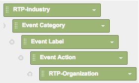

# Aangepaste RTP-rapporten in Google Universal Analytics {#custom-rtp-reports-in-google-universal-analytics}

>[!PREREQUISITES]
>
>[RTP integreren met Google Universal Analytics](/help/marketo/product-docs/web-personalization/reporting-for-web-personalization/web-analytics-integrations/integrate-rtp-with-google-universal-analytics.md)

In dit artikel wordt uitgelegd hoe u aangepaste RTP-rapporten instelt voor Google Universal Analytics (GUA).  De gegevens die van RTP naar GUA worden verzonden kunnen opstelling als twee afzonderlijke geroepen douanerapporten zijn:

* RTP B2B
* RTP-betrokkenheid

## Een aangepast rapport instellen {#setting-up-a-custom-report}

1. Meld u aan bij Google Analytics.

1. Klikken op **Aanpassing** in het bovenste menu.

1. Klikken **+Nieuw aangepast rapport**.

## RTP B2B-rapport {#rtp-b-b-report}

1. Geef een naam op voor het rapport **RTP B2B-rapport**.

1. Geef de naam van het eerste tabblad **Industrie**.

>[!NOTE]
>
>U zult **Dit tabblad dupliceren** en maak aanvullende vergelijkbare versies - stap 5)

1. Selecteer **Verkenner** rapporttype.

   

1. In de **Metrische groepen** , selecteert u de maatstaven die relevant zijn voor uw bedrijf.

   a. We raden het volgende aan:

   

1. Dit tabblad 4 keer dupliceren en een naam geven:

   1. **Marktsegment**
   1. **Groep**
   1. **Categorie**
   1. **ABM**
   1. **Organisaties**

   

1. In de **Dimension boor downs** in de sectie worden de relevante afmetingen voor elk tabblad hieronder vastgesteld.

<table> 
 <thead> 
  <tr> 
   <th> 
    

      Tabnaam 
    
</th> 
   <th> 
    

      Dimension boor downs
    
</th> 
  </tr> 
 </thead> 
 <tbody> 
  <tr> 
   <td>Marktsegment</td> 
   <td></td> 
  </tr> 
  <tr> 
   <td>Groep</td> 
   <td></td> 
  </tr> 
  <tr> 
   <td>Categorie</td> 
   <td></td> 
  </tr> 
  <tr> 
   <td>ABM</td> 
   <td></td> 
  </tr> 
  <tr> 
   <td>Organisaties</td> 
   <td></td> 
  </tr> 
 </tbody> 
</table>

1. Stel geen filters in en stel dit rapport in op beschikbaar voor **Alle websitegegevens** (of, indien van toepassing, wijzigen voor een specifieke analytische rekening).

1. Klikken **Opslaan**.

   

## RTP-betrokkenheidsrapport {#rtp-engagement-report}

1. Geef een naam op voor het rapport **RTP-betrokkenheidsrapport**.

1. De eerste tabnaam instellen op **Alle betrokkenheid**.

>[!NOTE]
>
>U dupliceert dit tabblad en maakt aanvullende, vergelijkbare tabbladen (stap 5)

1. Selecteer **Verkenner** rapporttype.

   

1. Selecteer in de sectie Metrische groepen de maatstaven die relevant zijn voor uw bedrijf. Hier volgt een aanbeveling:

   

1. Dit tabblad 4 keer dupliceren en een naam geven:

   1. **Alle betrokkenheid**
   1. **Betrokkenheid van de industrie**
   1. **Betrokkenheid per groep**
   1. **Betrokkenheid per rubriek**
   1. **Betrokkenheid van ABM**

   

1. In de **Dimension boor downs** de relevante afmetingen voor elk tabblad als volgt instellen:

<table> 
 <thead> 
  <tr> 
   <th> 
    

      Tabnaam 
    
</th> 
   <th> 
    

      Dimension boor downs 
    
</th> 
  </tr> 
 </thead> 
 <tbody> 
  <tr> 
   <td>Alle betrokkenheid</td> 
   <td></td> 
  </tr> 
  <tr> 
   <td>Betrokkenheid van ABM</td> 
   <td></td> 
  </tr> 
  <tr> 
   <td>Betrokkenheid per rubriek</td> 
   <td></td> 
  </tr> 
  <tr> 
   <td>Betrokkenheid per groep</td> 
   <td></td> 
  </tr> 
  <tr> 
   <td>Betrokkenheid van de industrie</td> 
   <td></td> 
  </tr> 
 </tbody> 
</table>

1. Stel de volgende filters in:

<table> 
 <thead> 
  <tr> 
   <th> 
    

      Inc/Exc 
    
</th> 
   <th> 
    

      Veld 
    
</th> 
   <th> 
    

      Type afstemmen 
    
</th> 
   <th> 
    

      Waarden 
    
</th> 
   <th colspan="1"> 
    

      Opmerkingen 
    
</th> 
  </tr> 
 </thead> 
 <tbody> 
  <tr> 
   <td>
Inclusief
</td> 
   <td>
Gebeurteniscategorie
</td> 
   <td>Regex</td> 
   <td>RTP-Campagnes|RTP-Recommendations|RTP-Segmenten</td> 
   <td colspan="1">Hiermee filtert u alle andere aangepaste gebeurtenissen die niet gerelateerd zijn aan RTP</td> 
  </tr> 
  <tr> 
   <td>Uitsluiten</td> 
   <td>Gebeurtenislabel</td> 
   <td>Regex</td> 
   <td>Aantal</td> 
   <td colspan="1">Hiermee kunt u vanuit uw rapportencampagne filteren met # in de naam van de campagne</td> 
  </tr> 
 </tbody> 
</table>

1. Dit rapport beschikbaar stellen voor **Alle websitegegevens** (of indien nodig wijzigen).

   

1. Klikken **Opslaan**.

>[!MORELIKETHIS]
>
>[RTP integreren met Google Universal Analytics](/help/marketo/product-docs/web-personalization/reporting-for-web-personalization/web-analytics-integrations/integrate-rtp-with-google-universal-analytics.md)
>
>[Aangepaste RTP-dashboards in Google Universal Analytics](/help/marketo/product-docs/web-personalization/reporting-for-web-personalization/web-analytics-integrations/custom-rtp-dashboards-in-google-universal-analytics.md)
