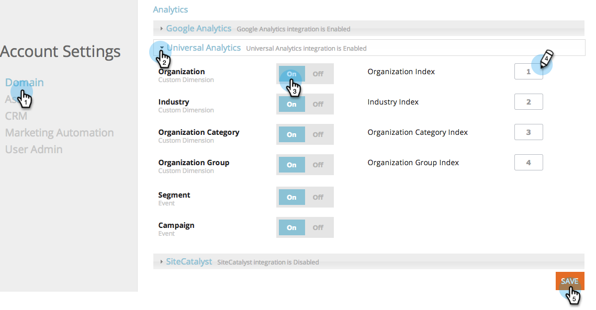

# RTP integreren met [!DNL Google Universal Analytics] {#integrate-rtp-with-google-universal-analytics}

## Intro {#intro}

Gebruik [!DNL Google Universal Analytics] (GUA) met de firmografische en personalisatiegegevens van [!DNL Marketo Real-Time Personalization] (RTP) om uw online marketinginspanningen beter te meten en te analyseren.

In dit artikel wordt uitgelegd hoe u het [!DNL Marketo Real-Time Personalization] (RTP)-platform instelt en integreert met [!DNL Google Universal Analytics] (GUA)-accounts. RTP de gegevens kunnen aan uw rekening worden toegevoegd GUA die u toestaat om de prestaties van organisaties, industrieën, firmographics en segmenten te bekijken RTP die uw website bezoeken.

**[!DNL Google Universal Analytics]**

[!DNL Google Universal Analytics] met de gegevens van RTP verstrekt u een beter inzicht in hoe de gebruikers van B2B met uw online inhoud in wisselwerking staan en helpen meten en betere resultaten van uw verpersoonlijkingscampagnes krijgen. [ las meer over  [!DNL Google Universal Analytics] ](https://support.google.com/analytics/answer/2790010/?hl=en&authuser=1).

>[!NOTE]
>
>**voor slechts de Gebruikers van de Manager van de Markering van Google**
>
>Er hoeft geen codering of speciale configuratie te worden uitgevoerd. Controleer of u de volgende checklist invult:
>
>* RTP-afmetingen worden gemaakt in [!DNL Google Universal Analytics]
>* [ RTP de markering wordt behoorlijk geïnstalleerd in de Manager van de Markering van Google ](https://docs.marketo.com/display/public/DOCS/Implementing+RTP+using+Google+Tag+Manager)
>* [!DNL Google Universal Analytics] Integratie is ingeschakeld in de accountinstellingen van RTP
>* [[!DNL Google Universal Analytics]  de markering wordt behoorlijk gevormd in de Manager van de Markering van Google ](https://support.google.com/tagmanager/answer/6107124?hl=en)
>* [ de markering van de Manager van de Markering van Google wordt behoorlijk geïnstalleerd uw website ](https://developers.google.com/tag-manager/quickstart)

## Aangepaste afmetingen instellen in GUA {#set-up-custom-dimensions-in-gua}

1. In Google Analytics:

   1. Ga naar **[!UICONTROL Admin]**
   1. Selecteer de **[!UICONTROL Account].**
   1. Selecteer de **[!UICONTROL Property].**
   1. Selecteer **[!UICONTROL Custom Definitions]** en **[!UICONTROL Custom Dimensions]** .
      

1. Voeg een nieuwe aangepaste dimensie toe. Klikken **[!UICONTROL +New Custom Dimension]**

   

1. Voeg het volgende toe **[!UICONTROL Custom Dimensions]:**

<table>
 <tbody>
  <tr>
   <td>
<strong>Aangepaste Dimension-naam</strong>
</td>
   <td>
<strong>Toepassingsgebied</strong>
</td>
   <td>
<strong>Actief</strong>
</td>
  </tr>
  <tr>
   <td>
<strong>RTP-organisatie</strong>
</td>
   <td>
Sessie
</td>
   <td>
✓
</td>
  </tr>
  <tr>
   <td>
<strong>RTP-industrie</strong>
</td>
   <td>
Sessie
</td>
   <td>
✓
</td>
  </tr>
  <tr>
   <td>
<strong>RTP-categorie</strong>
</td>
   <td>
Sessie
</td>
   <td>
✓
</td>
  </tr>
  <tr>
   <td>
<strong>RTP-groep</strong>
</td>
   <td>
Sessie
</td>
   <td>
✓
</td>
  </tr>
 </tbody>
</table>

>[!NOTE]
>
>**de Namen van Dimension van de Douane** moeten precies zijn zoals die in de lijst hierboven worden bepaald (anders zullen de de dashboards en rapporten van douane RTP in GUA niet correct tonen)

1. Voeg de lus **[!UICONTROL Name]** toe. Selecteer het bereik als **[!UICONTROL Session]** . Klik op **[!UICONTROL Create]**.

   

Je lijst Aangepaste Dimension moet er zo uitzien.

Zodra u de Dimensies van de Douane in GUA hebt geactiveerd, ga naar het platform RTP om deze afmetingen binnen RTP toe te laten.

## Activeer de integratie GUA in uw rekening RTP {#activate-the-gua-integration-in-your-rtp-account}

1. Ga in het platform RTP naar **[!UICONTROL Account Settings].**

   

1. Klik onder **[!UICONTROL Account Settings]** op **[!UICONTROL Domain]** .
1. Klik onder **[!UICONTROL Analytics]** op **[!UICONTROL Google Universal Analytics]** .
1. Draai **[!UICONTROL On]** de relevante afmetingen en gebeurtenissen van de Douane om deze gegevens van RTP aan [!DNL Google Universal Analytics] toe te voegen.
1. Voer in GUA de **[!UICONTROL Index number]** van de dimensie die is uitgelijnd met het indexnummer in.
1. Klik op **[!UICONTROL Save]**.

>[!NOTE]
>
>Het indexnummer voor de aangepaste Dimension is te vinden in GUA onder Aangepaste afmetingen.
>
>Voorbeeld: RTP-Industry Index Number is gelijk aan 1, RTP-Organization Index Number is gelijk aan 2.

## Oude dashboards verwijderen in Google Analytics {#remove-old-dashboards-in-google-analytics}

1. In Google Analytics. Ga naar **[!UICONTROL Reporting].**
1. Klik op **[!UICONTROL Dashboards].**
1. Selecteer een **[!UICONTROL Dashboard]** (RTP B2B- of RTP-prestaties)
1. Klik op **[!UICONTROL Delete Dashboard]**.

