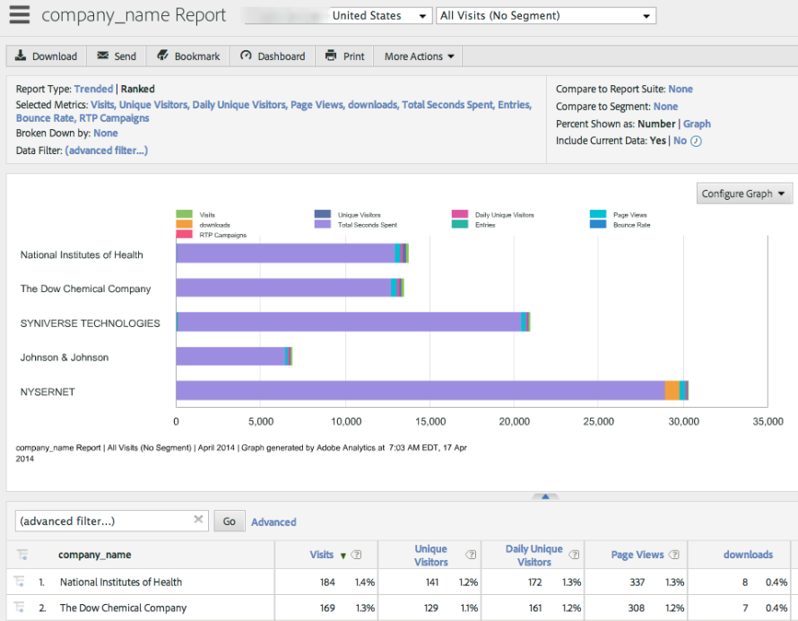
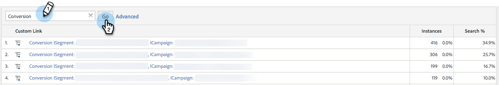

# Integreren met Adobe Analytics {#integrate-with-adobe-analytics}

## Intro {#intro}

Analyseer uw webanalyses vanuit een B2B-perspectief door de gegevens van uw organisatie-, industrie- en [!DNL Marketo Real-Time Personalization] (RTP)-campagne in uw Adobe Analytics-account te bekijken.

Dit document maakt de integratie mogelijk tussen [!DNL Marketo Real-Time Personalization] (RTP) en Adobe Adobe Analytics. De gegevens van RTP zullen u toestaan om tendensen in alle industriesegmenten en organisaties te ontdekken en te analyseren die uw plaats bezoeken en de doeltreffendheid van uw campagnes te meten RTP, die de inzichten en de analyse verstrekken om optimale resultaten te bereiken.

U kunt dit bereiken door metriek zoals de aantallen nieuwe versus terugkerende bezoekers in elk segment te bekijken, kliktarieven op campagnes te analyseren, en te ontdekken welke industrieën en aangepaste segmenten en in real time campagnes de beste omzettende lood produceerden. Gebruik deze mogelijkheid om het maximale voordeel van uw RTP-account te behalen.

## RTP Audience Analytics {#rtp-audience-analytics}

Met de integratie RTP - AA, hebt u een nieuwe dimensie binnen uw interface van de Webanalyse. RTP verbetert automatisch uw Web analytics dashboards met:

1. Organisatie- en bedrijfsgegevens
1. Aangepaste RTP-segmenten
1. Lijsten met benoemde accounts (Account-Based Marketing)

Hierdoor worden uw B2B-gegevens verbeterd en kunt u zich richten op relevante bezoekers door:

1. Uitgaande kanalen
1. Inhoud
1. Opnieuw rangschikken

## Kanaalrapport {#channel-report}

Het dashboard RTP helpt u de verdeling van uw bezoekers volgens verticals en segmenten begrijpen RTP. Je kunt de prestaties van je bezoeker bekijken op basis van de branche en verschillende marketingcampagnes (betaald, organisch, sociaal) in verband met die branche. Het dashboard biedt ook een overzicht op hoog niveau van de sitesecties die uw bezoekers bekijken op basis van hun branchetype.

## Gedragsrapport {#behavioral-report}

Verschillende gedragsrapporten kunnen in Adobe Analytics worden gecreeerd die op organisatie, industrie en RTP segmentgegevens wordt gebaseerd. Deze stroomrapporten visualiseren het pad dat bezoekers volgen van de ene pagina of gebeurtenis naar de volgende. Dit rapport kan u helpen ontdekken wat de inhoud houdt bezoekers betrokken bij uw site.

## RTP-prestaties {#rtp-performance}

De campagnebeelden van RTP van de mening en omzettingen onder de Verbindingen van de Douane in Adobe Analytics.

Dit rapport van de Verbinding van Douane zal beelden en omzettingen van campagnes onder het volgende noemende formaat tonen:

* De druk ISegment: [ Naam van het Segment RTP ], ICampaign: [ Naam van de Campagne RTP ]
* Conversie ISegment: {de Naam van het Segment van 0} RTP [, ICampaign: ] Naam van de Campagne RTP []

## Instellen in Adobe Analytics {#set-up-in-adobe-analytics}

De integratie maakt gebruik van de JavaScript API die Adobe Analytics biedt. Aangepaste conversievariabelen (eVar), aangepaste gebeurtenissen (gebeurtenis) en verkeersvariabelen worden in de integratie gebruikt. Alles moet zijn ingeschakeld vanuit AA-beheer. U moet de conversievariabelen, aangepaste gebeurtenissen en verkeersvariabelen instellen in AA, anders kunt u de gegevens in de suite niet zien, zelfs niet als u deze in RTP hebt ingeschakeld.

Voer de volgende stappen uit om deze variabelen in te stellen in AA:

1. Ga naar **[!UICONTROL Admin Tools]** in uw AA-account.
1. Selecteer de **[!UICONTROL Report Suite]** die moet worden gebruikt bij de integratie.
1. Ga onder **[!UICONTROL Edit Settings]** naar **[!UICONTROL Conversion]** en selecteer **[[!UICONTROL Conversion Variables]](https://microsite.omniture.com/t2/help/en_US/reference/#Edit_conversion_variables)**.
Selecteer het [&#x200B; Variabele van de Omzetting &#x200B;](https://microsite.omniture.com/t2/help/en_US/reference/#Conversion_Variables_eVar) aantal (wij adviseren):

   1. Evar # 20 for Industry Custom Conversions
   1. Evar # 21 for Organization Custom Conversions

   >[!NOTE]
   >
   >Als deze # worden genomen, selecteer een ander beschikbaar aantal. Lijn dit aantal met het groefaantal in de Montages van de Rekening RTP uit.

   1. Status wijzigen in _[!UICONTROL Enabled_].

      1. De Naam van de verandering in **Industrie** en **Organisatie**. (Zo wordt dit weergegeven in de rapportsuite.)

      1. Wijzig het veld Verlopen na in **[!UICONTROL Visit]** .

1. Onder **[!UICONTROL Edit Settings]** ga naar **[!UICONTROL Conversion]** en selecteer **[[!UICONTROL Success Events]](https://microsite.omniture.com/t2/help/en_US/reference/#Configure_success_events)**.

   1. Selecteer het gebeurtenisnummer Aangepaste succesgebeurtenissen (aanbevolen):

      1. event20 voor campagnes RTP
      1. event21 voor RTP-segmenten

      >[!NOTE]
      >
      >Als deze # worden genomen, selecteer een ander beschikbaar aantal. Lijn dit aantal met het groefaantal in de Montages van de Rekening RTP uit.

      1. Verander de twee gebeurtenisnamen in **Campagnes RTP** en **Segmenten RTP**. Dit is de naam die wordt weergegeven in de rapportsuite.

   1. Selecteer het gebied van het Type om **Teller (geen subrelations) te zijn**

1. Onder **[!UICONTROL Edit Settings]** ga naar **[Verkeer &#x200B;](https://microsite.omniture.com/t2/help/en_US/reference/#Traffic_Variable)** en selecteer **[Variabelen van het Verkeer &#x200B;](https://microsite.omniture.com/t2/help/en_US/reference/#Enable_traffic_variable_reports)**.

   1. Selecteer het bezit van de Variabele van het Verkeer # (wij adviseren):

      1. Eigenschap nr. 20 - Naam: RTP Segment Organisation
      1. Eigendomsnummer 21 - Naam: RTP Segment Industry
      1. Eigenschap nr. 25 - Naam: Campagne-organisatie
      1. Eigendomsnummer 26 - Naam: RTP Campagne Industry

      >[!NOTE]
      >
      >Als deze # worden genomen, selecteer een ander beschikbaar aantal. Dit nummer uitlijnen met het sleufnummer in de instellingen voor RTP-account)

      1. Wijzig de 4 eigenschapnamen. Dit is de naam die wordt weergegeven in de rapportsuite.

   1. Selecteer [!UICONTROL Enabled] veld naar **[!UICONTROL Enabled]** .

   1. Selecteer [!UICONTROL Path Reports] veld naar **[!UICONTROL Enabled]** .

## Instellen in [!DNL Marketo Real-Time Personalization] (RTP) {#set-up-in-marketo-real-time-personalization-rtp}

1. Ga in het RTP-platform naar **[!UICONTROL Account Settings]** .

   

1. Klik onder **[!UICONTROL Account Settings]** op **[!UICONTROL Domain]** .
1. Onder **[!UICONTROL Analytics]**, klik **Adobe Analytics**.
1. Draai **[!UICONTROL On]** de wisselaars van de variabelen Conversion, Custom en Traffic.
1. Wijs de Conversie, de Variabelen van de Gebeurtenis en van het Verkeer **groefaantallen** toe om de groefaantallen aan te passen die in AA worden gecreeerd
1. Klik op **[!UICONTROL Save]**.

>[!NOTE]
>
>Onze aanbevolen sleufinstellingen zijn
>
>**Variabelen van de Omzetting**
>
>* [!UICONTROL Industry Custom Conversions] - Slot 20
>* [!UICONTROL Organization Custom Conversions] - Slot 21
>
>**Gebeurtenissen van de Douane**
>
>* [!UICONTROL Campaign Custom Event] - Slot 20
>* [!UICONTROL Segment Custom Event] - Slot 21
>
>**Variabelen van het Verkeer**
>
>* [!UICONTROL Segment Organization Traffic Variable] - Slot 20
>* [!UICONTROL Segment Industry Traffic Variable] - Slot 21
>* [!UICONTROL Campaign Organization Traffic Variable] - Slot 22
>* [!UICONTROL Campaign Industry Traffic Variable] - Slot 23
>
>**zorg ervoor dat deze groefaantallen met de variabelen en de gebeurtenisaantallen richten die in A worden gecreeerd.**

## Rapporten {#reports}

Maak verbeterde SiteAdobe Analytics-rapporten op basis van de namen van de organisatie, de industrieën en RTP-segmenten en realtime campagnegegevens.

Voorbeelden van aangepaste rapporten en dashboards in AA zijn:

* Prestaties per branche of bepaald segment (op rekening-Gebaseerde genoemde lijsten)
* Uitsplitsing naar bedrijfstak per KPI-prestatie
* Per organisatie bekeken pagina&#39;s
* Prestaties van marketingkanalen volgens organisatie, industrie, segmenten

**-Report Examples-**

**Belangrijkste Rapport van de Industrieën**

**Rapport van Organisaties**

**Creërend het Dashboard RTP**

Creeer a [&#x200B; nieuw dashboard &#x200B;](https://microsite.omniture.com/t2/help/en_US/sc/user/t_dashboard_add.html), genoemd **Dashboard RTP**. Dit dashboard zal helpen de verdeling van uw bezoekers volgens verticals en segmenten begrijpen RTP.

1. Klik op **[!UICONTROL Dashboard]** click **[!UICONTROL Add Dashboard]** .

1. Noem het Dashboard **RTP Dashboard**.

1. Selecteer de **dashboardgrootte** 3 x 2, 2 x 2.

1. Creeer [&#x200B; rapportlet &#x200B;](https://microsite.omniture.com/t2/help/en_US/sc/user/t_dashboard_add_report.html#task_EC3AFBBAA51C45CEBAF632F841C305B3) en voeg [&#x200B; inhoud aan het dashboard &#x200B;](https://docs.marketo.com/Add%2520content%2520to%2520a%2520dashboard) toe.

Het rapport Industrieën toevoegen aan het dashboard

1. Ga naar **[!UICONTROL Custom Conversions]** en klik op **[!UICONTROL Industry]** .

1. Vorm Grafiek aan **Schijfgrafiek**.

1. Klik op **[!UICONTROL Dashboard]** en voeg **[!UICONTROL Reportlet]** toe.

1. Noem het rapport **Belangrijkste Industrieën**.

1. Plaats in Dashboard **RTP Dashboard**.

1. Creeer **Nieuw**.

De Segmentrapporten toevoegen aan het dashboard

1. Ga naar **[!UICONTROL Site Metrics]** . Klik op **[!UICONTROL Custom Events]** , **[!UICONTROL Segments]** .

1. Vorm Grafiek aan **Verticale Bar**.

1. Klik op **[!UICONTROL Dashboard]** en voeg **[!UICONTROL Reportlet]** toe.

1. Noem het rapport **Belangrijkste Segmenten**.

1. Plaats in Dashboard **RTP Dashboard**.

1. Creeer **Nieuw**.

Uw rapporten worden weergegeven op het dashboard.

## Afbeeldingen en klikken (conversies) weergeven in Adobe Analytics {#view-impressions-and-clicks-conversions-in-adobe-analytics}

1. Klik op **[!UICONTROL Custom]Koppelingen** .

   

1. Zoeken naar afbeeldingen om de namen van segmenten en campagnes weer te geven die het aantal indrukken voor de campagne aangeven.
   

1. Zoek naar Omzetting om de namen van Segmenten en van de Campagne te bekijken die het aantal klikken voor de campagne vertegenwoordigen.

   
