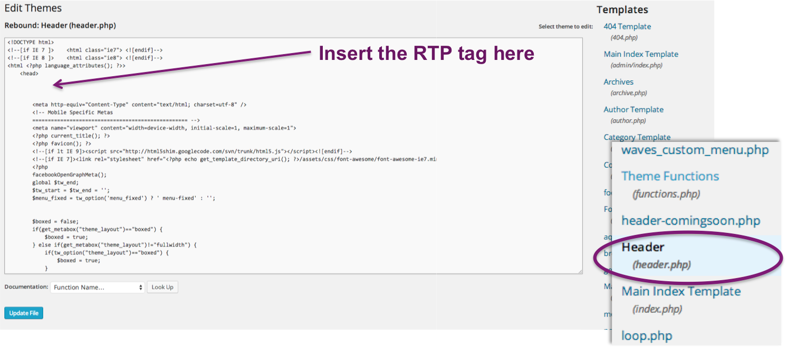

# RTP implementeren op [!DNL Wordpress] {#implementing-rtp-on-wordpress}

Volg onderstaande installatie-instructies om uw [!UICONTROL RTP tag] te implementeren:

1. Open omhoog het {**dossier 0} header.php van uw** thema **[!DNL WordPress].**

   U kunt een FTP-client gebruiken om toegang te krijgen tot uw server of de themabestanden rechtstreeks vanuit het dashboard van [!DNL WordPress] bewerken. De bestandseditor bevindt zich onder het tabblad **[!UICONTROL Appearance]** in het zijbalkmenu.

   

1. In de lijst van malplaatjedossiers rechts van de tekstredacteur, vind **header.php** en open het.

1. Ga naar **[!UICONTROL Account Settings]** .

   a. Als u uw JavaScript-tag al hebt ontvangen van Support, gaat u verder met stap 5.

   

1. Zoek onder [!UICONTROL Domain] het relevante domein op en klik op **[!UICONTROL Generate Tag]** .

   

1. Kopieer de JavaScript-tag RTP en plak deze naar uw websitesjablonen.

   a. Controleer of dit het eerste script in de koptekst van de pagina is - tussen de **`<head> </head>`** -tags.

   

1. Klik op **[!UICONTROL Update File]** voor het bestand header.php.

1. Controleer of het wordt weergegeven op alle pagina&#39;s, inclusief bestemmingspagina&#39;s en subdomeinen.

   a. U kunt dit doen door met de rechtermuisknop op de pagina van uw website te klikken. Ga naar **[!UICONTROL View Page Source].** Onderzoek naar **RTP** om van de markering de plaats te bepalen.
