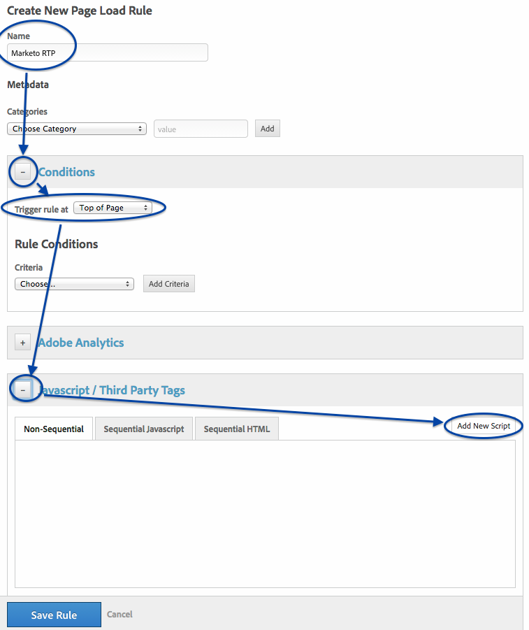
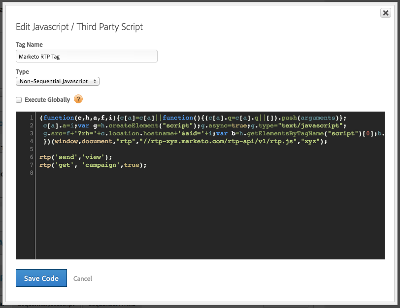

# RTP implementeren met Adobe Tag Manager {#implementing-rtp-using-adobe-tag-manager}

Volg onderstaande installatie-instructies om uw RTP-tag te implementeren:

1. Meld u aan bij uw RTP-account.

1. Ga naar **[!UICONTROL Account Settings]** .

   a. Als u uw JavaScript-tag al hebt ontvangen van Support, gaat u verder met stap 4.

   

1. Zoek onder [!UICONTROL Domain] het relevante domein op en klik op **[!UICONTROL Generate Tag]** .

   

1. Login aan uw [!DNL Dynamic Tag Manager] rekening ([ https://dtm.adobe.com/sign_in ](https://dtm.adobe.com/sign_in)).

1. Ga naar **[!UICONTROL Dashboard].** Klik op de relevante webeigenschap.

   

1. Ga naar **[!UICONTROL Rules]** en klik op **[!UICONTROL Create New Rule]** .

1. Vul het volgende in

   1. [!UICONTROL Name]: **Marketo RTP**
   1. [!UICONTROL Conditions] (collapse) : Trigger-regel op - **[!UICONTROL Top of Page]**
   1. [!UICONTROL Javascript] (collapse): click **[!UICONTROL Add New Script]**

   

1. Roep de nieuwe markering: **de Markering van Marketo RTP**

1. De volgende code verwijderen uit de [!UICONTROL RTP tag]

   * ``

1. Plak de JavaScript-tag RTP.

   

   >[!CAUTION]
   >
   >Zorg ervoor dat u alle tags verwijdert en dat u alleen het script zelf laat (geen `` )

1. Klik op **[!UICONTROL Save Code]** in de scripteditor en **[!UICONTROL Save Rule]** in de regeleditor.

1. Zoek in het deelvenster Regels de regel voor het laden van de Marketo RTP-pagina op en selecteer **[!UICONTROL Actions]** in het vervolgkeuzemenu **[!UICONTROL Activate Rules]** .

   

1. **[!UICONTROL Verify]** die op alle pagina&#39;s wordt weergegeven, inclusief bestemmingspagina&#39;s en subdomeinen.

   U kunt dit doen door met de rechtermuisknop op de pagina&#39;s van uw website te klikken. Ga naar **[!UICONTROL Inspect Element]**, klik op **[!UICONTROL Network]**, Onderzoek: **RTP**.
