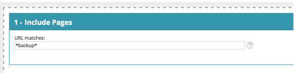

# [!DNL Web Personalization] Verklarende woordenlijst {#web-personalization-glossary}

Sommige inzichten in de wereld en taal van [!DNL Marketo Web Personalization].

| Term | Definitie |
|---|---|
| **Anonieme Bezoeker** | Een webbezoeker die nooit een formulier heeft ingevuld of zijn gegevens op de website heeft achtergelaten. |
| **Campagne van het Web** | Een aangepaste reactie die aan een specifiek segment is gekoppeld. Met Web Personalization bevatten webcampagnes dialoogvensters, In zones en Widgets. |
| **Clickstream** | De activiteit en het URL-pad van de bezoeker op de site en hoe lang ze elke pagina hebben bezocht |
| **ISP** | Internet Service Provider |
| **Bekende Bezoeker** | Een webbezoeker die een formulier heeft ingevuld en zijn gegevens (e-mailadres) op uw website heeft achtergelaten of op een koppeling in een Marketo-e-mailbericht heeft geklikt. |
| **Lijst van de Rekening** | Een lijst met sleutelnamen voor accounts en organisaties. Wordt ook wel een Account-Based Marketing-lijst (ABM) genoemd. |
| **Segmenten** | Een verzameling bezoekers die voldoen aan de opgegeven criteria die zijn gedefinieerd op de pagina [ Een segment instellen ](/help/marketo/product-docs/web-personalization/using-web-segments/web-segments.md) . |
| **Splitsen het Testen** | Een testexperiment met twee of meer varianten om het verschil in resultaten te meten. Het doel is om wijzigingen in webpagina&#39;s vast te stellen die het resultaat van interesse verhogen of maximaliseren. |
| **Jokerteken** | Een vervangingskarakter (&#42; wordt gebruikt) dat vóór of na een koord wordt gebruikt om een ander karakter of karakters in een koord te vervangen. Zie de onderstaande voorbeelden. |

## Voorbeelden van jokertekens {#wildcard-examples}

Hier volgen drie manieren waarop u jokertekens kunt gebruiken in [!DNL Web Personalization] .

Alle bezoekers op pagina-URL&#39;s die eindigen op basis van prijzen (bijvoorbeeld `www.marketo.com/pricing`

Alle bezoekers op pagina-URL&#39;s die beginnen met https:// (bijvoorbeeld `https://www.marketo.com`

Alle bezoekers op pagina-URL&#39;s afstemmen die het woord back-up bevatten (bijvoorbeeld `https://www.marketo.com/backup/pricing.html`

