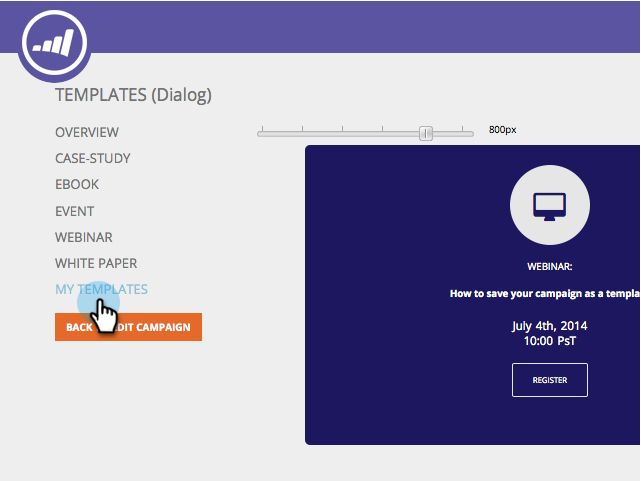

# Uw campagne opslaan als een sjabloon {#save-your-campaign-as-a-template}

Heb je ooit tijd doorgebracht met het maken van de perfecte webcampagne? U kunt de sjabloon nu opslaan als een sjabloon die u later weer kunt gebruiken.

1. Ga naar **[!UICONTROL Web Campaigns]** .

   

1. Zoek naar de campagne u als malplaatje wilt bewaren.

   

1. Klik op het pictogram Bewerken.

   

1. Controleer **[!UICONTROL Use as template]** en klik op **[!UICONTROL Save]** .

      

1. Dat is het! De volgende keer dat u een campagne maakt en een sjabloon selecteert, schakelt u [!UICONTROL My Templates] in de pagina Campagnes instellen in om de sjablonen weer te geven die u hebt opgeslagen.

   
