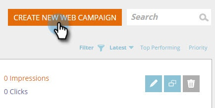

# Webcampagnes maken met sjablonen {#using-templates-to-create-web-campaigns}

Versnel en vereenvoudig uw proces van de de creatie van de Webcampagne door onze ingebouwde malplaatjes te gebruiken of door [&#x200B; uw te bewaren &#x200B;](save-your-campaign-as-a-template.md).

>[!NOTE]
>
>Sjablonen zijn geoptimaliseerd voor alle apparaten en voor zowel desktopcomputers als mobiele apparaten.

1. Ga naar **[!UICONTROL Web Campaigns]** .

   

1. Klik op **[!UICONTROL Create New Web Campaign]**.

   

1. Noem uw campagne.

   

1. Selecteer een [!UICONTROL Target Segment] .

   

1. Klik op **[!UICONTROL Templates]**.

   

1. Selecteer het juiste gebied voor uw campagne om een sjabloon te zien en te selecteren die voor u werkt.

   >[!NOTE]
   >
   >Er zijn een aantal coole sjablonen waaruit u kunt kiezen, en in de toekomst zullen we er meer aan toevoegen.

   

   >[!TIP]
   >
   >Voor mobiele campagnes selecteer een malplaatje van de **mobiele** sectie.

1. Pas de sjabloon aan.

   

1. Klik op **[!UICONTROL Save]**.

   

Echt waar! Heb je gezien hoeveel tijd je hebt bespaard door een sjabloon te gebruiken?

>[!MORELIKETHIS]
>
>[&#x200B; sparen een Campagne als Malplaatje &#x200B;](/help/marketo/product-docs/web-personalization/using-templates/save-your-campaign-as-a-template.md)
