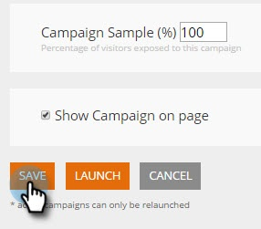

# Sjablonen gebruiken om webcampagnes te maken {#using-templates-to-create-web-campaigns}

Versnel en vereenvoudig het maken van uw webcampagne met onze ingebouwde sjablonen of door uw eigen ](save-your-campaign-as-a-template.md) op te slaan.[

>[!NOTE]
>
>Sjablonen zijn geoptimaliseerd voor alle apparaten en voor zowel desktopcomputers als mobiele apparaten.

1. Ga naar **Webcampagnes**.

   

1. Klik **Nieuwe webcampagne maken**.

   

1. Geef uw campagne een naam.

   

1. Selecteer een doelsegment.

   

1. Klik **Sjablonen**.

   

1. Selecteer het juiste gebied voor uw campagne om een sjabloon te zien en te selecteren die voor u werkt.

   >[!NOTE]
   >
   >Er zijn een aantal coole sjablonen waaruit u kunt kiezen, en in de toekomst zullen we er meer aan toevoegen.

   

   >[!TIP]
   >
   >Voor mobiele campagnes selecteert u een sjabloon in de sectie **mobile**.

1. Pas de sjabloon aan.

   

1. Klik **Opslaan**.

   

Echt waar! Heb je gezien hoeveel tijd je hebt bespaard door een sjabloon te gebruiken?

>[!MORELIKETHIS]
>
>[Een campagne opslaan als een sjabloon](/help/marketo/product-docs/web-personalization/using-templates/save-your-campaign-as-a-template.md)
