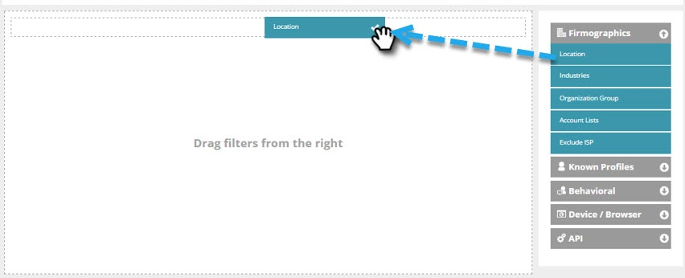

# Een basiswebsegment maken {#create-a-basic-web-segment}

Laten we een basissegment maken voor alle webbezoekers uit de VS en de financiële-dienstenindustrie.

1. Ga naar **[!UICONTROL Segments]** .

   

1. Klik op **[!UICONTROL Create New]**.

   

1. Voer de segmentnaam in.

   

1. Sleep **[!UICONTROL Location]** vanuit het rechtermenu en zet het neer in de segmenteditor.

   

1. Selecteer een land dat u wilt toevoegen in de vervolgkeuzelijst. Selecteer de **Verenigde Staten**.

   

   >[!NOTE]
   >
   >Het aantal steden is beperkt tot 300 per segment.

1. Sleep **[!UICONTROL Industries]** vanuit het rechtermenu en zet het neer in de segmenteditor.

   

1. Selecteer [!UICONTROL Industries] om toe te voegen uit de vervolgkeuzelijst. Selecteer de **[!UICONTROL Financial Services]Industrie**.

   

   U hebt nu een basissegment opgezet voor alle vooruitzichten om uw website van de VS en de financiële industrie te bezoeken.

1. Klik op **[!UICONTROL Save]** om het segment op te slaan of op **[!UICONTROL Save & Define Campaign]** om naar de pagina Campagnes te gaan.

   

Nu hebt u uw bezoekers uit de Verenigde Staten gesegmenteerd, ga door en voeg de financiële dienstensector toe.

>[!MORELIKETHIS]
>
>[ Segmenten van het Web ](/help/marketo/product-docs/web-personalization/using-web-segments/web-segments.md)
