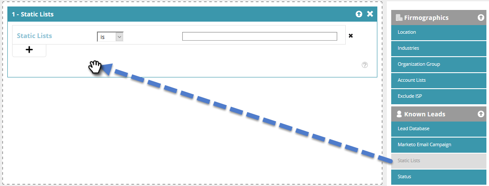

# Een segment maken met een statische lijst {#create-a-segment-using-a-static-list}

Het segment bekende Webbezoekers wanneer zij uw website bezoeken die op wordt gebaseerd als zij binnen of niet in één van uw Marketo [ statische lijsten ](/help/marketo/product-docs/core-marketo-concepts/smart-lists-and-static-lists/static-lists/understanding-static-lists.md) zijn.

1. Ga naar **[!UICONTROL Segments]** .

   

1. Klik op **[!UICONTROL Create New]**.

   

1. Voer een segmentnaam in.

   

1. Sleep **[!UICONTROL Static Lists]** in Bekende leads over het canvas.

   

1. Klik op de vervolgkeuzelijst om **[!UICONTROL is]** of **[!UICONTROL is not]** te selecteren (afhankelijk van wat u wilt) en typ de naam van de statische lijst.

   

1. Als u veelvoudige lijsten wilt toevoegen, moet u een nieuwe lijn voor elk tot stand brengen door **+** te klikken. Als u slechts één lijst wilt, overslaan aan [ Stap 8 ](#eight).

   

1. Voor veelvoudige lijsten (of de veelvoudige &quot;is niet&quot;lijsten), herhaal de stappen u in [ Stap 5 ](#five) leerde.

   

   >[!NOTE]
   >
   >De en/of drop-down is enkel dat. Klik erop om **[!UICONTROL and]** , **[!UICONTROL or]** of **[!UICONTROL and/or]** te selecteren.

1. Klik op **[!UICONTROL Save]** om het segment op te slaan of op **[!UICONTROL Save & Define Campaign]** om het op te slaan en naar de [!UICONTROL Campaigns] -pagina te gaan.

   
