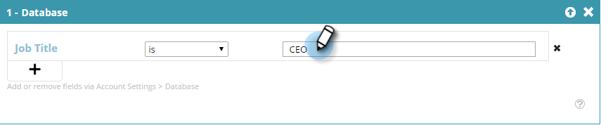

# Een segment maken met bekende persoongegevens {#create-a-segment-using-known-person-data}

Hier is hoe te om een segment tot stand te brengen gebruikend Bekende waarden van de Gegevens van de Persoon.

>[!PREREQUISITES]
>
>[ beheert Persoonsgegevens ](/help/marketo/product-docs/web-personalization/using-web-segments/manage-person-data.md)

1. Ga naar **[!UICONTROL Segments]** .

   

1. Klik op **[!UICONTROL Create New]**.

   

1. Voer een segmentnaam in.

   

1. Sleep **[!UICONTROL Database]** in Profielsegmentatie over naar het canvas.

   

1. Selecteer een gegevensveld voor personen in de vervolgkeuzelijst.

   

1. Voer een waarde in voor Persoonlijke gegevens.

   

   Er kan slechts één waarde zijn voor elk veld. Als u bijvoorbeeld meerdere waarden voor het veld Titel van taak wilt toevoegen, moet u voor elke waarde een nieuwe regel maken met dezelfde veldnaam. Ben zeker om de OF waarde te gebruiken om ervoor te zorgen dat om het even welke waarde een gelijke vangt.

   

## Meerdere gegevensvelden selecteren {#selecting-multiple-person-data-fields}

1. Klik op **+** om een ander gegevensveld voor personen toe te voegen.

   

1. Selecteer de operator [!UICONTROL AND]/[!UICONTROL OR] . Selecteer het veld dat u wilt toevoegen. Selecteer een gegevensveld voor een persoon. Voer de waarde van de persoonlijke gegevens in.

   

1. Klik op **[!UICONTROL Save]** om het segment op te slaan of op **[!UICONTROL Save & Define Campaign]** om het op te slaan en naar de [!UICONTROL Campaigns] -pagina te gaan.

   

   U hebt nu een segment voor bekende gegevens ingesteld.
