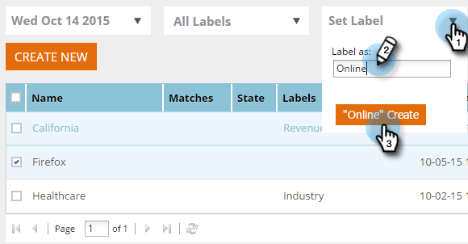

# Uw segment labelen {#label-your-segment}

Hebt u zoveel segmenten dat het schuiven omslachtig wordt? Gebruik labels om de segmenten te labelen, zodat u ze snel kunt vinden.

## Een segment coderen {#tag-a-segment}

1. Meld u aan bij [!DNL Web Personalization] en ga naar **[!UICONTROL Segments]** .

   

1. Selecteer de segmenten waaraan u een label wilt toewijzen.

   

1. Als u een bestaand label wilt gebruiken, klikt u op **[!UICONTROL Set Label]** , schakelt u een selectievakje in en klikt u op **[!UICONTROL Apply]** .

   

1. Of, om een nieuw etiket tot stand te brengen, klik **[!UICONTROL Set Label]**, ga de nieuwe etiketnaam in, en klik **creeer Nieuw**.

   

   >[!NOTE]
   >
   >De Create Nieuwe knoop toont de naam van het nieuwe etiket. Als het label te lang is, wordt &#39;&#39;Nieuw maken&#39;&#39; mogelijk niet weergegeven.

Koel! U weet nu hoe u labels voor segmenten kunt toewijzen en maken.
