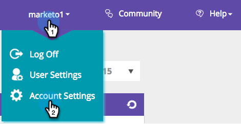

# Persoonlijke gegevens beheren {#manage-person-data}

Gebruik Persongegevens voor [!DNL Web Personalization] door persoonvelden te selecteren die u in de segmentatie wilt gebruiken.

1. Ga naar **[!UICONTROL Account Settings]** .

   

1. Ga naar **[!UICONTROL Database]** .

   

## Een veld Nieuwe persoon toevoegen {#adding-a-new-person-field}

1. Selecteer **Gebied om** van drop-down toe te voegen om een gebied van persoongegevens aan de lijst toe te voegen.

   

   >[!NOTE]
   >
   >Er wordt een nieuw veld toegevoegd in een status die in behandeling is en het kan 24 uur duren om het veld te activeren.

## Een persoonlijk veld verwijderen {#deleting-a-person-field}

1. Klik het schrappingspictogram ( ) om een gebied uit de lijst te verwijderen. Klik op **[!UICONTROL Yes]** om te bevestigen dat u het veld wilt verwijderen.

   

   >[!NOTE]
   >
   >**het Leiden uw gebieden van Gegevens van de Persoon**
   >
   >* Alleen velden met persoonlijke gegevens kunnen worden opgenomen
   >* U kunt maximaal 30 gegevensvelden voor personen toevoegen
   >* Het toevoegen van nieuwe velden kan tot 24 uur duren om te activeren
   >* Maximale lengte van tekenreekstypen is 255 tekens
   >* Verborgen velden worden automatisch verwijderd

<table>
 <tbody>
  <tr>
   <th>
REST API-naam
</th>
   <th>
SOAP API-naam
</th>
   <th>
Vriendelijke naam
</th>
  </tr>
  <tr>
   <td>
afdeling
</td>
   <td>
Afdeling
</td>
   <td>
Afdeling
</td>
  </tr>
  <tr>
   <td>
titel
</td>
   <td>
Titel
</td>
   <td>
Beroep
</td>
  </tr>
  <tr>
   <td>
beoordeling
</td>
   <td>
Classificatie
</td>
   <td>
Classificatie
</td>
  </tr>
  <tr>
   <td>
leadScore
</td>
   <td>
LeadScore
</td>
   <td>
Score
</td>
  </tr>
  <tr>
   <td>
leadStatus
</td>
   <td>
LeadStatus
</td>
   <td>
Status
</td>
  </tr>
  <tr>
   <td>
prioriteit
</td>
   <td>
Prioriteit
</td>
   <td>
Prioriteit
</td>
  </tr>
  <tr>
   <td>
leadRole
</td>
   <td>
LeadRole
</td>
   <td>
Functie
</td>
  </tr>
  <tr>
   <td>
geabonneerd
</td>
   <td>
Niet geabonneerd
</td>
   <td>
Niet geabonneerd
</td>
  </tr>
 </tbody>
</table>

De volgende voorbeeldvelden worden in het vak weergegeven voor nieuwe [!DNL Web Personalization] -accounts:

>[!MORELIKETHIS]
>
>[ creeer een Segment Gebruikend Bekende Gegevens van de Persoon ](/help/marketo/product-docs/web-personalization/using-web-segments/create-a-segment-using-known-person-data.md)
