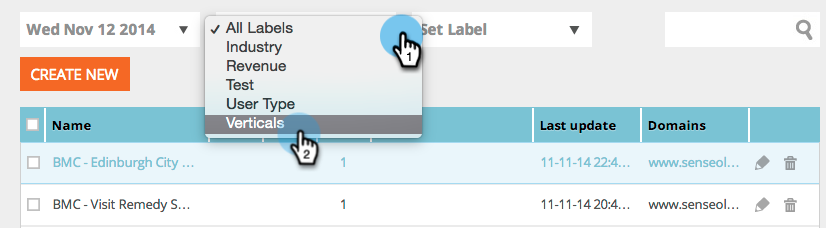

# Segmenten van een specifiek label weergeven {#view-segments-from-a-specific-label}

Wilt u de segmenten op basis van een specifiek label bekijken en filteren?

## Filteren op bestaande labels {#filter-by-existing-labels}

Selecteer onder de vervolgkeuzelijst met labels het gewenste label.

Super cool, merkt u nu slechts de segmenten die aan het geselecteerde etiket worden geassocieerd?

