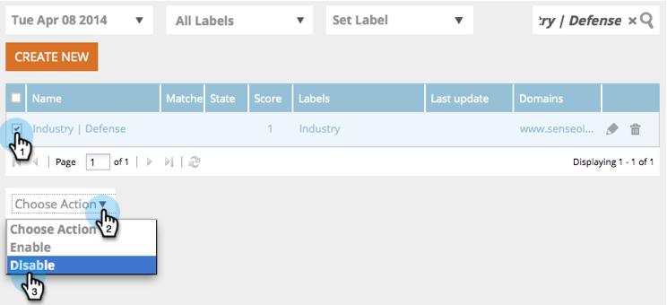

# Websegmenten {#web-segments}

## Segment weergeven {#view-segment}

Op het tabblad Segmenten worden alle aangepaste gedefinieerde segmenten weergegeven die u instelt op basis van verschillende kenmerken.  **een segment van A is een inzameling van bezoekers die aan de gespecificeerde criteria voldoen die in de &quot;Reeks worden bepaald een pagina van het Segment&quot;.** Een segment kan bezoekers zijn uit een bepaalde branche of locatie of op basis van de onsite activiteiten van de bezoeker.

In [!DNL Web Personalizatio] kan een bezoeker overeenkomen met meerdere segmenten. Bijvoorbeeld, als er een segment voor de bezoekers van de V.S. en een segment voor financieringsondernemingen is, zou een Webbezoeker van de Bank van Amerika **zowel** het segment voor de bezoeker van de V.S. als het segment voor financieringsondernemingen aanpassen.

**GRAFIEK:** de pagina van Segmenten toont een grafiek van het staafdiagram van de geselecteerde segmenten volgens het aantal bezoekers van het segment (y as) en de segmentnaam (x as).

<table> 
 <thead> 
  <tr> 
   <th colspan="1" rowspan="1">Naam</th> 
   <th colspan="1" rowspan="1">Beschrijving</th> 
  </tr> 
 </thead> 
 <tbody> 
  <tr> 
   <td colspan="1" rowspan="1"><strong>Naam</strong></td> 
   <td colspan="1" rowspan="1">De titel van het segment</td> 
  </tr> 
  <tr> 
   <td colspan="1" rowspan="1">
<strong>Overeenkomsten</strong>
</td> 
   <td colspan="1" rowspan="1">Het aantal bezoekers dat voldoet aan de aangepaste, gedefinieerde criteria van het segment</td> 
  </tr> 
  <tr> 
   <td colspan="1" rowspan="1"><strong>Campagne instellen</strong></td> 
   <td colspan="1" rowspan="1">Hiermee kunt u een campagne-CTA instellen die is gekoppeld aan de geselecteerde zoekterm</td> 
  </tr> 
  <tr> 
   <td colspan="1"><strong>Bezoekers</strong></td> 
   <td colspan="1">Een voorvertoning van de tabel met bezoekers die is gekoppeld aan de geselecteerde zoekterm</td> 
  </tr> 
  <tr> 
   <td colspan="1" rowspan="1"><strong>Clickstream</strong></td> 
   <td colspan="1" rowspan="1">Hiermee geeft u een tabel weer met de activiteit en het URL-pad van de bezoeker op de site en de duur van het bezoek aan elke pagina </td> 
  </tr> 
 </tbody> 
</table>

Zie [ om segmentetiketten tot stand te brengen en te bekijken ](/help/marketo/product-docs/web-personalization/using-web-segments/label-your-segment.md)

**Segmenten - Juiste Comité**

Als u een segment in de tabel selecteert, worden aanvullende details over het segment in het rechterdeelvenster weergegeven.

Deze details omvatten:

* Naam van segment
* Aanmaakdatum segment
* De bijbehorende campagnes die de campagnes tonen die met het segment werken. Als u op het aantal reacties klikt, gaat u naar de pagina met campagnes waarop de Campagne CTA (Call to action) voor het segment wordt weergegeven
* Het aantal overeenkomsten (het aantal bezoekers dat aan de segmentcriteria voldeed) voor het segment en het aantal afzonderlijke (unieke) bezoekers dat aan het segment voldeed. Wanneer u op de koppeling voor unieke bezoekers klikt, gaat u naar de pagina van de bezoeker waarop de resultaten van het segment worden weergegeven
* De eigenaar/gebruiker creator van het segment
* De domeinplaatsen verbonden aan het segment
* Een korte samenvatting van de geselecteerde criteria van het segment

## Een segment in- of uitschakelen {#enable-or-disable-a-segment}

Om een segment toe te laten of onbruikbaar te maken, checkbox van dat Segment in de lijst en in &quot;[!UICONTROL Choose Action]&quot;drop-down vakje bij de bodem van de lijst, selecteer de actie &quot;[!UICONTROL Enable]&quot; of &quot;[!UICONTROL Disable]&quot;. Wanneer een segment is uitgeschakeld, wordt het woord &quot;uitschakelen&quot; weergegeven onder de kolom [!UICONTROL State] .

## Segmenten maken {#create-segments}

Het segment dat u maakt, voldoet aan alle specifieke criteria die u op de pagina **[!UICONTROL Set Segment]** definieert. U kunt uw segmenten ook aanpassen op basis van een combinatie van criteria, waarbij u zich richt op een specifiek publiek in uw campagne.

Een nieuw segment maken

Klik op de pagina **[!UICONTROL Segments]** onder de grafiek op **[!UICONTROL Create New]** . Het volgende scherm verschijnt.

Definieer algemene parameters voor uw segment:

* **Naam:** noem uw segment.
* **Beschrijving:** verstrek een meer gedetailleerde verklaring van de segmentcriteria.
* **Domeinen:** selecteer het domein of de domeinen u in het segment wilt omvatten.
* **Logica van de Regel van het Segment:** selecteer EN/OF logica om elke segmenteringsattribuut te bouwen
* **Timing:** bepaal het niveau van bezoekersbetrokkenheid u in uw campagne wilt

   * **op Ingang**: De motor van de bezoeker komt op de website aan
   * **Na 1st - 9th klik**: Neem de bezoeker na een specifieke hoeveelheid klikt op de website in dienst

>[!TIP]
>
>**Logica van de Regel van het Segment**
>
>Er zijn drie filteropties:
>
>1. Alle filters gebruiken (1 en 2 en 3...)
>1. Alle filters gebruiken (1, 2 of 3...)
>1. Geavanceerde filters (met en/of expressies)
>
>    Met geavanceerde filters kunt u de segmentvoorwaarde bepalen. Voer de filternummers in, gescheiden door &quot;en&quot; en &quot;of&quot;.
>
>    * 1, 2 en 3
>    * 1 of 2 of 3
>
>    Het mengen van &quot;en&quot; en &quot;of&quot; vereist haakjes om logische intentie te verduidelijken. Bijvoorbeeld &quot;1 of 2 en 3&quot; moet als een van de volgende vermeldingen worden geschreven:
>
>    * 1 en 2 of 3
>    * (1 en 2) of 3
>
>    Geneste haakjes worden geaccepteerd voor complexere logica, bijvoorbeeld
>
>    * (1 en 2) of (3 en 4)
>    * 1 en 2 of (3 en 4)
>
>    Controleer uw logica na het invoegen, verwijderen of opnieuw rangschikken.

De attributen van het Segment van de belemmering en van het daling van de rechterzijkolom in de segmentredacteur op de linkerkant:

### Firmographics {#firmographics}

**Plaats**

Sleep **[!UICONTROL Location]** naar de segmenteditor.

* Selecteer een van de volgende parameters:

   * **[!UICONTROL Include]** - Selecteer of u een locatie wilt opnemen in de campagne of deze wilt uitsluiten.
   * **[!UICONTROL Select country to add]** - Selecteer in de vervolgkeuzelijst het land dat u wilt opnemen in het segment. De landnaam wordt rechts weergegeven. U kunt meerdere landen kiezen.

Zodra het land wordt toegevoegd, kunt u de staat, de plaats en de postcode van het segment ook specificeren.

* **[!UICONTROL Select State or Province to add]** - Selecteer in het keuzemenu de Amerikaanse staat of Canadese provincie die u wilt opnemen. U kunt meerdere selecties maken.
* **[!UICONTROL Zip Code]** - Voer de postcode in die u in het segment wilt opnemen.
* **[!UICONTROL Cities]** - Voer de plaats of steden in die u wilt opnemen. Gebruik een puntkomma tussen steden.

>[!TIP]
>
>**Welke segmentvoorwaarden kies ik? &#39;AND&#39; of &#39;OR&#39;?** OR werkt als een extra optie binnen elk veld. De vooruitzichten behoeven slechts aan één criterium van de veelvoudige criteria te voldoen die binnen elk gebied worden geselecteerd om voor het segment in aanmerking te komen. (Bijvoorbeeld, kunnen de vooruitzichten of van de V.S. *of* van de industrie van de Defensie zijn). EN functioneert als een aanvullende verplichte parameter waaraan voor dit segment moet worden voldaan. (De vooruitzichten moeten bijvoorbeeld zowel vanuit de VS als vanuit de defensie-industrie liggen). Binnen elk segmentatieprofiel kan elk afzonderlijk veld functioneren als zowel &quot;AND&quot; als &quot;OR&quot;, afhankelijk van de geselecteerde segmentvoorwaarde.

**Industrieën** onder de **[!UICONTROL Profile Segmentation]** sectie, controleer het vakje naast **[!UICONTROL Industry]**.

* Selecteer een van de volgende parameters:

   * **[!UICONTROL Includes]** - selecteer of u het segment een industrie wilt omvatten of uitsluiten.
   * **[!UICONTROL Select Industries to add]** - Selecteer de branche die u in het segment wilt opnemen. De industrie verschijnt onder de drop-down doos. U kunt kiezen uit meerdere industrieën.

**Groep van de Organisatie**

Schakel onder de sectie **[!UICONTROL Profile Segmentation]** het selectievakje naast **[!UICONTROL Organization Group]in.**

* Selecteer in het keuzemenu een van de volgende opties:

   * Fortune 500 - Omvat alleen Fortune 500-ondernemingen in dit segment
   * Fortune 1000 - Omvat alleen Fortune 1000-ondernemingen in dit segment
   * Global 2000 - Omvat de Global 2000-bedrijven in dit segment
   * Ondernemingen - Omvat organisaties met meer dan 1.000 werknemers en inkomsten van meer dan 250 miljoen dollar
   * SMB - omvat slechts kleine en middelgrote ondernemingen in dit segment

**Benoemde accounts -**

**Organisaties**

* **is van deze bedrijven (specifieke namen)**

   * Selecteer een bedrijf dat u als doel wilt instellen in de vervolgkeuzelijst &#39;Bedrijf selecteren om toe te voegen&#39;.
   * U kunt de exacte organisatienaam typen waarop u zich wilt richten. *It is altijd __ geadviseerd om Benoemde Lijsten van de Rekening in plaats van het typen van de namen manueel voor betere gelijken (zie hieronder) te gebruiken.

**Benoemde Lijst van de Rekening**

Selecteer van a [ Benoemde Lijst van de Rekening ](/help/marketo/product-docs/web-personalization/account-based-web-marketing/create-a-new-account-list.md) om zeer belangrijke gerichte rekeningen te segmenteren.

>[!NOTE]
>
>Het aantal in de steunen naast de Benoemde naam van de Lijst van de Rekening wordt gebruikt als indexverwijzing voor de lijst voor Personalization van het Web [ Gelezen API ](https://experienceleague.adobe.com/en/docs/marketo-developer/marketo/javascriptapi/web-personalization).

**sluit ISP** uit

Sluit de Dienstverleners van Internet (ISPs) van het segment uit.

### Bekende personen {#known-people}

**[!UICONTROL Database]**

[!DNL Web Personalization] integreert met uw Marketo-database, zodat u campagnes kunt segmenteren en personaliseren op basis van bekende persoonkenmerken en -gegevens.

Selecteer Gegevensbestand, en selecteer een gebied van persoongegevens van drop-down. Selecteer **+** om gebieden van drop-down toe te voegen.

U kunt gegevensvelden voor personen toevoegen of verwijderen uit Account Settings > Database

>[!TIP]
>
>Uw segmentcriteria maken op basis van alle gegevensvelden van personen uit Marketo, zoals functie, score, rol enz.
>
>Eg. &quot;Functie is gelijk aan GMO&quot; en &quot;Score is kleiner dan of gelijk aan 50&quot;

**[!UICONTROL Marketo Email Campaign]** U kunt campagnes segmenteren en personaliseren door de e-mailverwijzing van een bezoeker die op een Marketo-e-mail klikt en die op de site arriveert. Segment door de Naam van het Programma van Marketo of de Naam van de Campagne en vervolg het gesprek van e-mail aan Web. Selecteer + om gebieden van drop-down toe te voegen.

**[!UICONTROL Status]**

Bepaal uw segment volgens de status van een vooruitzicht: gekend of anoniem.

* Bekend - selecteer deze optie van de drop-down doos voor bekende bezoekers. Een bezoeker is bekend wanneer hij of zij een formulier op uw website verzendt en op de pagina [!DNL Web Personalization] [!UICONTROL People] wordt weergegeven.
* Anoniem - Selecteer deze optie in het keuzemenu voor anonieme bezoekers.

### Gedrag {#behavioral}

**[!UICONTROL Visits]-** Bepaal uw segment volgens bezoekersgedrag of identificeer.

* Aantal bezoeken - Selecteer deze optie in het keuzemenu om het aantal bezoeken voor vooruitzichten op de website te specificeren.

   * Selecteer Gelijk aan, Gelijk aan of Groter dan, of Gelijk aan of minder dan van de drop-down doos.

* Specifieke bezoeken - Selecteer deze optie in het keuzemenu om een specifieke bezoeker op te geven.

   * Voer in het tekstvak rechts het bezoekersnummer in dat u wilt bijhouden. U vindt het unieke [!DNL Web Personalization] bezoekersidentificatienummer wanneer u op een bezoeker (op de bezoekerspagina) en de campagne instellen in het rechterdeelvenster klikt. De bezoeker-id bevindt zich in het gedeelte Geavanceerde instellingen. De bezoekersidentiteitskaart kan ook in URL (b.v. VISITOR=JZJIFJNUI60PZ8Y97BHTY9BL8PKWS) worden gevonden.

**Termen van het Onderzoek** - bepaal een segment volgens de onderzoekstermijnen van een vooruitzicht.

* De bezoeker heeft gezocht naar - Van de drop-down lijst, selecteer de termijnen u van uw bezoekersonderzoek wilt volgen, of uw eigen onderzoekstermijnen toevoegen. (Het is niet nodig dat het jokerteken &#42; in zoektermen wordt gebruikt omdat dit standaard is ingesteld om woordgroepen met de zoekterm op te nemen.)

**[!UICONTROL Referrals]** - Voeg URL&#39;s toe waarnaar de bezoeker heeft verwezen.

* Selecteer verwijzingen die u wilt toevoegen - Selecteer in de vervolgkeuzelijst de verwijzingssites die u wilt bijhouden of voeg uw eigen verwijzing toe. Als deze optie is geselecteerd, worden de verwijzingen weergegeven in het onderstaande vak. (Het gebruik van &#42; als jokerteken is toegestaan)

**[!UICONTROL Include Pages]** - Houd de vooruitzichten voor specifieke pagina&#39;s bij die op uw website worden bezocht.

* URL-overeenkomsten - Voeg de URL toe van specifieke webpagina&#39;s die u wilt bijhouden. U kunt meerdere URL&#39;s toevoegen door deze te scheiden met een puntkomma. (Het gebruik van &#42; als jokerteken is toegestaan.)

**[!UICONTROL Exclude Pages]** - Sluit specifieke pagina&#39;s uit die u niet wilt afstemmen in het segment. (Het gebruik van &#42; als jokerteken is toegestaan.)

* URL komt niet overeen - Voeg de URL toe van specifieke webpagina&#39;s die u wilt uitsluiten van bijhouden. U kunt meerdere URL&#39;s toevoegen door deze te scheiden met een puntkomma

### Apparaat/browser {#device-browser}

**[!UICONTROL Mobile OS]**

Sleep de [!UICONTROL Mobile OS] naar de Segment-editor

* **type van Bezoeker** 
  **[!UICONTROL Mobile OS]** - Selecteer in de vervolgkeuzelijst een of meer vermelde mobiele besturingssystemen. Het geselecteerde mobiele besturingssysteem wordt hieronder weergegeven.

   * De bezoeker gebruikt elk mobiel apparaat
   * De bezoeker gebruikt dit specifieke apparaat/besturingssysteem
   * De bezoeker gebruikt geen mobiel apparaat

* **[!UICONTROL Device]** - Selecteer in de vervolgkeuzelijst een of meer apparaten (Apple, Samsung, LG, HTC, Nexus, Blackberry, enz.). De geselecteerde apparaten worden hieronder weergegeven.

**Browser**

Doelbezoeker die specifieke browsertypen en/of versies gebruikt.

* Browsertype - Selecteer een of meer internetbrowsers in het keuzemenu. De geselecteerde browsers worden hieronder weergegeven.
* Browserversie - voer de browserversie in die u aan het segment wilt toevoegen. U kunt meerdere versies selecteren door elke versie te scheiden met een komma. (Het gebruik van &#42; als jokerteken is toegestaan.)

### API {#api}

**Gebeurtenissen van Gegevens** - de bezoekers van het segment die de specifieke Gebeurtenissen van de Gegevens van de Douane teweegbrengen

Voeg de waarde van de Gebeurtenis toe u wilt richten. Bijvoorbeeld uit gegevensbronnen van derden.

**de Context API van de Gebruiker**

De vraag van Personalization API van het Web [ leest meer over het hier.](https://experienceleague.adobe.com/en/docs/marketo-developer/marketo/javascriptapi/web-personalization)

>[!TIP]
>
>**Gebruikend Jokertekens -** wanneer u om het even welke onderzoekstermijn of URL zou willen omvatten die iets binnen het bevat, d.w.z. &quot;[ google.com ](https://google.com)&quot;of &quot;product van de onderzoekstermijn&quot;, roepen wij dit een vervanging en het zou met een asterisk - deze kleine kerel &#42; - op elk eind moeten worden ingevoerd. Zo om het even wat die uit [ google.com ](https://google.com) komen zou als &#42; [ google.com ](https://google.com) moeten worden ingevoerd &#42;

## Bewerken [!UICONTROL Segments] {#edit-segments}

U kunt een segment bewerken dat is gemaakt.

1. Ga naar **[!UICONTROL Segments]** als u een segment wilt bewerken.

   

1. Klik in de tabel **[!UICONTROL Segments]** op het bewerkingspictogram (  ) van het segment dat u wilt bewerken. De pagina **[!UICONTROL Set Segment]** wordt geopend met het geselecteerde segment.
1. Pas eventuele bewerkingen of wijzigingen toe die u op het segment wilt aanbrengen.
1. Klik op **[!UICONTROL Save]**.

## Segmenten verwijderen {#delete-segments}

U kunt segmenten verwijderen die u hebt gemaakt.

1. Selecteer een segment op de bovenstaande pagina **[!UICONTROL Segments]** .
1. Klik op het verwijderpictogram (  ) van het segment dat u wilt verwijderen.
1. Een bevestigingsbericht verschijnt, bevestigend dat u op het punt staat het **Segment** te schrappen.

>[!NOTE]
>
>U kunt geen segment verwijderen dat aan een campagne is gekoppeld. Eerst moet u de campagne en dan het segment schrappen.

Geweldig! Nu u de sectie van Segmenten begrijpt, leren wij over campagnes.

>[!MORELIKETHIS]
>
>* [ creeer een Basis Segment van het Web ](/help/marketo/product-docs/web-personalization/using-web-segments/create-a-basic-web-segment.md)
>* [ creeer een Nieuwe Campagne van het Web van de Dialoog ](/help/marketo/product-docs/web-personalization/working-with-web-campaigns/create-a-new-dialog-web-campaign.md)
>* [ creeer een Nieuwe Campagne van het Web van de Zone ](/help/marketo/product-docs/web-personalization/working-with-web-campaigns/create-a-new-in-zone-web-campaign.md)
>* [ creeer een Nieuwe Campagne van het Web Widget ](/help/marketo/product-docs/web-personalization/working-with-web-campaigns/create-a-new-widget-web-campaign.md)
