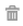

# Websegmenten {#web-segments}

## Segment {#view-segment} weergeven

Op het tabblad Segmenten worden alle aangepaste gedefinieerde segmenten weergegeven die u instelt op basis van verschillende kenmerken.  **Een segment is een verzameling bezoekers die voldoen aan de opgegeven criteria die zijn gedefinieerd op de pagina &quot;Een segment instellen&quot;.**  Een segment kan bezoekers zijn uit een bepaalde branche, locatie of op basis van de onsite activiteit van de bezoeker.

In Personalisatie van het Web, kan een bezoeker meer dan één segment aanpassen. Als er bijvoorbeeld een segment is voor bezoekers in de VS en een segment voor financiële ondernemingen, zou een webbezoeker van de Bank of America **beide** overeenkomen met het segment voor bezoekers in de VS en het segment voor financiële ondernemingen.

**GRAPH:**  Op de pagina Segmenten wordt een staafdiagram weergegeven met een grafiek van de geselecteerde segmenten op basis van het aantal bezoekers van het segment (y-as) en de segmentnaam (x-as).

<table> 
 <thead> 
  <tr> 
   <th colspan="1" rowspan="1">Naam</th> 
   <th colspan="1" rowspan="1">Beschrijving</th> 
  </tr> 
 </thead> 
 <tbody> 
  <tr> 
   <td colspan="1" rowspan="1"><strong>Naam</strong></td> 
   <td colspan="1" rowspan="1">De titel van het segment</td> 
  </tr> 
  <tr> 
   <td colspan="1" rowspan="1">
<strong>Overeenkomsten</strong>
</td> 
   <td colspan="1" rowspan="1">Het aantal bezoekers dat voldoet aan de aangepaste, gedefinieerde criteria van het segment</td> 
  </tr> 
  <tr> 
   <td colspan="1" rowspan="1"><strong>Campagne instellen</strong></td> 
   <td colspan="1" rowspan="1">Hiermee kunt u een campagne-CTA instellen die is gekoppeld aan de geselecteerde zoekterm</td> 
  </tr> 
  <tr> 
   <td colspan="1"><strong>Bezoekers</strong></td> 
   <td colspan="1">Een voorvertoning van de tabel met bezoekers die is gekoppeld aan de geselecteerde zoekterm</td> 
  </tr> 
  <tr> 
   <td colspan="1" rowspan="1"><strong>Clickstream</strong></td> 
   <td colspan="1" rowspan="1">Hiermee geeft u een tabel weer met de activiteit en het URL-pad van de bezoeker op de site en de duur van de bezochte pagina </td> 
  </tr> 
 </tbody> 
</table>

Zie [Segmentlabels maken en weergeven](/help/marketo/product-docs/web-personalization/using-web-segments/label-your-segment.md)

**Segmenten - Rechterdeelvenster**

Als u een segment in de tabel selecteert, worden aanvullende details over het segment in het rechterdeelvenster weergegeven.

Deze details omvatten:

* Naam van segment
* Aanmaakdatum segment
* De bijbehorende campagnes die de campagnes tonen die met het segment werken. Als u op het aantal reacties klikt, gaat u naar de pagina met campagnes waarop de campagne-CTA (Call to Action) voor het segment wordt weergegeven
* Het aantal overeenkomsten (het aantal bezoekers dat aan de segmentcriteria voldeed) voor het segment en het aantal afzonderlijke (unieke) bezoekers dat aan het segment voldeed. Wanneer u op de koppeling voor unieke bezoekers klikt, gaat u naar de pagina van de bezoeker waarop de resultaten van het segment worden weergegeven
* De eigenaar/gebruiker creator van het segment
* De domeinplaatsen verbonden aan het segment
* Een korte samenvatting van de geselecteerde criteria van het segment

## Een segment {#enable-or-disable-a-segment} in- of uitschakelen

Als u een segment wilt in- of uitschakelen, schakelt u het selectievakje van dat segment in de tabel in en schakelt u in het vervolgkeuzemenu Handeling kiezen onder aan de tabel de actie &quot;Inschakelen&quot; of &quot;Uitschakelen&quot; in. Wanneer een segment is uitgeschakeld, wordt het woord &quot;uitschakelen&quot; weergegeven onder de kolom Status.

## Segmenten {#create-segments} maken

Het segment dat u maakt, voldoet aan alle specifieke criteria die u definieert op de pagina **Segment instellen**. U kunt uw segmenten ook aanpassen op basis van een combinatie van criteria, waarbij u zich richt op een specifiek publiek in uw campagne.

Een nieuw segment maken

Van **Segmenten** pagina, klik **Nieuw** onder de grafiek creëren. Het volgende scherm verschijnt.

Definieer algemene parameters voor uw segment:

* **Naam:**  Geef uw segment een naam.
* **Beschrijving:**  Geef een gedetailleerdere uitleg van de segmentcriteria.
* **Domeinen:**  selecteer het domein of de domeinen die u in het segment wilt opnemen.
* **Segmentregellogica:**  selecteer een AND/OR-logica om elk segmenteringskenmerk te maken
* **Timing:** Bepaal het niveau van bezoekersbetrokkenheid u in uw campagne wilt

   * **Bij binnenkomst**: Inschakelen van de bezoeker komt op de website
   * **Na de eerste tot de negende klik**: De bezoeker inschakelen na een bepaalde hoeveelheid klikken op de website

>[!TIP]
>
>**Logica voor segmentregels**
>
>Er zijn drie filteropties:
>
>1. Alle filters gebruiken (1 en 2 en 3...)
>1. Alle filters gebruiken (1, 2 of 3...)
>1. Geavanceerde filters (met en/of expressies)

   >
   >    
   Met geavanceerde filters kunt u de segmentvoorwaarde bepalen. Voer de filternummers in, gescheiden door &quot;en&quot; en &quot;of&quot;.
   >
   >    
   * 1, 2 en 3
   >    * 1 of 2 of 3

   >
   >    Het mengen van &quot;en&quot; en &quot;of&quot; vereist haakjes om logische intentie te verduidelijken. bijv. &quot;1 of 2 and 3&quot; moet worden geschreven als een van de volgende vermeldingen:
   >
   >    
   * 1 en (2 of 3)
   >    * (1 en 2) of 3

   >
   >    Geneste haakjes worden geaccepteerd voor complexere logica, bijvoorbeeld
   >
   >    
   * (1 en 2) of (3 en 4)
   >    * 1 en (2 of (3 en 4))

   >
   >    Controleer uw logica na het invoegen, verwijderen of opnieuw rangschikken.

De attributen van het Segment van de belemmering en van het daling van de rechterzijkolom in de segmentredacteur op de linkerkant:

### Firmographics {#firmographics}

**Locatie**

Sleep **Location** in de segmentredacteur.

* Selecteer een van de volgende parameters:

   * **Opnemen**  - Selecteer of u een locatie in de campagne wilt opnemen of uitsluiten.
   * **Selecteer land om toe te voegen** - Van de drop-down doos, selecteer het land u in het segment wenst te omvatten. De landnaam wordt rechts weergegeven. U kunt meerdere landen kiezen.

Zodra het land wordt toegevoegd, kunt u de staat, de plaats en de postcode van het segment ook specificeren.

* **Selecteer Staat of Provincie om toe te voegen** - Van de drop-down doos, selecteer de staat van de V.S. of Canadese Provincie u wenst om te omvatten. U kunt meerdere selecties maken.
* **Postcode**  - Voer de postcode in die u in het segment wilt opnemen.
* **Steden** : ga naar de stad of steden die u wilt opnemen. Gebruik een puntkomma tussen steden.

>[!TIP]
>
>**Welke segmentvoorwaarden kies ik? &quot;AND&quot; of &quot;OR&quot;?** OR werkt als een extra optie binnen elk gebied. De vooruitzichten behoeven slechts aan één criterium van de veelvoudige criteria te voldoen die binnen elk gebied worden geselecteerd om voor het segment in aanmerking te komen. (De vooruitzichten kunnen bijvoorbeeld van de V.S. zijn. *of* van de defensie-industrie). EN functioneert als een aanvullende verplichte parameter waaraan voor dit segment moet worden voldaan. (De vooruitzichten moeten bijvoorbeeld zowel vanuit de VS als vanuit de defensie-industrie liggen). Binnen elk segmentatieprofiel kan elk afzonderlijk veld functioneren als zowel &quot;AND&quot; als &quot;OR&quot;, afhankelijk van de geselecteerde segmentvoorwaarde.

**** IndustriesSchakel onder de sectie  **Profielsegmentatie het selectievakje naast** Industrie **** in.

* Selecteer een van de volgende parameters:

   * **Omvat**  - selecteer of u het segment een industrie wilt omvatten of uitsluiten.
   * **Selecteer Industrieën om toe te voegen** - Selecteer de industrie u in het segment wenst te omvatten. De industrie verschijnt onder de drop-down doos. U kunt kiezen uit meerdere industrieën.

**Organisatie**

Schakel onder de sectie **Profielsegmentatie** het vakje naast **Organisatie-groep.** in.

* Selecteer een van de volgende opties in het keuzemenu:

   * Fortune 500 - Omvat alleen Fortune 500-ondernemingen in dit segment
   * Fortune 1000 - Omvat alleen Fortune 1000-ondernemingen in dit segment
   * Global 2000 - Omvat de Global 2000-bedrijven in dit segment
   * Ondernemingen - Omvat organisaties met meer dan 1.000 werknemers en inkomsten van meer dan 250 miljoen dollar
   * SMB - omvat slechts kleine en middelgrote ondernemingen in dit segment

**-Benoemde accounts-**

**Organisaties**

* **Is afkomstig van deze ondernemingen (specifieke namen)**

   * Selecteer een bedrijf dat u als doel wilt instellen in de vervolgkeuzelijst &#39;Bedrijf selecteren om toe te voegen&#39;.
   * U kunt de exacte organisatienaam typen waarop u zich wilt richten. *Het is _always_ geadviseerd om de Lijsten van de Benoemde Rekening in plaats van het typen van de namen manueel voor betere gelijken (zie hieronder) te gebruiken.

**Lijst met benoemde accounts**

Selecteer een [Benoemde lijst van de Rekening](/help/marketo/product-docs/web-personalization/account-based-web-marketing/create-a-new-account-list.md) om zeer belangrijke gerichte rekeningen te segmenteren.

>[!NOTE]
>
>Het aantal tussen de haakjes naast de Benoemde naam van de Lijst van de Rekening wordt gebruikt als indexverwijzing voor de lijst voor de Personalisering van het Web [Lees API](https://developers.marketo.com/documentation/websites/rtp-js-api/).

**ISP uitsluiten**

Sluit de Dienstverleners van Internet (ISPs) van het segment uit.

### Bekende personen {#known-people}

**Database**

De Personalisatie van het Web integreert met uw Gegevensbestand van het Marketo, toestaand u om campagnes door bekende persoonattributen en gegevens te segmenteren en te personaliseren.

Selecteer Gegevensbestand, en selecteer een gebied van persoongegevens van drop-down. Selecteer **+** om gebieden van drop-down toe te voegen.

U kunt gegevensvelden voor personen toevoegen of verwijderen uit Account Settings > Database

>[!TIP]
>
>De criteria voor het segment maken op basis van alle gegevensvelden voor personen van Marketo, zoals Functie; Score; Rol; enz.
>
>Eg. &quot;Functie is gelijk aan GMO&quot; en &quot;Score is kleiner dan of gelijk aan 50&quot;

**Marketo-e-** mailcampagneSegment maken en campagnes personaliseren door een bezoeker die op een Marketo-e-mail klikt en op de site arriveert via e-mail te verwijzen. Segment door de Naam van het Programma van Marketo of de Naam van de Campagne en vervolg het gesprek van e-mail aan Web. Selecteer + om gebieden van drop-down toe te voegen.

**Status**

Bepaal uw segment volgens de status van een vooruitzicht: bekend of anoniem.

* Bekend - selecteer deze optie van de drop-down doos voor bekende bezoekers. Een bezoeker is bekend wanneer hij of zij een formulier op uw website indient en op de pagina Personen voor webpersonalisatie wordt weergegeven.
* Anoniem - Selecteer deze optie in het keuzemenu voor anonieme bezoekers.

### Gedrag {#behavioral}

**Bezoekingen -** Definieer het segment op basis van het gedrag van de bezoeker of identificeer het.

* Aantal bezoeken - Selecteer deze optie in het keuzemenu om het aantal bezoeken voor vooruitzichten op de website te specificeren.

   * Selecteer Gelijk aan, Gelijk aan of Groter dan, of Gelijk aan of minder dan van de drop-down doos.

* Specifieke bezoeken - Selecteer deze optie in het keuzemenu om een specifieke bezoeker op te geven.

   * Voer in het tekstvak rechts het bezoekersnummer in dat u wilt bijhouden. Het unieke identificatienummer van de bezoeker van de Personalisatie van het Web kan worden gevonden wanneer het klikken op een bezoeker (op de bezoekerspagina) en de Vastgestelde Campagne op het juiste zijpaneel. De bezoeker-id bevindt zich in het gedeelte Geavanceerde instellingen. De bezoekersidentiteitskaart kan ook in URL (b.v. VISITOR=JZJIFJNUI60PZ8Y97BHTY9BL8PKWS) worden gevonden.

**Zoektermen**  - Definieer een segment volgens de zoektermen van een perspectief.

* De bezoeker heeft gezocht naar - Van de drop-down lijst, selecteer de termijnen u van uw bezoekersonderzoek wilt volgen, of uw eigen onderzoekstermijnen toevoegen. (Het jokerteken * is niet nodig voor zoektermen omdat dit standaard is ingesteld om woordgroepen met de zoekterm op te nemen.)

**Verwijzingen**  - URL&#39;s toevoegen waarnaar de bezoeker heeft verwezen.

* Selecteer verwijzingen die u wilt toevoegen - Selecteer in de vervolgkeuzelijst de verwijzingssites die u wilt bijhouden of voeg uw eigen verwijzing toe. Als deze optie is geselecteerd, worden de verwijzingen weergegeven in het onderstaande vak. (Het gebruik van * als jokerteken is toegestaan)

**Inclusief pagina** &#39;s - Houd rekening met de vooruitzichten voor specifieke pagina&#39;s die op uw website worden bezocht.

* URL-overeenkomsten - Voeg de URL toe van specifieke webpagina&#39;s die u wilt bijhouden. U kunt meerdere URL&#39;s toevoegen door deze te scheiden met een puntkomma. (Het gebruik van * als jokerteken is toegestaan.)

**Pagina&#39;s**  uitsluiten - Sluit specifieke pagina&#39;s uit die u niet wilt afstemmen in het segment. (Het gebruik van * als jokerteken is toegestaan.)

* URL komt niet overeen - Voeg de URL toe van specifieke webpagina&#39;s die u wilt uitsluiten van bijhouden. U kunt meerdere URL&#39;s toevoegen door deze te scheiden met een puntkomma

### Apparaat/browser {#device-browser}

**Mobiel besturingssysteem**

Het mobiele besturingssysteem naar de Segment-editor slepen

* **Type bezoeker** 

   **Mobiel besturingssysteem** : selecteer in de keuzelijst een of meer vermelde mobiele besturingssystemen. Het geselecteerde mobiele besturingssysteem wordt hieronder weergegeven.

   * De bezoeker gebruikt elk mobiel apparaat
   * De bezoeker gebruikt dit specifieke apparaat/besturingssysteem
   * De bezoeker gebruikt geen mobiel apparaat

* **Apparaat**   - Selecteer in de vervolgkeuzelijst een of meer apparaten (Apple, Samsung, LG, HTC, Nexus, Blackberry enz.). De geselecteerde apparaten worden hieronder weergegeven.

**Browser**

Doelbezoeker die specifieke browsertypen en/of versies gebruikt.

* Browsertype - Selecteer een of meer internetbrowsers in het keuzemenu. De geselecteerde browsers worden hieronder weergegeven.
* Browserversie - voer de browserversie in die u aan het segment wilt toevoegen. U kunt meerdere versies selecteren door elke versie te scheiden met een komma. (Het gebruik van * als jokerteken is toegestaan.)

### API {#api}

**Gebeurtenissen**  gegevens - bezoekers van segmenten die specifieke gebeurtenissen van de Gegevens van de Douane teweegbrengen

Voeg de waarde van de Gebeurtenis toe u wilt richten. Bijvoorbeeld uit gegevensbronnen van derden.

**Context-API van gebruiker**

Web Personalization API call [read meer over het hier.](https://developers.marketo.com/documentation/websites/rtp-user-context-api/)

>[!TIP]
>
>**Met jokertekens -** Wanneer u een zoekterm of URL wilt opnemen die iets in de naam bevat, dat wil zeggen: &quot;[google.com](https://google.com)&quot; of &quot;zoekterm product&quot;, noemen wij dit een jokerteken en het zou met een asterisk - deze kleine kerel* - op elk eind moeten worden ingevoerd. Daarom moet alles wat afkomstig is van [google.com](https://google.com) worden ingevoerd als * [google.com](https://google.com)*

## Segmenten {#edit-segments} bewerken

U kunt een segment bewerken dat is gemaakt.

1. Als u een segment wilt bewerken, gaat u naar **Segmenten**.

   

1. Klik in de tabel **Segmenten** op het bewerkingspictogram ( ) van het segment dat u wilt bewerken. De pagina **Segment instellen** wordt geopend met het geselecteerde segment.
1. Pas eventuele bewerkingen of wijzigingen toe die u op het segment wilt aanbrengen.
1. Klik **Opslaan**.

## Segmenten {#delete-segments} verwijderen

U kunt segmenten verwijderen die u hebt gemaakt.

1. Selecteer een segment op de bovenstaande pagina **Segmenten**.
1. Klik op het verwijderpictogram ( ) van het segment dat u wilt verwijderen.
1. Er wordt een bevestigingsbericht weergegeven waarin wordt bevestigd dat u op het punt staat het **Segment** te verwijderen.

>[!NOTE]
U kunt geen segment verwijderen dat aan een campagne is gekoppeld. Eerst moet u de campagne en dan het segment schrappen.

Geweldig! Nu u de sectie van Segmenten begrijpt, leren wij over campagnes.

>[!MORELIKETHIS]
* [Een basiswebsegment maken](/help/marketo/product-docs/web-personalization/using-web-segments/create-a-basic-web-segment.md)
* [Nieuwe webcampagne voor dialoog maken](/help/marketo/product-docs/web-personalization/working-with-web-campaigns/create-a-new-dialog-web-campaign.md)
* [Nieuwe webcampagne maken in zone](/help/marketo/product-docs/web-personalization/working-with-web-campaigns/create-a-new-in-zone-web-campaign.md)
* [Nieuwe widgetwebcampagne maken](/help/marketo/product-docs/web-personalization/working-with-web-campaigns/create-a-new-widget-web-campaign.md)

