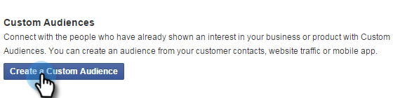
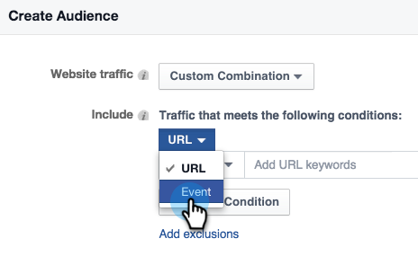
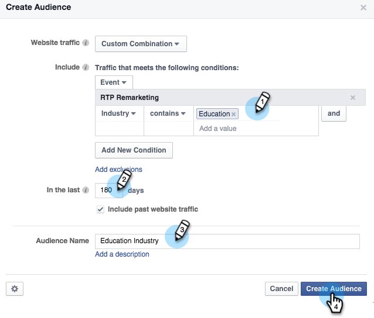

# Persoonlijke opmerkingen in Facebook {#personalized-remarketing-in-facebook}

De gepersonaliseerde Markeringen laat u met uw gebruikers opnieuw in dienst nemen gebruikend Gegevens RTP en de macht van de Markering van Facebook.

>[!PREREQUISITES]
>
>* Voltooi de [Opnieuw toewijzen met webpersonalisatiegegevens](/help/marketo/product-docs/web-personalization/website-retargeting/retargeting-with-web-personalization-data.md) instellen
>* Controleer de [&#128279;](https://developers.facebook.com/docs/ads-for-websites/website-custom-audiences/getting-started#install-the-pixel) [Facebook-documentatie over aangepast publiek](https://developers.facebook.com/docs/ads-for-websites/website-custom-audiences/getting-started#install-the-pixel) en Opmerking.

## Een publiek maken in Facebook {#creating-an-audience-in-facebook}

1. Ga in Facebook naar je [Tabblad Publiek](https://www.facebook.com/ads/audience_manager) in Advertentiebeheer.

1. Klikken **Gereedschappen** en selecteert u **Soorten publiek**.

   

1. Klikken **Een aangepast publiek maken**.

   

1. Selecteren **Websiteverkeer**.

   

1. Selecteer in de lijst Websites de optie **Aangepaste combinatie**.

   

1. Selecteer in de lijst Opnemen de optie **Gebeurtenis**.

   

1. Selecteer in de lijst Gebeurtenis de optie **RTP Opmerking** en selecteert u een parameter.

   

1. Selecteer in dit voorbeeld de optie Industrie om **Onderwijs**. Enter **Onderwijs** en bewerken **In de laatste** 180 dagen te zijn. Voer de naam van het publiek in: **Onderwijsindustrie**. Klikken **Publiek maken**.

   

1. U hebt nu een nieuw aangepast publiek gemaakt met RTP-gegevens in Facebook.

   

## RTP-gegevenspunten in Facebook {#rtp-data-points-in-facebook}

<table> 
 <tbody> 
  <tr> 
   <th>Gebeurtenisnaam</th> 
   <th> </th> 
  </tr> 
  <tr> 
   <td>RTP Opmerking</td> 
   <td> 
    
 
     <table> 
      <tbody> 
       <tr> 
        <th>Parameter</th> 
        <th>Waarde</th> 
       </tr> 
       <tr> 
        <td>ABM-lijst</td> 
        <td>(Naam van lijst op basis van account)</td> 
       </tr> 
       <tr> 
        <td colspan="1">Categorie</td> 
        <td colspan="1">
Fortune 500

Fortune 1000

Globaal 2000
</td> 
       </tr> 
       <tr> 
        <td colspan="1">Groep</td> 
        <td colspan="1">
Enterprise

SMB
</td> 
       </tr> 
       <tr> 
        <td>Marktsegment</td> 
        <td>
Defensie

Onderwijs

Financiële diensten

Overheid

Gezondheidszorg, Pharma, Biotech

Software en internet

enz. (volgens de opties van de Industrie RTP)
</td> 
       </tr> 
       <tr> 
        <td colspan="1">Gesegmenteerd publiek</td> 
        <td colspan="1">(Naam van Gesegmenteerde Publiek dat in RTP wordt gecreeerd)</td> 
       </tr> 
      </tbody> 
     </table> 
    
</td> 
  </tr> 
 </tbody> 
</table>

## Doelgroep voor publiek met advertentie {#target-your-audience-with-an-ad}

Zie voor meer informatie [Facebook-documentatie](https://developers.facebook.com/docs/ads-for-websites/website-custom-audiences/getting-started#target-your-audience).

1. Ga naar Advertentiebeheer en klik op **Advertentie maken**.

   

1. Selecteren **Personen naar uw website verzenden** als het doel van uw campagne.

   

1. Voer de URL van uw website in.

   

1. Maak uw advertentieset. Selecteer een aangepast publiek in de lijst met soorten publiek die u hebt gemaakt, bijvoorbeeld Onderwijsindustrie.

   

1. Selecteer alle andere advertentieopties, stel uw budget in en definieer uw advertentiefilters.

   

1. U bent nu allemaal in Facebook met een gepersonaliseerde marketingcampagne opgezet.

>[!MORELIKETHIS]
>
>* [Opnieuw toewijzen met webpersonalisatiegegevens](/help/marketo/product-docs/web-personalization/website-retargeting/retargeting-with-web-personalization-data.md)
>* [Persoonlijke opmerkingen in Google](/help/marketo/product-docs/web-personalization/website-retargeting/personalized-remarketing-in-google.md)
