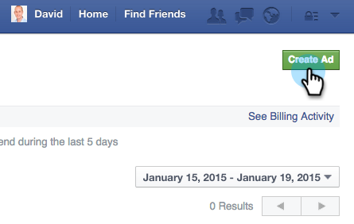

# Speciale opmerkingen in [!DNL Facebook] {#personalized-remarketing-in-facebook}

Met gepersonaliseerde opmerkingen kunt u opnieuw contact opnemen met uw gebruikers met behulp van RTP-gegevens en de kracht van Facebook-marketing.

>[!PREREQUISITES]
>
>* Voltooi [&#x200B; opnieuw het richten met de Gegevens van Personalization van het Web &#x200B;](/help/marketo/product-docs/web-personalization/website-retargeting/retargeting-with-web-personalization-data.md) opstelling
>* Herzie de [&#128279;](https://developers.facebook.com/docs/ads-for-websites/website-custom-audiences/getting-started#install-the-pixel) [&#x200B; documentatie van Facebook over het publiek van de Douane &#x200B;](https://developers.facebook.com/docs/ads-for-websites/website-custom-audiences/getting-started#install-the-pixel) en het Opmerken.

## Een publiek maken in [!DNL Facebook] {#creating-an-audience-in-facebook}

1. In [!DNL Facebook], ga naar uw [&#x200B; lusje van het Publiek &#x200B;](https://www.facebook.com/ads/audience_manager) in de Manager van Advertenties.

1. Klik op **[!UICONTROL Tools]** en selecteer **[!UICONTROL Audiences]** .

1. Klik op **[!UICONTROL Create a Custom Audience]**.

1. Selecteer **[!UICONTROL Website Traffic]**.

1. Selecteer [!UICONTROL Website traffic] in de lijst **[!UICONTROL Custom Combination]** .

1. Selecteer **[!UICONTROL Event]** in de lijst Opnemen.

1. Selecteer [!UICONTROL Event] in de lijst **[!UICONTROL RTP Remarketing]** en selecteer een parameter.

1. In dit voorbeeld selecteert u [!UICONTROL Industry] om **[!UICONTROL Education]** te bevatten. Voer **[!UICONTROL Education]** in en bewerk **[!UICONTROL In the Last]** om 180 dagen te duren. Ga de Naam van het publiek in: **Onderwijsindustrie**. Klik op **[!UICONTROL Create Audience]**.

1. U hebt nu een nieuw aangepast publiek gemaakt met RTP-gegevens in [!DNL Facebook] .

## RTP-gegevenspunten in [!DNL Facebook] {#rtp-data-points-in-facebook}

<table>
 <tbody>
  <tr>
   <th>Gebeurtenisnaam</th>
   <th> </th>
  </tr>
  <tr>
   <td>RTP Opmerking</td>
   <td>
    

     <table>
      <tbody>
       <tr>
        <th>Parameter</th>
        <th>Waarde</th>
       </tr>
       <tr>
        <td>ABM-lijst</td>
        <td>(Naam van lijst op basis van account)</td>
       </tr>
       <tr>
        <td colspan="1">Categorie</td>
        <td colspan="1">
Fortune 500

Fortune 1000

Globaal 2000
</td>
       </tr>
       <tr>
        <td colspan="1">Groep</td>
        <td colspan="1">
Enterprise

SMB
</td>
       </tr>
       <tr>
        <td>Marktsegment</td>
        <td>
Defensie

Onderwijs

Financiële diensten

Overheid

Gezondheidszorg, Pharma, Biotech

Software en internet

enz. (volgens de opties van de Industrie RTP)
</td>
       </tr>
       <tr>
        <td colspan="1">Gesegmenteerd publiek</td>
        <td colspan="1">(Naam van Gesegmenteerde Publiek dat in RTP wordt gecreeerd)</td>
       </tr>
      </tbody>
     </table>
    
</td>
  </tr>
 </tbody>
</table>

## Doelgroep voor publiek met advertentie {#target-your-audience-with-an-ad}

Voor extra details, zie {de documentatie van 0} Facebook [.](https://developers.facebook.com/docs/ads-for-websites/website-custom-audiences/getting-started#target-your-audience)

1. Ga naar Advertentiebeheer en klik op **[!UICONTROL Create Ad]** .

   

1. Selecteer **[!UICONTROL Send people to your website]** als het doel van uw campagne.

   

1. Voer de URL van uw website in.

   

1. Maak uw advertentieset. Selecteer een aangepast publiek in de lijst met soorten publiek die u hebt gemaakt, bijvoorbeeld Onderwijsindustrie.

   

1. Selecteer alle andere advertentieopties, stel uw budget in en definieer uw advertentiefilters.

   

1. U bent nu allemaal ingesteld met een gepersonaliseerde marketingcampagne in [!DNL Facebook] .

>[!MORELIKETHIS]
>
>* [&#x200B; het opnieuw samenkomen met de Gegevens van Personalization van het Web &#x200B;](/help/marketo/product-docs/web-personalization/website-retargeting/retargeting-with-web-personalization-data.md)
>* [&#x200B; Gepersonaliseerde Markering in Google &#x200B;](/help/marketo/product-docs/web-personalization/website-retargeting/personalized-remarketing-in-google.md)
