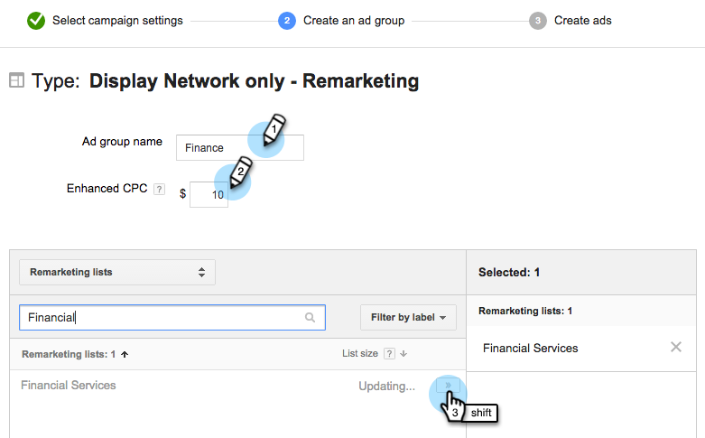

# Persoonlijke opmerkingen in Google {#personalized-remarketing-in-google}

Met gepersonaliseerde marketing kunt u opnieuw contact opnemen met uw gebruikers met behulp van RTP-gegevens en de kracht van Google Analytics met het bereik van het Google Display Network.

>[!PREREQUISITES]
>
>* Voltooi het [Opnieuw richten met de configuratie van Gegevens](retargeting-with-web-personalization-data.md) van de Personalisatie van het Web
>* Opmerking [reviseren met Help](https://support.google.com/analytics/topic/2611283?hl=en&amp;ref_topic=3413645) -documentatie voor Google Analytics

>

## Een opmerkelijk publiek maken in Google {#creating-a-remarketing-audience-in-google}

1. Meld u aan bij uw Google Analytics. Klik op **Beheer**, **Account**, **Eigenschap**. Klik op **Audience Definitions** and **Publiek**.

   

1. Klik **+Nieuw publiek**.

   

1. **Configuratie** koppeling: Link naar uw Google Adwords-account
1. **Publiek** definiëren: Klik op **Nieuw** maken.

   

1. In de Bouwer van de Publiek, klik op **Reeksen** en **vind de Gegevens** RTP onder de Dimension van de Douane, de Variabelen van de Douane, Gebeurtenissen.

>[!TIP]
>
>Hoe te om de gegevens RTP in Analytics te vinden om uw publiek te bouwen?
>
>In Google Analytics:
>
>* Aangepaste variabelen: Organisatie, industrie
>* Gebeurteniscategorie: Segment, Insightera-CTA, RTP-Remarketing
>* Gebeurtenislabel: Segmentnaam, naam campagne, segmentnaam publiek

>
>
In Google Universal Analytics:
>
>* Aangepaste Dimension: Organisatie, Industrie, Categorie (Fortune 500.1000, Globale 2000), Groep (Onderneming, SMB), Lijst ABM (Benoemde Lijst van de Rekening)
>* Gebeurteniscategorie: RTP-Segment, RTP-Campagne RTP-Markketing
>* Gebeurtenislabel: Segmentnaam, naam campagne, segmentnaam publiek

>

**Voorbeeld van het opmerken Publiek van RTP Gesegmenteerde Gegevens van het Publiek**

1. Klik op **Reeksen.**
1. Selecteer **Gebeurtenislabel.**
1. Ga **Naam van Gesegmenteerde Publiek** (zoals het in RTP verschijnt) in.
1. Klik op **Toepassen**.

**Voorbeeld van het publiek van de Gegevens van de Industrie RTP**

1. Klik op **Reeksen**.
1. Selecteer** RTP-Industry*.
1. Voer de **naam van de bedrijfstak** in (bijv. Financiële diensten, onderwijs...).
1. Klik op **Toepassen**.
1. Voer een **Audience Name** in. Klik op **Opslaan**.

## Een campagne voor opmerkingenadvertenties maken in Google Adwords {#create-a-remarketing-ad-campaign-in-google-adwords}

1. Meld u aan bij **Google Adwords**. Klik op **Campagnes**, uitgezochte Netwerk van de **Vertoning slechts**.

   

1. Voer de **naam** van de campagne in en selecteer Opmerking **type.**

   

1. Voer de naam **Advertentiegroep in,** voer **Enhanced CPC** in en selecteer **Lijst** Opmerkingen.

   

1. Klik op Opslaan en ga verder.
1. Voeg uw afbeelding of tekstadvertentie toe en start uw campagne voor het opnieuw op de markt brengen van tekst.

   

>[!NOTE]
>
>**Verwante artikelen**
>
>* [Opnieuw toewijzen met webpersonalisatiegegevens](retargeting-with-web-personalization-data.md)
>* [Persoonlijke opmerkingen op Facebook](personalized-remarketing-in-facebook.md)

