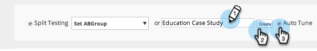

# AB Test Uw Campagne van het Web {#ab-test-your-web-campaign}

Testen is een uitstekende manier om uw webcampagnes te optimaliseren voor een betere betrokkenheid. Zo ga je aan de slag.

Als u uw gepersonaliseerde campagnes wilt testen door A/B, kunt u twee of meer campagnes selecteren, deze aan dezelfde **[!UICONTROL Split Test]** -groep koppelen en **[!UICONTROL Auto Tune]** selecteren om automatisch door te gaan met de best presterende campagne.

>[!TIP]
>
>Schakel [!UICONTROL Auto Tune] niet in als u liever handmatig wilt berekenen en wilt zien welke campagne beter presteert.

## Een gesplitste A/B-test instellen {#how-to-set-up-a-split-a-b-test}

1. Ga naar **[!UICONTROL Web Campaigns]** .

   

   >[!NOTE]
   >
   >Om het gemakkelijker te maken om de campagne te vinden u wilt, gebruik de [&#x200B; filtereigenschap &#x200B;](/help/marketo/product-docs/web-personalization/working-with-web-campaigns/filter-web-campaigns.md).

1. Selecteer de eerste campagne u aan test A/B wilt. Klik op **[!UICONTROL Edit]**.

   

1. Selecteer **[!UICONTROL Split Testing]** in de campagnepagina en klik op **[!UICONTROL Create New]** .

   

1. Ga de **Gesplitste Testende Naam van de Groep** in, klik **[!UICONTROL Create]**. Selecteer **[!UICONTROL Auto Tune]**.

   

1. **[!UICONTROL Save]** of **[!UICONTROL Launch]** de campagne.

   >[!TIP]
   >
   >Als u **[!UICONTROL Auto Tune]** selecteert, kan het [!DNL Web Personalization] -platform automatisch de beter presterende gesplitste testcampagne herkennen en wordt de campagne voortgezet met de hoogste conversiecampagne terwijl de andere wordt gepauzeerd.

1. Herhaal dit proces met de tweede campagne.

1. Selecteer de tweede campagne die u wilt testen A/B. Klik op **[!UICONTROL Edit]**.

   

1. In de **[!UICONTROL Set Campaign]** pagina, selecteer **Splitsen Testen** en kies de **Groep** van drop-down. Selecteer **[!UICONTROL Auto Tune]**.

   

1. **[!UICONTROL Save]** of **[!UICONTROL Launch]** de campagne.

1. Herhaal dit proces voor een derde of vierde campagne om te testen.

1. In **[!UICONTROL Web Campaigns]** kunt u de gesplitste testcampagnes zien die door het pictogram A/B worden aangeduid.

   

>[!TIP]
>
>1. U kunt zoveel campagnes testen als u wilt. Beste praktijken zijn twee tot drie campagnes
>1. Zorg ervoor dat elke gesplitste testgroep aan hetzelfde segment is gekoppeld. U wilt testen naar hetzelfde publiek.
>1. Probeer verschillende inhoudsonderdelen (casestudy A vs. casestudy B), verander het overseinen en creatieve elementen, kleuren, grootte of vraag aan acties.
>1. Optimaliseer en geniet van uw persoonlijke inhoud!

>[!MORELIKETHIS]
>
>* [&#x200B; creeer een Campagne van de Dialoog &#x200B;](/help/marketo/product-docs/web-personalization/working-with-web-campaigns/create-a-new-dialog-web-campaign.md)
>* [&#x200B; creeer een RTP in de Campagne van de Zone &#x200B;](/help/marketo/product-docs/web-personalization/working-with-web-campaigns/create-a-new-in-zone-web-campaign.md)
>* [&#x200B; creeer een Campagne van Widget RTP &#x200B;](/help/marketo/product-docs/web-personalization/working-with-web-campaigns/create-a-new-widget-web-campaign.md)
