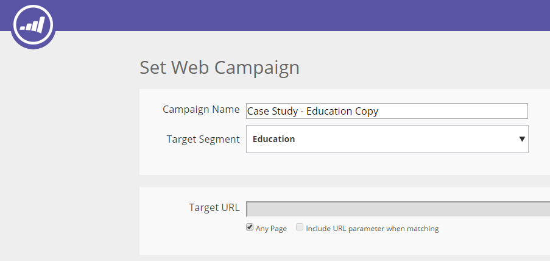

# Een webcampagne klonen {#clone-a-web-campaign}

Gebruik de klooneigenschap op de pagina van de Campagnes van het Web om de campagnemontages te kopiëren en de inhoud voor gespleten het testen optimalisering te veranderen, of een campagne met de zelfde inhoud te klonen en het te richten naar een verschillend segment. Maak binnen enkele seconden webcampagnes!

## Een klooncampagne maken {#create-a-clone-campaign}

1. Ga naar **Webcampagnes**.

   

   >[!NOTE]
   >
   >Om het gemakkelijker te maken om de Webcampagne te vinden u wilt, gebruik [filtereigenschap](/help/marketo/product-docs/web-personalization/working-with-web-campaigns/filter-web-campaigns.md).

1. Klik voor de webcampagne op **Klonen**.

   

1. Het klonen van campagne kopieert alle inhoud van de bestaande webcampagne naar de nieuwe gekloonde campagne. De nieuwe gekloonde webcampagne heeft de titel &quot;[CAMPAIGN NAME] Copy&quot;.

   

   >[!TIP]
   >
   >Alle inhoud in de webcampagne wordt gekopieerd naar de klooncampagne, behalve gesplitste tests. Vergeet dus niet een gesplitste testgroep toe te voegen aan de gekloonde campagne als u deze wilt testen op anderen.

>[!MORELIKETHIS]
>
>* [Een dialoogcampagne maken](/help/marketo/product-docs/web-personalization/working-with-web-campaigns/create-a-new-dialog-web-campaign.md)
>* [Een RTP maken in een zonecampagne](/help/marketo/product-docs/web-personalization/working-with-web-campaigns/create-a-new-in-zone-web-campaign.md)
>* [Een RTP-widgetcampagne maken](/help/marketo/product-docs/web-personalization/working-with-web-campaigns/create-a-new-widget-web-campaign.md)

