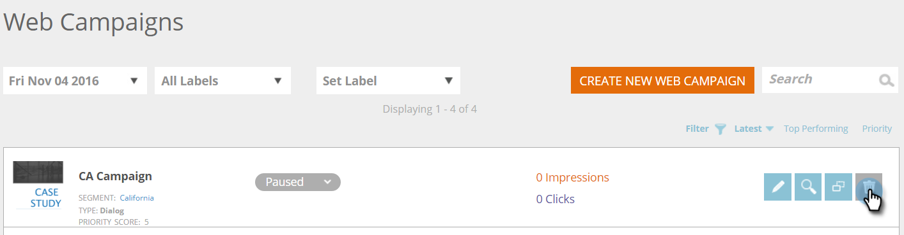

# Nieuwe webcampagne voor dialoogvenster maken {#create-a-new-dialog-web-campaign}

## Een dialoogvensterwebcampagne maken {#create-a-dialog-web-campaign}

Maak een webcampagne om uw webinhoud in real-time aan te passen en de juiste boodschap af te geven aan de juiste gebruiker op het juiste moment.

Een webcampagne is een aangepaste reactie die is gekoppeld aan een specifiek segment. De reactie kan een dialoogdoos op uw website, een [in zonevervanging](create-a-new-in-zone-web-campaign.md), een [widgeteigenschap](create-a-new-widget-web-campaign.md)of een e-mailalarm zijn.

1. Ga naar **Webcampagnes**.

   

1. Selecteer **Nieuwe webcampagne maken**.

   

1. Selecteer het **Dialog** type van Webcampagne. Ontwerp en voeg creatieve elementen toe in de editor. Klik **Voorvertoning** om te zien hoe de webcampagne op uw site reageert.

   

<table> 
 <thead> 
  <tr> 
   <th colspan="1" rowspan="1">Naam</th> 
   <th colspan="1" rowspan="1">Beschrijving</th> 
  </tr> 
 </thead> 
 <tbody> 
  <tr> 
   <td colspan="1"><strong>Weergeven ingeschakeld</strong></td> 
   <td colspan="1">Hiermee kunt u <a href="https://docs.marketo.com/display/DOCS/Set+How+Your+Web+Campaign+Displays" rel="nofollow">aanpassen wanneer en hoe</a> uw webcampagneweergaven worden weergegeven.</td> 
  </tr> 
  <tr> 
   <td colspan="1" rowspan="1"><strong>Dialoogvensterstijl</strong></td> 
   <td colspan="1" rowspan="1"> 
    <ul> 
     <li>Modern bijsnijden - Een stijlvolle en kenmerkende dialoog met halftransparante zwarte rand en afgeronde hoeken</li> 
     <li>Modern bijsnijden II - Een stijlvolle en onderscheidende dialoog met een lichtschaduwbijsnijdkleur en afgeronde hoeken en een knop Sluiten</li> 
     <li>Transparant - een volledig transparant dialoogvenster, ideaal voor transparante (png) afbeeldingen voor uw oproep tot acties. </li> 
     <li>Eenvoudig - Een eenvoudig stijldialoogvenster met een dikkere titelkopruimte die voldoet aan de behoeften van het standaarddialoogvenster.</li> 
    </ul></td> 
  </tr> 
  <tr> 
   <td colspan="1"><strong>In/uit animeren</strong></td> 
   <td colspan="1">Instellen bij invoeren en/of afsluiten van dialoogvenster. Selecteer een effect (droppen, blind, dia, vervagen, geen effect), duur (in seconden) en richting (omhoog, omlaag, links, rechts).</td> 
  </tr> 
  <tr> 
   <td colspan="1" rowspan="1">
<strong>Positie</strong>
</td> 
   <td colspan="1" rowspan="1">Selecteer een van de 9 opties voor de positie van het dialoogvenster op de pagina. Als u bijvoorbeeld het middelste vak selecteert, wordt het dialoogvenster in het midden van het scherm weergegeven.</td> 
  </tr> 
  <tr> 
   <td colspan="1" rowspan="1">
<strong>Op coördinaten</strong>

 
</td> 
   <td colspan="1" rowspan="1">Voor extra plaatsingsopties van de dialoogdoos, selecteer checkbox "de Coördinaten van de Positie"en ga de nauwkeurige het schermcoördinaten (Horizontaal, Verticaal) in waar u de dialoog zou willen verschijnen.</td> 
  </tr> 
  <tr> 
   <td colspan="1"><strong>Knopvulling</strong></td> 
   <td colspan="1">Pas de sluitknop van het modale model aan met behulp van kleur, stijl en positie. U kunt ook uw eigen knop gebruiken door er een koppeling naar te maken in het vak URL van afbeelding.</td> 
  </tr> 
  <tr> 
   <td colspan="1"><strong>Vast</strong></td> 
   <td colspan="1">Als u het selectievakje met plakken inschakelt, blijft het dialoogvenster op de juiste positie staan, zonder tijdslimiet, totdat het door de gebruiker wordt gesloten. Het dialoogvenster wordt tijdens de gehele sessie op alle pagina's weergegeven.</td> 
  </tr> 
  <tr> 
   <td colspan="1"><strong>Modal</strong></td> 
   <td colspan="1">Hiermee krijgt u meer focus op het dialoogvenster en wordt de achtergrond donkerder weergegeven achter het dialoogvenster, waardoor de gebruiker meer bewust wordt van het dialoogvenster.</td> 
  </tr> 
  <tr> 
   <td colspan="1"><strong>Modale kleur</strong></td> 
   <td colspan="1">Pas de kleur en dekking van het modaal model aan.</td> 
  </tr> 
  <tr> 
   <td colspan="1"><strong>Time-out </strong></td> 
   <td colspan="1">Het aantal seconden dat het dialoogvenster wordt geactiveerd voordat het wordt uitgefaded.</td> 
  </tr> 
  <tr> 
   <td colspan="1"><strong>Kleur koptekst</strong></td> 
   <td colspan="1">Stel de koptekstbalk van het dialoogvenster in op de gewenste kleur. De kleur kan worden gekozen uit een kleurdiagram of worden ingevoerd als hexadecimale kleurcode. </td> 
  </tr> 
  <tr> 
   <td colspan="1"><strong>Achtergrondkleur van inhoud </strong></td> 
   <td colspan="1">Stel de achtergrondkleur van het dialoogvenster in op de gewenste kleur. De kleur kan worden gekozen uit een kleurdiagram of worden ingevoerd als hexadecimale kleurcode. </td> 
  </tr> 
  <tr> 
   <td colspan="1"><strong>Titel dialoogvenster</strong></td> 
   <td colspan="1">Voeg een titel toe aan de titelbalk van het dialoogvenster.</td> 
  </tr> 
  <tr> 
   <td colspan="1"><strong>Breedte en hoogte</strong></td> 
   <td colspan="1">Selecteer de pixelgrootte van het dialoogvenster.</td> 
  </tr> 
  <tr> 
   <td colspan="1"><strong>Breedte automatisch</strong></td> 
   <td colspan="1">Als u dit selectievakje inschakelt, wordt het dialoogvenster automatisch aangepast aan de breedte van de inhoud.</td> 
  </tr> 
  <tr> 
   <td colspan="1"><strong>Resizeerbaar </strong></td> 
   <td colspan="1">Als u het selectievakje voor formaatwijziging inschakelt, kan de grootte van het dialoogvenster door de gebruiker worden aangepast.</td> 
  </tr> 
  <tr> 
   <td colspan="1"><strong>RTF-editor</strong></td> 
   <td colspan="1">
Met de RTF-editor kunt u tekst opmaken, koppelen en afbeeldingen invoegen. <a href="using-the-web-personalization-rich-text-editor.md">Lees hier</a> meer.
</td> 
  </tr> 
  <tr> 
   <td colspan="1"><strong>Voorvertonen op site</strong></td> 
   <td colspan="1">Voorvertoning van campagnes weergeven voordat deze worden gestart.  
    <ul> 
     <li>URL - Voer een voorbeeld-URL in waar de campagne wordt uitgevoerd om een voorbeeld te zien van hoe de campagne er live uitziet.</li> 
     <li>Apparaat - Voorproef hoe uw campagne door apparaat zal verschijnen: Desktop, mobiel portret, mobiel landschap, tablet-Staand, staand liggend. </li> 
     <li>Voorvertoning - Klik <strong>Voorvertoning </strong>om een nieuw venster met de voorbeeld-URL te openen om te zien hoe de campagne reageert. </li> 
     <li>Delen - Gebruik de knop Delen om een e-mail te sturen naar een collega met een koppeling om de proxycampagne te bekijken.</li> 
    </ul></td> 
  </tr> 
 </tbody> 
</table>

>[!TIP]
>
>Versnel en vereenvoudig het maken van uw campagne door onze [ingebouwde sjablonen](../../../product-docs/web-personalization/using-templates/using-templates-to-create-web-campaigns.md) of [uw bestaande campagne](../../../product-docs/web-personalization/using-templates/using-templates-to-create-web-campaigns.md) als sjabloon voor hergebruik op te slaan.

## Een webcampagne bewerken {#edit-a-web-campaign}

1. Van **Web** **Campagnes** pagina, klik **Edit** op de Webcampagne.

>[!NOTE]
>
>Om het gemakkelijker te maken om de Webcampagne te vinden u wilt, gebruik [filtereigenschap](filter-web-campaigns.md).

## Een webcampagne voorvertonen {#preview-a-web-campaign}

1. Van **Webcampagnes** pagina, klik **Voorproef** op de Webcampagne u wenst om te bekijken.

## Een webcampagne klonen {#clone-a-web-campaign}

Zie [Een webcampagne klonen](clone-a-web-campaign.md).

## Een webcampagne {#delete-a-web-campaign} verwijderen

1. Klik op de pagina **Webcampagnes** op **Verwijderen **op de webcampagne die u wilt verwijderen.

   

1. Er verschijnt een bevestigingsbericht om te bevestigen of u de webcampagne wilt verwijderen.

>[!MORELIKETHIS]
>
>* [Nieuwe webcampagne maken in zone](create-a-new-in-zone-web-campaign.md)
>* [Nieuwe widgetwebcampagne maken](create-a-new-widget-web-campaign.md)

