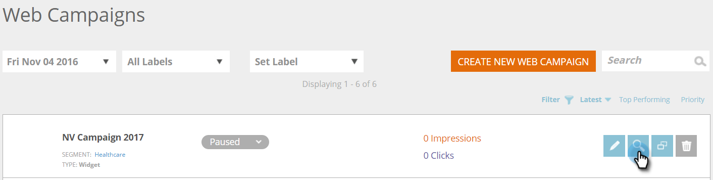
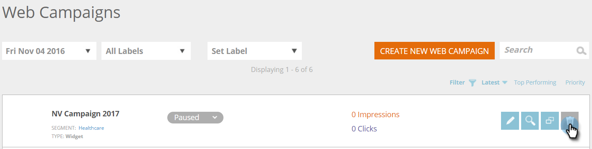

# Nieuwe widgetwebcampagne maken {#create-a-new-widget-web-campaign}

Een Webcampagne is een aangepaste reactie verbonden aan een specifiek segment en kan a [ dialoogdoos ](/help/marketo/product-docs/web-personalization/working-with-web-campaigns/create-a-new-dialog-web-campaign.md) op uw website, a [ in streekvervanging ](/help/marketo/product-docs/web-personalization/working-with-web-campaigns/create-a-new-in-zone-web-campaign.md), een widgeteigenschap, of een e-mailalarm zijn. De widgetwebcampagne is een tekst of banner die aan de verticale zijde van uw webpagina wordt weergegeven en die u kunt uitbreiden en inkrimpen, terwijl u tijdens het bezoek de webpagina blijft zoeken.

## Een widgetwebcampagne maken {#create-a-widget-web-campaign}

1. Ga naar **[!UICONTROL Web Campaigns]** .

   

1. Selecteer **[!UICONTROL Create New Web Campaign]** .

   

1. Selecteer het type campagne van **[!UICONTROL Widget]** .

   

1. Gebruik de meerdere opties om de widget aan te passen.

   

1. Klik op **[!UICONTROL Preview]** om te zien hoe de webcampagne op uw site reageert.

   

<table>
 <thead>
  <tr>
   <th colspan="1" rowspan="1">Naam</th>
   <th colspan="1" rowspan="1">Beschrijving</th>
  </tr>
 </thead>
 <tbody>
  <tr>
   <td colspan="1"><strong>Sjablonen</strong></td>
   <td colspan="1">Maak een keuze uit een van de verschillende vooraf gedefinieerde sjablonen.</td>
  </tr>
  <tr>
   <td colspan="1"><strong>Weergeven ingeschakeld</strong></td>
   <td colspan="1">Staat u toe om <a href="/help/marketo/product-docs/web-personalization/working-with-web-campaigns/set-how-your-web-campaign-displays.md" rel="nofollow"> aan te passen wanneer en hoe </a> uw vertoningen van de Webcampagne.</td>
  </tr>
  <tr>
   <td colspan="1"><strong>In/uit animeren</strong></td>
   <td colspan="1">Instellen bij invoeren en/of afsluiten van dialoogvenster. Selecteer een effect (droppen, blind, dia, vervagen, geen effect), duur (in seconden) en richting (omhoog, omlaag, links, rechts).</td>
  </tr>
  <tr>
   <td colspan="1"><strong>Positie</strong></td>
   <td colspan="1">Selecteer een van de vier opties voor de positie van de widget op de pagina: Rechts, Links, Boven, Onder. Positie % is het percentage van de positionering waar de widget op de browserpagina wordt weergegeven (zo zal "50% onder" ertoe leiden dat de widget halverwege de onderkant van de pagina wordt weergegeven, "10% links" zorgt ervoor dat de widget linksboven op de pagina wordt weergegeven, enz.). </td>
  </tr>
  <tr>
   <td colspan="1" rowspan="1"><strong>Widget-kleur</strong></td>
   <td colspan="1" rowspan="1">
Selecteer de widgetkleur in een kleurengrafiek of voer deze in als RGB-kleurcode. U kunt ook het transparantieniveau van de widgetachtergrond selecteren door de balk aan de onderkant in een van beide richtingen te verplaatsen.
</td>
  </tr>
  <tr>
   <td colspan="1" rowspan="1">
<strong>Widget-knop</strong> 
</td>
   <td colspan="1" rowspan="1">Pas de widgetknop zelf aan.  Pijl: Staat u toe om van veelvoudige verschillende pictogrammen in het juiste drop-down menu te kiezen. De kleur van de linkervervolgkeuzelijst wordt bepaald.  Douane: Tussenvoegsel URL van om het even welk ontvangen beeld. Geaccepteerde bestandstypen: .JPEG, .GIF (inclusief animatie), .PNG, .APNG, .SVG, .BMP.  Tekst: Widget kan tekst zijn - pas zijn kleur, grootte, en doopvont aan.</td>
  </tr>
  <tr>
   <td colspan="1"><strong>Vast</strong></td>
   <td colspan="1">Als u deze optie selecteert, wordt de widget tijdens de gehele sessie op alle webpagina's weergegeven.</td>
  </tr>
  <tr>
   <td colspan="1"><strong>Widget op cameraweergave minimaliseren</strong></td>
   <td colspan="1">Hiermee wordt een widget ingevoegd, maar blijft deze geminimaliseerd. De gebruiker moet er dan op klikken om de widget te maximaliseren.</td>
  </tr>
  <tr>
   <td colspan="1"><strong>Standaardwaarde herstellen </strong></td>
   <td colspan="1">Hiermee herstelt u de oorspronkelijke standaardinstelling voor de widget door de widgetkleur in te stellen op de standaardoptie voor transparante grijstinten.</td>
  </tr>
  <tr>
   <td colspan="1"><strong>Voorvertonen op site </strong></td>
   <td colspan="1">Voorvertoning van campagnes weergeven voordat deze worden gestart. 
    <ul>
     <li>URL - Voer een voorbeeld-URL in waar de campagne wordt uitgevoerd om een voorbeeld te zien van hoe de campagne er live uitziet.</li>
     <li>Voorproef - klik <strong> Voorproef </strong> om een nieuw venster van voorbeeld URL te openen om te zien hoe de campagne reageert (voeg de <a href="https://chrome.google.com/extensions/detail/ldiddonjplchallbngbccbfdfeldohkj?hl=en" rel="nofollow"> uitbreiding van Chrome </a> voor de beste voorproefervaring van de Campagne van het Web toe.) </li>
     <li>Delen - Gebruik de knop Delen om een e-mail te sturen naar een collega met een koppeling om de proxycampagne te bekijken.</li>
    </ul></td>
  </tr>
 </tbody>
</table>

>[!NOTE]
>
>**wil A/B uw Webcampagnes testen?** Één of meerdere Webcampagnes kunnen [ A/B worden getest voor optimale resultaten ](/help/marketo/product-docs/web-personalization/working-with-web-campaigns/ab-test-your-web-campaign.md). Met de functie [!UICONTROL Auto Tune] herkent het platform automatisch de beter presterende campagnes, gaat het verder met de hoogste conversiecampagnes en pauzeert het de andere campagnes.

## Een webcampagne bewerken {#edit-a-web-campaign}

Klik op de pagina [!UICONTROL Web Campaigns] op **[!UICONTROL Edit]** in de campagne.

>[!NOTE]
>
>Om het gemakkelijker te maken om de campagne te vinden u wilt, gebruik de [ filtereigenschap ](/help/marketo/product-docs/web-personalization/working-with-web-campaigns/filter-web-campaigns.md).

## Een webcampagne klonen {#clone-a-web-campaign}

Zie [ Klonen een Campagne van het Web ](/help/marketo/product-docs/web-personalization/working-with-web-campaigns/clone-a-web-campaign.md).

## Een webcampagne voorvertonen {#preview-a-web-campaign}

Klik op de pagina [!UICONTROL Web Campaigns] op **[!UICONTROL Preview]** in de webcampagne die u wilt voorvertonen

## Een webcampagne verwijderen {#delete-a-web-campaign}

1. Klik op de pagina [!UICONTROL Web Campaigns] op **[!UICONTROL Delete]** in de webcampagne die u wilt verwijderen.

   

1. Er verschijnt een bevestigingsbericht om te bevestigen of u de webcampagne wilt verwijderen.

>[!MORELIKETHIS]
>
>* [ creeer een Nieuwe Campagne van het Web van de Zone ](/help/marketo/product-docs/web-personalization/working-with-web-campaigns/create-a-new-in-zone-web-campaign.md)
>* [ creeer een Nieuwe Campagne van het Web van de Dialoog ](/help/marketo/product-docs/web-personalization/working-with-web-campaigns/create-a-new-dialog-web-campaign.md)
